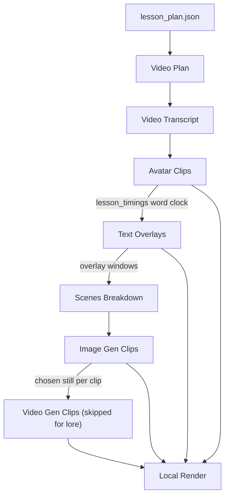

# 00 — Overview: the lore video pipeline

This repo turns a research plan into long-form lore videos: an MP4 per video in which one narrator tells a connected history or science story, over generated stills with gentle camera motion.

- **`lesson_plan.json` is the videos' specification.**
  - It fixes the chapters, the videos under each, and the research facts each video draws on ([01](01-upstream.md)).
  - It supplies no narration, no imagery, no clock and no video.
  - The pipeline's job is to manufacture everything the plan could not carry, from the facts the plan states.
- **These docs own structure: stage responsibilities, module boundaries, data contracts, design rationale.**
  - They do not own how to run the thing on a fresh machine; that is [generation/README.md](../../README.md).
  - There is no deployment surface. This pipeline is run from a shell, on one machine at a time, by a person.
- **Code is anchored as `path/file.py::symbol`, never by line number.**
  - Line numbers in this repo rot within days.
  - Paths are relative to `generation/`, so `stages/scenes_breakdown.py::generate_clips` is `generation/stages/scenes_breakdown.py`. Inside the table in [11](11-support-layer.md) that inventories `core/`, paths are relative to `core/`; nowhere else drops a prefix.
  - When a doc and the code disagree, the code is truth and the doc is the bug.
  - `python docs/architecture/check_anchors.py` checks every anchor in this set against the source and exits non-zero on any that no longer resolves. Run it after moving or renaming anything the docs name.

## Running the pipeline

`python run.py <directory>` is the entry point and the whole orchestrator. [generation/README.md](../../README.md) has the invocations; what follows is the behaviour they inherit.

- **The run directory is the input and the output.**
  - `<directory>` is a local folder or `s3://bucket/prefix` that already holds `lesson_plan.json`. Every artifact of the run is written back into it, one folder per video ([01](01-upstream.md)).
  - `run.py::selected` filters the plan's videos by `--video`, a folder prefix such as `c01-v02` or an exact title. Asking for nothing builds every video; asking for something that matches nothing is an error, not a silent no-op.
- **`run.py` loads `.env` before it imports anything else**, from `generation/` first and the repository root second. It has to be first, because `core/constants.py` reads the environment at module scope ([11](11-support-layer.md)).
- **The directory chooses the storage backend.** `run.py::storage_for` maps `s3://b/p` to `STORAGE=s3`, `S3_BUCKET=b` and a key root of `p/`, and a local path to `STORAGE=local` with `LOCAL_STORAGE_ROOT` set to that folder and an empty key root. `run.py` pre-parses the positional argument at import for this, because `core/clients/s3.py` picks its backend at module scope. Under `local` the vendor stages that have no local equivalent are skipped ([13](13-generation-layout.md)). `local` is the only mode the render stage runs in.

## The pipeline, in order

    lesson_plan.json → Video Plan → Video Transcript → Avatar Clips → Text Overlays
        → Scenes Breakdown → Image Gen Clips → Video Gen Clips → Local Render

- **The plan is the one input the pipeline cannot make ([01](01-upstream.md)).** A run fails at start-up if the run directory has no `lesson_plan.json`.
- **The eight stages are a list in a JSON file.**
  - `config/stages.json` under `stages` is the definition: eight titles, in order.
  - `run.py::pipeline` reads that list in order, drops the video type's `skip_stages`, and under `STORAGE=local` also drops `run.py::LOCAL_SKIP`. `run.py::run_video` walks the result for one video.
  - Each title is resolved to a callable through `run.py::STAGES`, a dict of title to stage function.
  - Adding a stage means adding a config entry and a `STAGES` entry. Nothing else knows the list exists.
- **The config's order is the pipeline's order.** `run.py::STAGES` is a lookup table and its literal order means nothing.
- **One video type, `lore`, and it is the default.**
  - `config/video_types.json` holds it; `run.py::video_type` validates it and merges its `layers` over `run.py::LAYER_DEFAULTS`.
  - `lore` skips Video Gen Clips, turns off the talking head, text slides, infographics, overview diagrams, conclusion slide, planner visual techniques and web images, and turns on `LAYER_PROGRAMMATIC_MOTION`. Its `params` blocks are `LAYER_PROGRAMMATIC_MOTION` and `NARRATION`.
- **Three of these orderings are load-bearing.**
  - Avatar Clips before Text Overlays: Avatar Clips produces `lesson_timings`, the word-level clock for the whole video, and Text Overlays has no other way to turn an LLM's chosen phrase into a timestamp.
  - Text Overlays before Scenes Breakdown: the clip splitter reads the overlay manifest to carve the transcript around the windows already occupied by overlays.
  - Image Gen Clips before Video Gen Clips: motion generation is image-to-video and starts from the chosen still.

## The stage contract

- **Every stage is one function with the same shape: `f(output_path, output_type, inputs) -> dict`.**
  - `run.py::run_stage` is the only caller. It looks the stage up in `run.py::STAGES`, calls it, and saves what comes back.
  - `output_path` is `context.artifact_path(title)` and `output_type` is the stage's own title.
  - `inputs` is built once per video in `run.py::run_video`: `Context.model_dump()`, plus every `LAYER_*` flag, plus one `<NAME>_PARAMS` key per `params` block of the video type.
  - Each stage's first act is to rebuild the typed context with `core/context.py::Context` from `inputs`.
- **The returned dict is the stage's artifact, and the stage does not save it.**
  - `run.py::run_stage` writes it to `{root}{folder}/{title}.json`, the path `core/context.py::Context.artifact_path` builds.
  - A stage that writes binary media uploads that itself, but the JSON manifest always goes back through the caller.
- **Stages communicate only through storage, never through return values.**
  - Every stage re-reads its inputs through `Context` properties.
  - This is why any stage can be rerun alone, and why a hand-edited artifact is picked up by whatever runs next.
- **Skip-if-exists and retry live in exactly one place.**
  - `run.py::run_stage` returns the cached JSON when `{title}.json` already exists in the video's folder, without calling the stage at all. `--force` overrides it.
  - It carries `@retry(stop_after_attempt(3), wait_exponential)`, so a stage that raises is called up to three times before the exception escapes.
  - No stage implements its own JSON-level skip. Several implement a finer-grained per-clip skip on top; those are named in the stage docs.
- **Only JSON is skipped. Media is not.**
  - Every mp3, mp4, mov and png is regenerated and re-uploaded on any run that reaches its stage, at full vendor cost.
  - Deleting a stage's JSON to force a rerun therefore re-buys all of that stage's media.

## Where every artifact lives

- **Every path is below `{root}{folder}/`, the video's folder in the run directory.**
  - `core/context.py::Context` builds every path: `base_path`, `media_path` and `artifact_path` directly, and one reviewed-path property per upstream artifact.
  - To find which stage writes a file, find the file here.

| Stage | Config entry | Callable | `Context` property | Artifact in the video folder |
| --- | --- | --- | --- | --- |
| 1 | Video Plan | `stages/video_plan.py::generate_lesson_video_plan` | `video_plan_path` | `Video Plan.json` |
| 2 | Video Transcript | `stages/transcript.py::generate_lesson_transcript` | `transcripts_path` | `Video Transcript.json` |
| 3 | Avatar Clips | `stages/avatar_clips.py::generate_avatar_assets` | `avatar_assets_path` | `Avatar Clips.json` |
| 4 | Text Overlays | `stages/text_overlays.py::generate_text_overlays` | `text_overlays_path` | `Text Overlays.json` |
| 5 | Scenes Breakdown | `stages/scenes_breakdown.py::generate_clips` | `clips_path` | `Scenes Breakdown.json` |
| 6 | Image Gen Clips | `stages/image_clips.py::generate_all_images` | — | `Image Gen Clips.json` |
| 7 | Video Gen Clips | `stages/video_clips.py::generate_all_videos` | — | `Video Gen Clips.json`, not produced for lore |
| 8 | Local Render | `stages/local_render.py::render_lesson` | — | `Local Render.json` |

Binary media, all under the video's `media/` folder unless noted:

| Media | Written by | Path under `media/` |
| --- | --- | --- |
| Segment audio | Avatar Clips | `{segment}.mp3` |
| Character portraits | Avatar Clips | `character_images/{name}.png` |
| Talking-head clips | Avatar Clips | `avatar_assets/{segment}.mp4` |
| Avatar intro cards | Avatar Clips | `Avatar/Introduction/{id}.mov` |
| Text slides | Text Overlays | `TextSlides/{id}.mov` |
| Diagrams | Text Overlays | `Diagrams/{id}.mov` |
| Per-clip candidate stills | Image Gen Clips | `images/{media.id}/` and `images/{media.id}/{media.id}.json` |
| Per-clip motion | Video Gen Clips | `videos/{media.id}/` |
| Finished video | Local Render | `{title}.mp4`, the title made path-safe |

Under `lore` the talking-head, text-slide and diagram layers are off, so a lore video folder holds audio, stills and the finished MP4.

## The key

- **`{folder}` is the video's identity and it appears in every artifact path.**
  - `run.py::videos` names it `c{chapter:02d}-v{video:02d}-{slug(title)}`, with 1-based chapter and video indexes in plan order. `run.py::slug` lowercases, hyphenates and caps at 60 characters.
  - It is exposed as the `key` property on `core/context.py::Context`.
- **Reordering or retitling videos in the plan changes their folders.**
  - Every artifact under the old folder stays there, orphaned, and the pipeline regenerates all eight stages under the new one.
- **Media ids are hashed separately.**
  - `core/hash.py::hash_image_description` lowercases and underscores a description before hashing it, so a clip's `media.id` is stable across videos that describe the same visual.

## The human edit loop

- **A generated artifact can be corrected by hand, and the convention is a sidecar.**
  - `core/context.py::Context.reviewed_path` prefers `{stage}-edited.json` over `{stage}.json` when the sidecar exists. `video_plan_path`, `transcripts_path`, `avatar_assets_path`, `text_overlays_path` and `clips_path` all go through it.
  - Sidecars are written by hand.
- **The skip check does not know about sidecars, and this asymmetry is the most common way to confuse a run.**
  - `run.py::run_stage` tests only the canonical `{stage}.json`.
  - So an edited sidecar does not stop the stage regenerating, and deleting only the canonical file leaves a stale sidecar that every downstream stage will still prefer.
  - To genuinely redo a stage, delete both.

## Traps

Each of these is silent — the run does not stop and the log does not say so.

- **`stages/text_overlays.py::slides_timings_identifier` and `::identify_diagram_timings` contain `input("Check Timings")` calls.**
  - They are off unless `REVIEW_TIMINGS` is set, because as written they cannot survive the worker pool they run inside. Set it and a non-interactive run blocks forever on stdin rather than failing.
- **`stages/video_clips.py::generate_ai_video_with_qc` returns before its QC branch.**
  - Whenever Video Gen Clips runs, the Gemini quality check runs and its verdict is discarded. No video is ever regenerated on a QC failure, and the reimagine path below the return is dead.
- **One stage raising kills the rest of that video but not the batch.**
  - `run.py::run_video` has no per-stage try/except, deliberately: a failure in stage 3 means stages 4 to 8 read what stage 3 did not write.
  - `run.py::main` runs videos on a `core/log.py::ContextAwareThreadPoolExecutor` (`--workers`, default 3), catches per video, logs, notifies and continues with the others. The exit code is 1 if any video failed.

## Repo map

This is the inventory of what the pipeline uses, by role. If a module is not here, it is not part of this pipeline. [13](13-generation-layout.md) covers the folder layout and the rules that hold it together.

| Folder | Holds |
| --- | --- |
| `run.py` | the orchestrator: storage selection, plan loading, video selection, stage order, the dispatch table, skip, retry, the CLI, the worker pool |
| `config/` | `config/stages.json`, the eight-entry stage list; `config/video_types.json`, the layer flags, stage skips and params per video type; `config/subject_profiles.py`, the `history` and `science` profiles |
| `stages/` | the eight stages, one module each |
| `prompts/` | every model-facing string, one module per stage plus the lore narration prompts |
| `templates/` | the Jinja2 HTML that becomes overlay video, and `templates/diagrams/` for the diagram types |
| `core/` | everything more than one stage needs: storage, models, media manufacture, the lore editorial pipeline, plumbing ([11](11-support-layer.md)) |
| `tools/` | the checks that keep the above honest, and the lore authoring and preview tools ([13](13-generation-layout.md)) |
| `docs/` | this set |

## External services

One video touches most of these. Auth is environment variables throughout; the full table is in [11](11-support-layer.md).

| Service | Used by | For |
| --- | --- | --- |
| GPT 5, Claude 5 Sonnet, Claude 5 Opus, all through the TrueFoundry gateway | [03](03-video-plan.md), [04](04-transcript.md), [06](06-text-overlays.md), [07](07-scenes-breakdown.md), [08](08-images.md) | planning, narration, editorial review, QC, overlay content, clip splitting, prompt rewriting |
| ElevenLabs | [05](05-avatar-clips.md) | speech, and the character alignment the whole video clock is derived from |
| D-ID | [05](05-avatar-clips.md) | talking-head video from a portrait and an audio track; off for lore |
| fal.ai FLUX | [08](08-images.md) | still image generation |
| Google Custom Search | [08](08-images.md) | sourced imagery for maps; off for lore |
| Kling via fal.ai, Luma | [09](09-videos.md) | image-to-video motion, with Luma as fallback; skipped for lore |
| Google Gemini | [09](09-videos.md) | video QC, whose verdict is currently discarded |
| ffmpeg | [10](10-render.md) | the final composite and the programmatic camera motion |
| Playwright and ffmpeg | [05](05-avatar-clips.md), [06](06-text-overlays.md), [10](10-render.md) | HTML to video |
| AWS S3, SES, CloudWatch | under `STORAGE=s3` | artifacts, mail, logs |
| Google Chat | `core/notification_system.py` | batch start, per-video success and failure; silent under local storage |

## Doc index

| Doc | Stage | Covers |
| --- | --- | --- |
| [01 — Input](01-upstream.md) | — | The run directory, the `lesson_plan.json` format, storage selection, folder naming and video selection |
| [03 — Video Plan](03-video-plan.md) | 1 | The video's shape: the plan's facts arranged into sections and concepts, with teaching techniques |
| [04 — Video Transcript](04-transcript.md) | 2 | The video said out loud, as single-host lore narration |
| [05 — Avatar Clips](05-avatar-clips.md) | 3 | The voice, the talking head, and the word clock every later stage times against |
| [06 — Text Overlays](06-text-overlays.md) | 4 | Slides, diagrams and the conclusion, rendered to video and pinned to the clock |
| [07 — Scenes Breakdown](07-scenes-breakdown.md) | 5 | The transcript cut into timed visual clips around the overlay windows |
| [08 — Image Gen Clips](08-images.md) | 6 | One still per clip, generated or sourced, and the QC that picks it |
| [09 — Video Gen Clips](09-videos.md) | 7 | Motion from each chosen still; skipped for lore |
| [10 — Render](10-render.md) | 8 | Every artifact composited into one MP4 with ffmpeg |
| [11 — Support layer](11-support-layer.md) | — | `core/`: storage, the model clients, logging, notifications, and every environment variable |
| [13 — Layout](13-generation-layout.md) | — | The folder rules, the two storage backends, and the checks that enforce both |
