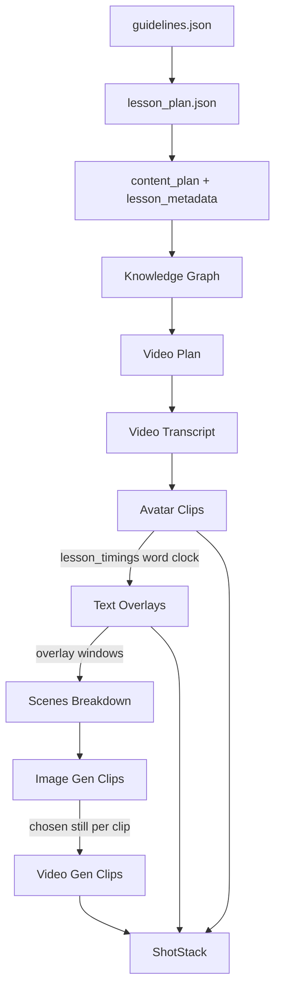

# 00 — Overview: the AP video lesson pipeline

This repo turns a curriculum data model into a narrated, animated video lesson: an MP4 in which a host and a historical figure discuss one learning objective, over generated imagery and motion, with text slides, diagrams and knowledge-check questions overlaid, plus subtitles, thumbnails and per-section splits staged for delivery.

- **The curriculum data model is the lesson's specification.**
  - It fixes the unit, chapter, section and subsection hierarchy, the learning objectives, the concepts under each, the misconceptions and the assessment boundaries.
  - It supplies no narration, no imagery, no clock and no video.
  - The pipeline's job is to manufacture everything the data model could not carry, and to leave the hierarchy it states alone — the split every stage doc is organised around.
- **These docs own structure: stage responsibilities, module boundaries, data contracts, design rationale.**
  - They do not own how to run the thing on a fresh machine; that is [generation/README.md](../../README.md).
  - There is no deployment surface. This pipeline is run from a shell, on one machine at a time, by a person.
- **Code is anchored as `path/file.py::symbol`, never by line number.**
  - Line numbers in this repo rot within days.
  - Paths are relative to `generation/`, so `stages/scenes_breakdown.py::generate_clips` is `generation/stages/scenes_breakdown.py`. Inside the table in [11](11-support-layer.md) that inventories `core/`, paths are relative to `core/`; nowhere else drops a prefix.
  - When a doc and the code disagree, the code is truth and the doc is the bug.
  - `python docs/architecture/check_anchors.py` checks every anchor in this set against the source and exits non-zero on any that no longer resolves. Run it after moving or renaming anything the docs name.

## Running the pipeline

`python run.py` is the entry point and the whole orchestrator. [generation/README.md](../../README.md) has the invocations; what follows is the behaviour they inherit.

- **What runs is chosen on the command line, not by editing code.**
  - `config/courses.py::get_execution_input` turns a subject string like `"AP US History - v2"` into the `ExecutionInput` dict, picking course and curriculum out of the hardcoded `config/courses.py::data_list` by the subject's base name.
  - `run.py::selected` filters the course's subsections by `--unit`, `--chapter`, `--section` and `--subsection`. Asking for nothing that exists is an error, not a silent no-op.
  - A versioned subject starts from the `v0` corpus: `run.py::main` copies the `- v0` prefix into the new version's if it does not exist yet, which is idempotent and skipped otherwise.
- **`run.py` loads `.env` before it imports anything else**, from `generation/` first and the repository root second. It has to be first, because `core/constants.py` reads the environment at module scope ([11](11-support-layer.md)).
- **Two storage backends, chosen by `STORAGE`.** Under `s3` every artifact lives in the bucket; under `local` everything lives in a folder, the vendor stages that have no local equivalent are skipped, and ShotStack is swapped for `stages/local_render.py` ([13](13-generation-layout.md)).

## The pipeline, in order

    guidelines.json → lesson_plan.json → content_plan + lesson_metadata
        → Knowledge Graph → Video Plan → Video Transcript → Avatar Clips
        → Text Overlays → Scenes Breakdown → Image Gen Clips → Video Gen Clips → ShotStack

- **The first row is upstream prerequisite work and is not part of the nine ([01](01-upstream.md)).**
  - It runs per course or per chapter, not per lesson, and `run.py` does not run it. The scripts live in `ops/authoring/`.
  - A lesson run assumes all three artifacts already exist in storage and fails on the read if they do not.
- **The last nine are the pipeline proper, and they are a list in a JSON file.**
  - `config/stages.json` under `content.subsection` is the definition: nine entries, each `{"title": ..., "type": "custom"}`.
  - `run.py::pipeline` reads that list in order, and `run.py::run_lesson` walks it for one subsection.
  - Each title is resolved to a callable through `run.py::STAGES`, a dict of title to stage function.
  - Adding a stage means adding a config entry and a `STAGES` entry. Nothing else knows the list exists.
- **The config's order is the pipeline's order, and it is not the order `STAGES` is written in.**
  - `config/stages.json` lists Text Overlays before Scenes Breakdown; `run.py::STAGES` does not, and it does not matter. The config is what `run.py::pipeline` iterates, so the config wins. The dict is a lookup table and its literal order means nothing.
- **Three of these orderings are load-bearing.**
  - Avatar Clips before Text Overlays: Avatar Clips produces `lesson_timings`, the word-level clock for the whole lesson, and Text Overlays has no other way to turn an LLM's chosen phrase into a timestamp.
  - Text Overlays before Scenes Breakdown: the clip splitter reads the overlay manifest to carve the transcript around the windows already occupied by slides and diagrams.
  - Image Gen Clips before Video Gen Clips: motion generation is image-to-video and starts from the chosen still.

## The stage contract

- **Every stage is one function with the same shape: `f(output_level, output_type, inputs) -> dict`.**
  - `run.py::run_stage` is the only caller. It looks the stage up in `run.py::STAGES`, calls it, and saves what comes back.
  - `output_level` is always the string `"subsection"` and `output_type` is the stage's own title. Every stage declares the first parameter as `output_path` and every stage ignores both.
  - `inputs` is the uppercase dict built by `run.py::placeholders` — the lesson hierarchy plus the lesson plan slices, with keys like `SUBSECTION_TITLE`.
  - Each stage's first act is to rebuild that into a typed context: `core/context.py::APVideoContext`, whose `root_validator` maps the uppercase placeholder names onto its own fields.
- **The returned dict is the stage's artifact, and the stage does not save it.**
  - `run.py::run_stage` writes it to `contents/subsection/{output_type}/{key}.json`, at the path `run.py::artifact_path` builds.
  - A stage that writes binary media uploads that itself, but the JSON manifest always goes back through the caller.
- **Stages communicate only through storage, never through return values.**
  - `run.py::run_lesson` does accumulate each stage's return into a `content` dict and pass it forward as the `SUBSECTION_CONTENT` placeholder, but no video stage reads it.
  - Every stage re-reads its inputs through `APVideoContext` properties.
  - This is why any stage can be rerun alone, and why a hand-edited artifact is picked up by whatever runs next.
- **Skip-if-exists and retry live in exactly one place.**
  - `run.py::run_stage` returns the cached JSON when `contents/subsection/{output_type}/{key}.json` already exists, without calling the stage at all. `--force` overrides it.
  - It carries `@retry(stop_after_attempt(3), wait_exponential)`, so a stage that raises is called up to three times before the exception escapes.
  - No stage implements its own JSON-level skip. Several implement a finer-grained per-clip skip on top; those are named in the stage docs.
- **Only JSON is skipped. Media is not.**
  - Every mp3, mp4, mov and png is regenerated and re-uploaded on any run that reaches its stage, at full vendor cost.
  - Deleting a stage's JSON to force a rerun therefore re-buys all of that stage's media.

## Where every artifact lives

- **Every path is `{curriculum}/{course}/{subject}/...` in the bucket named by `S3_BUCKET`.**
  - `core/path.py::get_content_path` builds the content paths; the media paths are f-strings on `APVideoContext`.
  - To find which stage writes a file, find the file here.

| Stage | Config entry | Callable | `APVideoContext` property | S3 artifact |
| --- | --- | --- | --- | --- |
| 1 | Knowledge Graph | `stages/knowledge_graph.py::generate_lesson_knowledge_graph` | `kg_path` | `contents/subsection/Knowledge Graph/{key}.json` |
| 2 | Video Plan | `stages/video_plan.py::generate_lesson_video_plan` | `video_plan_path` | `contents/subsection/Video Plan/{key}.json` |
| 3 | Video Transcript | `stages/transcript.py::generate_lesson_transcript` | `transcripts_path` | `contents/subsection/Video Transcript/{key}.json` |
| 4 | Avatar Clips | `stages/avatar_clips.py::generate_avatar_assets` | `avatar_assets_path` | `contents/subsection/Avatar Clips/{key}.json` |
| 5 | Text Overlays | `stages/text_overlays.py::generate_text_overlays` | `text_overlays_path` | `contents/subsection/Text Overlays/{key}.json` |
| 6 | Scenes Breakdown | `stages/scenes_breakdown.py::generate_clips` | `clips_path` | `contents/subsection/Scenes Breakdown/{key}.json` |
| 7 | Image Gen Clips | `stages/image_clips.py::generate_all_images` | `image_json_path` | `contents/subsection/Image Gen Clips/{key}.json` |
| 8 | Video Gen Clips | `stages/video_clips.py::generate_all_videos` | `video_json_path` | `contents/subsection/Video Gen Clips/{key}.json` |
| 9 | ShotStack | `stages/shotstack.py::generate_lesson_video` | `shotstack_json_path` | `contents/subsection/ShotStack/{key}.json` |

Upstream, and not owned by any of the nine:

| Artifact | Written by | Path |
| --- | --- | --- |
| Guidelines | `core/guidelines.py::parse_csv_with_combined_header`, by hand | `{curriculum}/{course}/{subject}/guidelines.json` |
| Lesson plan shard | `ops/authoring/lesson_plan.py::APVideosLessonPlanner.generate_lesson_plan` | `lesson-plan/ap-video-data/{unit}_{chapter}.json` |
| Lesson plan | `ops/authoring/lesson_plan.py::APVideosLessonPlanner.aggregate_ap_video_lesson_plan` | `lesson_plan.json` |
| Content plan | `ops/authoring/content_plan.py::APVideosContentPlanner.generate_content_plan` | `contents/subsection/content_plan/{key}.json` |
| Lesson metadata | `ops/authoring/metadata.py::generate_lesson_metadata` | `contents/subsection/lesson_metadata/{key} - v{N}.json` |

Binary media, all under one prefix:

| Media | Written by | Path under `media/{key}/` |
| --- | --- | --- |
| Segment audio | Avatar Clips | `{segment}.mp3` |
| Character portraits | Avatar Clips | `character_images/{uuid}.png` |
| Talking-head clips | Avatar Clips | `avatar_assets/{segment}.mp4` |
| Avatar intro cards | Avatar Clips | `Avatar/Introduction/{id}.mov` |
| Text slides | Text Overlays | `TextSlides/{id}.mov` |
| Diagrams | Text Overlays | `Diagrams/{id}.mov` |
| Conclusion slide | Text Overlays | `ConclusionSlides/{id}.mp4` |
| Per-clip stills | Image Gen Clips | `images/{media.id}/{media.id}.png` and `.json` |
| Per-clip motion | Video Gen Clips | `videos/{media.id}/{media.id}-v{N}-{retry}.mp4` and `.json` |
| Finished lesson | ShotStack | `{subsection}.mp4` |

The finished lesson is also copied to the public viewer bucket named by `S3_BUCKET_UI`, with subtitles, per-section splits and thumbnails; that layout is in [10](10-shotstack.md).

## The key

- **`{key}` is the lesson's identity and it appears in every artifact path.**
  - `hash_code(get_key([unit, chapter, section, subsection]))`, that is `core/hash.py::hash_code` over `core/path.py::get_key`.
  - `get_key` is `"-".join(titles)` — the four titles joined with hyphens, with no normalisation of case, whitespace or punctuation.
  - `hash_code` is SHA-256 hex truncated to the first 8 characters.
  - It is exposed as the `key` property on `core/context.py::Context`, which is the one place it is computed.
- **Renaming a subsection in the curriculum data model creates a new lesson.**
  - Every artifact for the old title stays under the old hash, orphaned, and the pipeline regenerates all nine stages from scratch under the new one.
  - The derivation runs one way. To map a hash back to a title, re-hash the candidates.
- **Media ids are hashed separately.**
  - `core/hash.py::hash_image_description` lowercases and underscores a description before hashing it, so a clip's `media.id` is stable across lessons that describe the same visual.

## The human edit loop

- **A generated artifact can be corrected by hand, and the convention is a sidecar.**
  - Six `APVideoContext` properties prefer `{key}-edited.json` over `{key}.json` when the sidecar exists: `content_plan_path`, `video_plan_path`, `transcripts_path`, `clips_path`, `avatar_assets_path`, `text_overlays_path`.
  - The Streamlit reviewer, `ops/review/app.py`, is what writes them ([12](12-operator-tooling.md)).
- **The skip check does not know about sidecars, and this asymmetry is the most common way to confuse a run.**
  - `run.py::run_stage` tests only the canonical `{key}.json`.
  - So an edited sidecar does not stop the stage regenerating, and deleting only the canonical file leaves a stale sidecar that every downstream stage will still prefer.
  - To genuinely redo a stage, delete both.

## Traps

Each of these is silent — the run does not stop and the log does not say so.

- **`stages/text_overlays.py::slides_timings_identifier` and `::identify_diagram_timings` contain `input("Check Timings")` calls.**
  - They are off unless `REVIEW_TIMINGS` is set, because as written they cannot survive the worker pool they run inside. Set it and a non-interactive run blocks forever on stdin rather than failing.
- **`stages/video_clips.py::generate_ai_video_with_qc` returns before its QC branch.**
  - The Gemini quality check runs, and its verdict is discarded. No video is ever regenerated on a QC failure, and the reimagine path below the return is dead.
- **One stage raising kills the rest of that lesson but not the batch.**
  - `run.py::run_lesson` has no per-stage try/except, deliberately: a failure in stage 4 means stages 5 to 9 read what stage 4 did not write.
  - `run.py::main` catches per lesson, logs, notifies and continues with the others.
- **`core/clients/s3.py` hardcodes `gen-ai-textbooks-dev` as a default in `create_presigned_url` and `download`.**
  - Those calls ignore `S3_BUCKET`, so a run against another bucket can read from dev without saying so.

## Repo map

This is the inventory of what the pipeline uses, by role. If a module is not here, it is not part of this pipeline. [13](13-generation-layout.md) covers the folder layout and the rules that hold it together.

| Folder | Holds |
| --- | --- |
| `run.py` | the orchestrator: stage order, the dispatch table, skip, retry, the CLI, the worker pool |
| `config/` | `config/stages.json`, the nine-entry stage list, and `config/courses.py`, the course and curriculum presets |
| `stages/` | the nine stages, one module each, plus `stages/local_render.py` |
| `prompts/` | every prompt string, one module per stage |
| `templates/` | the Jinja2 HTML that becomes overlay video, and `templates/diagrams/` for the five diagram types |
| `core/` | everything more than one stage needs: storage, models, media manufacture, plumbing ([11](11-support-layer.md)) |
| `ops/` | the human-run scripts: review, repair, authoring, quality, delivery, feedback, media ([12](12-operator-tooling.md)) |
| `tools/` | the checks that keep the above honest ([13](13-generation-layout.md)) |
| `docs/` | this set |

## External services

One lesson touches all of these. Auth is environment variables throughout; the full table is in [11](11-support-layer.md).

| Service | Used by | For |
| --- | --- | --- |
| Google Sheets | [02](02-knowledge-graph.md) | the knowledge graph is read from spreadsheets, not generated |
| OpenAI o1, GPT-4o, GPT-4.1 | [03](03-video-plan.md), [04](04-transcript.md), [06](06-text-overlays.md), [07](07-scenes-breakdown.md), [08](08-images.md) | planning, narration, QC, overlay content, clip splitting, prompt rewriting |
| ElevenLabs | [05](05-avatar-clips.md) | speech, and the character alignment the whole lesson clock is derived from |
| D-ID | [05](05-avatar-clips.md) | talking-head video from a portrait and an audio track |
| fal.ai FLUX | [08](08-images.md) | still image generation |
| Google Custom Search | [08](08-images.md) | sourced imagery for maps |
| Kling via fal.ai, Luma | [09](09-videos.md) | image-to-video motion, with Luma as fallback |
| Google Gemini | [09](09-videos.md) | video QC, whose verdict is currently discarded |
| Shotstack | [10](10-shotstack.md) | the final timeline render |
| Playwright and ffmpeg | [05](05-avatar-clips.md), [06](06-text-overlays.md), [10](10-shotstack.md) | HTML to video, and local splitting |
| AWS S3, DynamoDB, SES, CloudWatch | everywhere, under `STORAGE=s3` | artifacts, cost rows, mail, logs |
| Google Chat | `core/notification_system.py` | batch start, per-lesson success and failure |

## Doc index

| Doc | Stage | Covers |
| --- | --- | --- |
| [01 — Upstream](01-upstream.md) | — | The three prerequisites: guidelines, lesson plan, content plan and metadata. Not part of the nine, and not run by `run.py` |
| [02 — Knowledge Graph](02-knowledge-graph.md) | 1 | The facts and their relationships, read out of Google Sheets with no model involved |
| [03 — Video Plan](03-video-plan.md) | 2 | The lesson's shape: sections, concepts, teaching techniques, visuals, historical figures |
| [04 — Video Transcript](04-transcript.md) | 3 | The lesson said out loud, as a host-and-figure dialogue, plus its questions |
| [05 — Avatar Clips](05-avatar-clips.md) | 4 | The voices, the talking heads, and the word clock every later stage times against |
| [06 — Text Overlays](06-text-overlays.md) | 5 | Slides, diagrams and the conclusion, rendered to video and pinned to the clock |
| [07 — Scenes Breakdown](07-scenes-breakdown.md) | 6 | The transcript cut into timed visual clips around the overlay windows |
| [08 — Image Gen Clips](08-images.md) | 7 | One still per clip, generated or sourced, and the QC that picks it |
| [09 — Video Gen Clips](09-videos.md) | 8 | Motion from each chosen still |
| [10 — ShotStack](10-shotstack.md) | 9 | The timeline assembled and rendered, split, subtitled and published |
| [11 — Support layer](11-support-layer.md) | — | `core/`: storage, the model clients, cost, logging, notifications, and every environment variable |
| [12 — Operator tooling](12-operator-tooling.md) | — | `ops/`: the Streamlit reviewer, the `-edited.json` contract, the repair and delivery scripts, and what QC actually gates |
| [13 — Layout](13-generation-layout.md) | — | The folder rules, the two storage backends, and the checks that enforce both |
