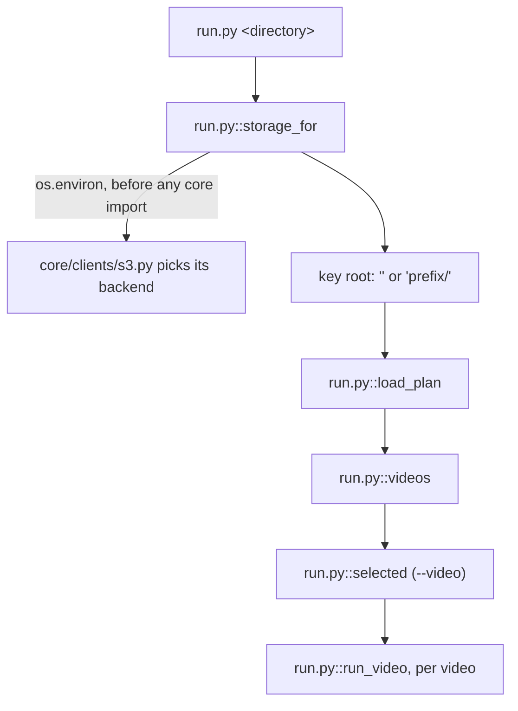

# 01 — Input: the run directory and lesson_plan.json

> What a run reads before the first stage ([00](00-overview.md)). None of this is a stage; `run.py` does it once per invocation, and [03](03-video-plan.md) is the first stage proper.

## What it does

Turns `python run.py <directory>` into a storage backend, a loaded plan, and one `core/context.py::Context` per selected video, each with the folder all of that video's artifacts go into.

## Contract

- **Reads** `{root}lesson_plan.json` from the run directory, and nothing else.
- **Writes** nothing. The plan is read and never written; the stages write into the per-video folders.
- **Produces** a dict of folder to `Context`, handed to `run.py::run_video` one video at a time.

| Step | Code | Result |
| --- | --- | --- |
| Storage | `run.py::storage_for` | `STORAGE`, `S3_BUCKET` or `LOCAL_STORAGE_ROOT` in the environment, and the key root |
| Plan | `run.py::load_plan` | the parsed `lesson_plan.json` |
| Videos | `run.py::videos` | one `Context` per chapter/video, in plan order |
| Selection | `run.py::selected` | the `--video` subset, keyed by folder |

## Flow



## Storage selection

- **The directory argument decides the backend; there is no separate flag.**
  - `s3://bucket/prefix` becomes `STORAGE=s3`, `S3_BUCKET=bucket`, and a key root of `prefix/` (empty when there is no prefix).
  - Anything else is a local path: `STORAGE=local`, `LOCAL_STORAGE_ROOT` set to its absolute path, and an empty key root, because the folder itself is the storage root.
- **It happens at import, not in `main`.**
  - `core/clients/s3.py` reads `STORAGE` at module scope and rebinds itself onto `core/clients/local_store.py` under `local` ([13](13-generation-layout.md)).
  - So `run.py` pre-parses the positional argument with a throwaway parser and updates `os.environ` before its first core import. The real parser in `run.py::build_parser` reads the same argument again inside `run.py::main`.
  - The directory overrides any `STORAGE`, `S3_BUCKET` or `LOCAL_STORAGE_ROOT` in `.env`, because `.env` is loaded first and the update comes after it.

## lesson_plan.json

The format `tools/lore_video_plan.json` is written in, and the one [lore_input_spec.md](../lore_input_spec.md) sets the quality bar for:

```json
{
  "_meta": {"subject": "World History", "subject_profile": "history"},
  "chapters": [
    {
      "chapter": "Chapter 1: The Medieval World",
      "videos": [
        {
          "title": "The World in 1200",
          "lessons": [
            {"name": "Song China in 1200", "concepts": ["One research fact, as a sentence.", "..."]}
          ]
        }
      ]
    }
  ]
}
```

- **Required keys:** `chapters[].chapter`, `chapters[].videos[].title`, `videos[].lessons`, and each lesson's `name`. `concepts` may be absent or contain blanks; blank concepts are dropped.
- **`_meta.subject` and optional `_meta.subject_profile` pick the profile.** `config/subject_profiles.py::resolve_profile` takes an explicit `subject_profile` if given and refuses an unknown one; otherwise it matches the subject name against each profile's aliases and refuses if none matches. The profile id, `history` or `science`, becomes `Context.subject` for every video in the plan.
- **Other keys are carried but not read by `run.py`.** `_meta.purpose`, `chapter_notes`, `hook_idea` and `estimated_concepts` sit in the plan for the authoring tools; `run.py::videos` reads only the keys above.

## Videos and folders

- **Every video in every chapter becomes one `Context`.**
  - `run.py::videos` sets `root`, `folder`, `subject`, `chapter` (the chapter string), `title`, and `lessons` (the video's lesson list, verbatim).
  - `folder` is `c{ci:02d}-v{vi:02d}-{slug(title)}`, where `ci` and `vi` are 1-based chapter and video indexes. `run.py::slug` lowercases, replaces every run of non-alphanumerics with `-`, and caps at 60 characters.
  - The folder is the video's identity: `Context.key` returns it and every artifact path sits below `{root}{folder}/`.
- **`--video` selects by folder prefix or exact title, and is repeatable.**
  - `c01` selects chapter 1; `c01-v02` selects one video; a full title selects that video.
  - No `--video` builds every video in the plan. A `--video` that matches nothing is a parser error pointing at `--dry-run`, which prints every folder and which of its artifacts exist.

## Boundary

- **The Video Plan stage is the only reader of the facts.** `stages/video_plan.py::plan_facts` flattens the video's `lessons[].concepts` and `stages/video_plan.py::format_plan_facts` groups them under each lesson `name` for the planner prompt ([03](03-video-plan.md)).
- **A video with no concepts fails at stage 1**, not at load: `stages/video_plan.py::generate_lesson_video_plan` raises, and `run.py::main` records the failure and continues with the other videos.

## Seams

- **Folder names follow plan order.** Inserting a video or chapter above an existing one renumbers everything after it, and the renumbered videos regenerate from scratch under their new folders.
- **A missing plan is a `SystemExit`** from `run.py::load_plan` naming the run directory, raised before logging or notifications start.
