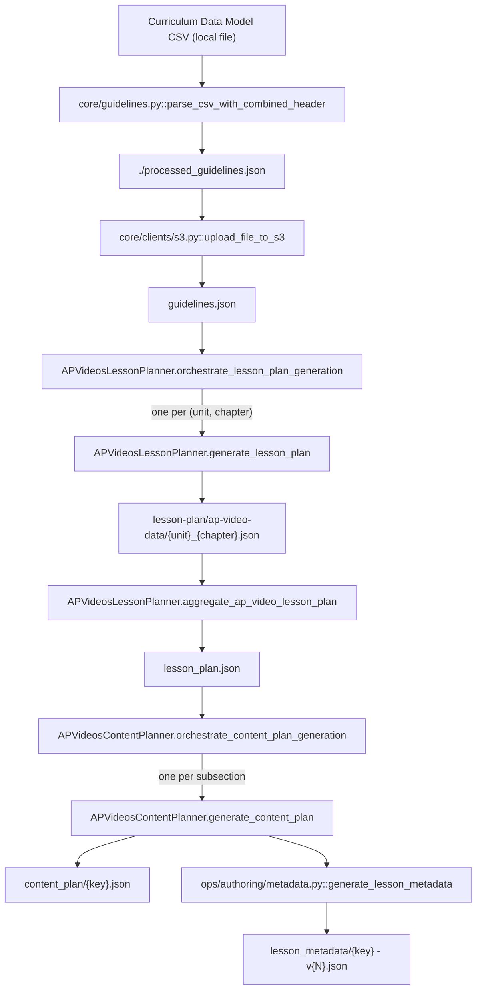

# 01 — Upstream: guidelines, lesson plan, content plan

> Everything the nine stages assume already exists ([00](00-overview.md)). None of this is part of the per-lesson pipeline, and `run.py` does not run any of it. [02](02-knowledge-graph.md) is the first stage proper.

## What it does

Turns a curriculum data model spreadsheet into the three S3 artifacts a lesson run reads before it generates anything: the flattened `guidelines.json`, the `lesson_plan.json` hierarchy that defines what a lesson *is*, and the per-lesson `content_plan` and `lesson_metadata` that the planning stages take as their brief.

## Contract

- **Three artifacts, three different production mechanisms, none of them automatic.**

| Artifact | Path under `{curriculum}/{course}/{subject}/` | Produced by | Granularity |
| --- | --- | --- | --- |
| Guidelines | `guidelines.json` | a developer running `core/guidelines.py` as a script | per course |
| Lesson plan shard | `lesson-plan/ap-video-data/{unit}_{chapter}.json` | `ops/authoring/lesson_plan.py::APVideosLessonPlanner.generate_lesson_plan` | per chapter |
| Lesson plan | `lesson_plan.json` | `ops/authoring/lesson_plan.py::APVideosLessonPlanner.aggregate_ap_video_lesson_plan` | per course |
| Content plan | `contents/subsection/content_plan/{key}.json` | `ops/authoring/content_plan.py::APVideosContentPlanner.generate_content_plan` | per lesson |
| Lesson metadata | `contents/subsection/lesson_metadata/{key} - v{N}.json` | `ops/authoring/metadata.py::generate_lesson_metadata` | per lesson |

- **Each is run by hand, from its own module.**
  - Guidelines: `core/guidelines.py`'s `__main__`.
  - Lesson plan and content plan: the `APVideosLessonPlanner` and `APVideosContentPlanner` methods in `ops/authoring/`, driven from a Python shell.
  - There is no orchestrator for this layer and no CLI. It runs perhaps once per course.
- **A lesson run does not check for any of this.**
  - `run.py::load_plan` loads `lesson_plan.json` and raises if it is absent. Under `STORAGE=local` it raises with the path to copy it to; under `s3` it is a `NoSuchKey`.
  - Stage 2 onward read the content plan and metadata through `APVideoContext` and raise on a missing key.
  - There is no message that says "run the upstream first"; there is a `NoSuchKey`.

## Scope

- **Owns the hierarchy.** Unit, chapter, section, subsection — what a lesson is, and therefore what `{key}` hashes.
- **Owns the mapping from a standards spreadsheet to that hierarchy**, including which rows are excluded from the corpus entirely.
- **Owns nothing about how a lesson is taught or shown.** The content plan is a list of concepts; every decision about sequencing, narration, visuals and timing belongs to the stages.

Not here:

- The knowledge graph, which is read from a different set of spreadsheets and is genuinely stage 1 — [02](02-knowledge-graph.md).
  - The content plan and the knowledge graph both describe "the facts of this lesson" and they come from different sources. That is confusing and it is the actual design.
- Clustering, categorisation and key-concept generation. Other courses derive their hierarchy that way; this one reads it out of the spreadsheet as written.

## Flow



## Layer 1: guidelines

- **`core/guidelines.py::fetch_guidelines` is the only reader, and it special-cases video courses.**
  - When `'Video' in course` it reads `f'{curriculum}/{course}/{subject}/guidelines.json'`.
  - Otherwise it falls back to `core/path.py::get_full_guidelines_path`, a shared default path. Every course this pipeline builds has `Video` in its name, so that branch is never taken here.
  - It then filters by `Course`, `Standards Organization` and `Subject`, and if that filter matches nothing it returns the whole file on the assumption it was already filtered for this input. For the video corpus the filter always matches nothing, so the whole file is what comes back.
- **`core/guidelines.py::parse_csv_with_combined_header` is the producer, and it is a script, not a stage.**
  - Its `__main__` has the CSV path, the course and the subject hardcoded; the checked-in values are for AP Biology.
  - The header is four rows deep: the first is dropped and the remaining three are joined per column with `' | '`, which is why field names in the code look like `"Common Misconceptions | Common Misconception 1"`.
  - `process_data` then groups rows by `(Domain, Subject)` into `chapter` and `unit`, and emits `{"chapter", "unit", "concepts": [...]}`.
- **Four columns decide what is excluded from the corpus, and exclusion is silent.**
  - `Remove L4`, `FRQ Only`, `llm-blacklist-decision`, `human-blacklist-decision`.
  - Any non-empty value in any of them drops the row, with a `print` to stdout and no record in the output.
  - This is the only place the corpus is trimmed, and it happens before anything is versioned.
- **The per-concept fields the downstream planner actually reads:**
  - `Cluster`, `Standard Description (L1)`, `Standard Description (L2)`, `Standard Description (L3)`, `Standard Description Plus`, `Concept`.
  - `Common Misconception 1` through `4`, `BoundaryNotes`.
  - `DomainId`, `ClusterId`, `StandardId`.

## Layer 2: lesson plan

- **`ops/authoring/lesson_plan.py::APVideosLessonPlanner` is three static methods, run in order.**
  - `orchestrate_lesson_plan_generation` reads the guidelines and returns one work item per unique `(unit, chapter)` pair.
  - `generate_lesson_plan` builds one chapter's slice of the hierarchy and writes it as a shard.
  - `aggregate_ap_video_lesson_plan` merges every shard in `lesson-plan/ap-video-data/` into `lesson_plan.json`.
- **The hierarchy mapping is fixed, and it is the whole point of this layer.**
  - `Cluster` becomes a Section.
  - `Standard Description (L1)` becomes a Subsection — this is the lesson, and its text is the learning objective a video is made for.
  - Beneath that, concepts nest under `Standard Description (L3)` then `Standard Description Plus`, or directly under `Standard Description Plus` when the chapter defines no L3 at all. `generate_lesson_plan` decides with `any_l3s_defined`, so the depth of the `Concepts` tree varies by chapter.
- **Misconceptions and boundary notes are accumulated as sets, then listed.**
  - Every column starting `Common Misconception` and every column starting `BoundaryNotes` is swept, so adding a fifth misconception column needs no code change.
  - Because they are sets, order is not stable between runs.
- **The shard is the skip unit.**
  - `generate_lesson_plan` returns early when `lesson-plan/ap-video-data/{unit}_{chapter}.json` exists.
  - Re-running a chapter therefore requires deleting its shard, and re-running the aggregate is what publishes it.
- **`aggregate_ap_video_lesson_plan` writes with no skip check at all.**
  - It reads whatever shards are present and overwrites `lesson_plan.json`.
  - A half-generated set of shards produces a valid, short lesson plan, and the pipeline will happily generate the lessons it contains.

The published shape, which is what `segment.py` walks and what every `get_*_lesson_plan` helper in `core/lesson_plan.py` navigates:

```json
{
  "Units": {
    "<unit>": {
      "Chapters": {
        "<chapter>": {
          "Sections": {
            "<section>": {
              "Subsections": {
                "<subsection>": {
                  "Concepts": { "...": "nested L3/L4 tree of concept strings" },
                  "Misconceptions": ["..."],
                  "BoundaryNotes": ["..."],
                  "DomainId": "...", "ClusterId": "...", "StandardId": "..."
                }
              }
            }
          }
        }
      }
    }
  }
}
```

## Layer 3: content plan and metadata

- **`ops/authoring/content_plan.py::APVideosContentPlanner.generate_content_plan` does two unrelated things and skips them independently.**
  - It writes the content plan, which is a straight copy of the subsection's `Concepts` subtree to `contents/subsection/content_plan/{key}.json`. No model is involved.
  - It calls `ops/authoring/metadata.py::generate_lesson_metadata`, which is where the LLM work is.
  - Each is guarded by its own `does_file_exist`, and the method returns early only when both exist.
- **`generate_lesson_metadata` is the one upstream step that generates rather than copies.**
  - It produces `lesson_metadata`: `lesson_title`, `boundaries_and_purpose`, `perspective_guidance`, and `key_concepts`, alongside `key_concepts_feedback` and `key_phrases_feedback`.
  - It uses `LLM.GPT_5` through `core/clients/openai.py`, with the older manual QC loop bounded by `core/stage_constants.py::NUMBER_OF_QC_ITERATIONS`.
  - It is the only caller of `APVideoContext.metadata_path`, which is versioned: the property walks `{key} - v1.json`, `{key} - v2.json` and so on and returns the highest that exists, so writing a new version is how metadata is superseded rather than replaced.
- **`ops/authoring/metadata.py` is not a stage**, and it lives in `ops/` rather than `stages/` to say so. `run.py::STAGES` does not list it; `APVideosContentPlanner.generate_content_plan` is its only caller.
- **`aggregate_content_plan` does not aggregate.**
  - It delegates entirely to `ops/quality/chapter_reviewer.py::chapter_level_review`, a chapter-wide metadata review that uses embeddings to find and fix inconsistencies across a chapter's lessons.
  - The comment in the method says the old implementation also dumped content plans into the lesson plan; that half is gone.

## Rules

- **The hierarchy is read, not derived.** `APVideosLessonPlanner.orchestrate_lesson_plan_generation` hardcodes the `unit` and `chapter` keys that `process_data` emits. There is no configuration for which spreadsheet columns become which level; changing that means changing `core/guidelines.py::process_data` and the planner together.
- **`config/stages.json` describes the nine stages and nothing else.** It is read in exactly one place, `run.py::pipeline`, and only for `content.subsection`. No upstream step is configured.

## External dependencies

- **Guidelines: none beyond S3.** The CSV is a local file and the parse is stdlib `csv` and `json`.
- **Lesson plan: none beyond S3.** No model reads the guidelines; the hierarchy is a deterministic regrouping.
- **Content plan: none for the plan itself.** The copy is S3 to S3.
- **Metadata: OpenAI**, through `core/clients/openai.py`, plus S3.
- **Chapter review**: embeddings and Google Sheets, through `ops/quality/chapter_reviewer.py`.

## Boundary

- **Downstream reads `lesson_plan.json` for structure and `content_plan/{key}.json` for substance.**
  - `run.py::lessons` reads only the four levels of titles out of the lesson plan; it never looks at Concepts.
  - `run.py::placeholders` slices the lesson plan four ways through `core/lesson_plan.py` and passes those slices as `UNIT_LESSON_PLAN`, `CHAPTER_LESSON_PLAN`, `SECTION_LESSON_PLAN` placeholders.
- **The `SUBSECTION_CONCEPTS` placeholder is empty for this config, and no video stage misses it.**
  - `run.py::placeholders` fills it from `subsection.get("ContentPlan", [])`, but the video lesson plan stores that subtree under `Concepts`.
  - Stages that want the content plan read `APVideoContext.content_plan_path` from S3 instead, which is why the mismatch has never mattered.
- **`{key}` is fixed here, once, by the four titles this layer chooses.**
  - Every artifact in [02](02-knowledge-graph.md) through [10](10-render.md) is filed under it.
  - Changing a Cluster name or an L1 description in the spreadsheet re-keys every lesson beneath it.

## Seams

- **`core/guidelines.py` carries a second, unused vocabulary.**
  - `HIERARCHY_LEVELS`, `transform_into_hierarchial_data`, `flatten_concepts`, `extract_concepts` and `extract_skills` read a `Key Concept N` spreadsheet format that this corpus does not use, and nothing here calls them.
- **`ops/delivery/stele.py` is the publish end of this same data model**, mapping finished lessons back onto the `DomainId` / `ClusterId` / `StandardId` this layer carried down ([12](12-operator-tooling.md)).
