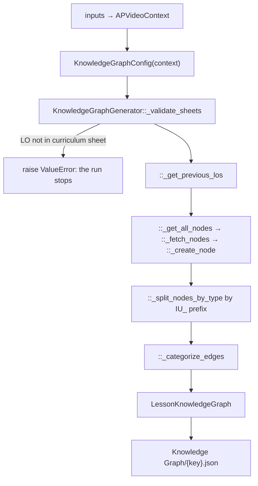

# 02 — Knowledge Graph

> Stage 1 of nine ([00](00-overview.md)). It establishes the facts every later stage is allowed to teach; [03](03-video-plan.md) arranges them into a lesson and [04](04-transcript.md) says them out loud.

## What it does

Reads the lesson's facts and the relationships between them out of Google Sheets, splits them into the facts belonging to this learning objective and the facts carried over from the previous one, and writes them as a graph. No model is involved.

## Contract

- **Its input is not an S3 artifact. It is a spreadsheet.**
  - This is the one stage whose upstream is outside the pipeline entirely: nothing in this repo writes what it reads.
  - `stages/knowledge_graph.py::KnowledgeGraphConfig` holds the spreadsheet ids, keyed by subject in its `SUBJECT_CONFIGS` and resolved per chapter by `::get_spreadsheet_id`.
  - Two sheets are read from the chapter's knowledge-graph spreadsheet: the nodes sheet, `"Final Schema Data Model"`, and the edges sheet, `"7. Relationship Gen Output"` with `"Relationship Gen Output"` as a fallback name.
  - A third spreadsheet, `KnowledgeGraphConfig.LO_ORDER_SHEET_CONFIG`, gives the curriculum's learning-objective order and is what makes "the previous learning objective" a well-defined thing.
- **Writes one artifact: `contents/subsection/Knowledge Graph/{key}.json`, via `APVideoContext.kg_path`.**
  - `::generate_lesson_knowledge_graph` returns `LessonKnowledgeGraph.model_dump()` and the caller saves it ([00](00-overview.md), the stage contract).
- **Skipped when that file exists**, by `run.py::run_stage`. The stage has no skip logic of its own.
- **It has no `-edited.json` sidecar.**
  - `APVideoContext.kg_path` is one of the two content properties with no edited-file branch, the other being `context_pack_path`.
  - A wrong fact is corrected in the spreadsheet and the artifact deleted, not patched in S3.

## Scope

- **Owns what is true.** Every fact any later stage teaches traces to a node here.
- **Owns the boundary of the lesson**: which facts belong to this learning objective, which belong to the previous one and are available for continuity, and which are cross-unit.
- **Owns refusal on a broken spreadsheet.** `KnowledgeGraphGenerator::_validate_sheets` raises rather than generating a partial graph.

Not here:

- Which facts get taught, in what order, or grouped how — [03](03-video-plan.md).
- Any wording a viewer will hear. A node's `fact_text` is a statement, not narration — [04](04-transcript.md).
- Any visual. `theme` and `classification` on a node are metadata, not a picture.
- The content plan, which also describes this lesson's concepts and comes from the lesson plan rather than these sheets — [01](01-upstream.md).
  - Two descriptions of "the facts of this lesson", from two sources, is the genuine shape of the system.

## Flow



## Design decisions

- **No model reads the curriculum.**
  - The whole stage is deterministic sheet reading, filtering and grouping.
  - The facts a lesson may assert are therefore authored by subject-matter experts in a spreadsheet, and nothing downstream can invent one — [03](03-video-plan.md) is checked against this file for exactly that reason.
  - This is surprising in a pipeline otherwise built out of LLM calls, and it is the strongest guarantee in the system.

- **A node is identified by its id, and the id prefix carries meaning.**
  - `KnowledgeGraphConfig::xu_prefix` is `IU_`. `::_split_nodes_by_type` puts prefixed nodes in `xu_facts` and the rest in `lo_nodes`.
  - So "is this fact from another unit" is a string test on an id, not a field.

- **Edges are categorised by which side of the lesson boundary they touch.**
  - `::_categorize_edges` puts an edge into `lo_edges` when both ends are in this learning objective, and into `iu_edges` when it bridges to the previous one.
  - An edge to a node in neither is dropped.
  - This is what lets [03](03-video-plan.md) distinguish `fact_relationships` from `intra_unit_relationships` without knowing anything about units.

- **"The previous learning objective" is resolved from the curriculum sheet, not from the lesson plan.**
  - `::_get_previous_los` looks the current objective up in the LO-order spreadsheet and takes what precedes it.
  - The lesson plan's ordering is not consulted, so the two can disagree, and the sheet wins.

- **String matching is fuzzy on purpose, and centralised.**
  - `::_strings_equal` and `::_string_contains` are static helpers used for every sheet comparison.
  - Learning-objective text is copied between spreadsheets by hand, so exact equality would fail on whitespace and casing.

- **The graph carries a rendered form of itself.**
  - `graph_repr` is a computed string summary written alongside the structured fields.
  - It exists so a prompt can include the graph without a caller having to serialise it, which is how [03](03-video-plan.md) passes it to the model.

## Layers

In the order `::generate_lesson_knowledge_graph` walks them:

- `KnowledgeGraphConfig` — the subject-to-spreadsheet map, the sheet names, the `IU_` prefix, and two lazily-built `core/clients/gsheet.py::GoogleSheetsClient` instances (`::kg_sheets_client`, `::curriculum_sheets_client`).
  - Knows where the data is, not what it means.
- `KnowledgeGraphGenerator::generate` — the sequence: validate, find previous objectives, fetch nodes, split, categorise edges, build the model.
- `::_validate_sheets` — every learning objective in the nodes sheet must exist in the curriculum sheet.
- `::_get_previous_los` — the `(objective, section)` pairs preceding this lesson.
- `::_fetch_nodes` and `::_create_node` — sheet rows to `KGNode`.
- `::_categorize_edges` — rows to `lo_edges` and `iu_edges`.
- `::_log_generation_summary` — the counts that make a thin graph visible in CloudWatch.
- `core/types.py::LessonKnowledgeGraph` — the artifact, plus the post-hoc helpers `::correct_kg_facts` and `::find_redundant_facts` which are used by [03](03-video-plan.md) rather than here.

## Rules

Blocking:

- **A learning objective in the nodes sheet that the curriculum sheet does not have — `ValueError` from `::_validate_sheets`.**
- **No nodes for this lesson's `(objective, section)` pair — `ValueError`.**
  - Both are raised before anything is written, so a bad sheet leaves no partial artifact.
  - `run.py::run_stage` will retry twice more and then let the exception escape, which aborts the remaining eight stages for this lesson.

Warn-only:

- **Nothing.** There is no advisory lane in this stage.

## Artifact

`LessonKnowledgeGraph`, dumped flat with no wrapper:

```json
{
  "lo_nodes": [
    { "id": "...", "fact_text": "...", "is_definition": false,
      "theme": "...", "classification": "..." }
  ],
  "lo_edges": [
    { "type": "...", "explanation": "...", "strength": "...", "direction": "...",
      "source_id": "...", "target_id": "...",
      "source_statement": "...", "target_statement": "..." }
  ],
  "iu_edges": [ "same shape as lo_edges, or null" ],
  "xu_facts": [ "same shape as lo_nodes, ids prefixed IU_, or null" ],
  "graph_repr": "computed string summary"
}
```

## External dependencies

- **Google Sheets API**, through `core/clients/gsheet.py::GoogleSheetsClient`.
  - Service-account credentials are assembled from environment variables by `core/google_api_utils.py::construct_service_account_dict` — the six `GOOGLE_*` variables in [11](11-support-layer.md).
- **S3**, for the write only, and only via the caller.
- **No LLM. No image, audio or video service. No local binary.**

## Boundary

- **Two stages read this file and they read different parts of it.**
  - [03](03-video-plan.md) loads it as `LessonKnowledgeGraph` and uses `lo_nodes` as the pool of facts a plan may cite, `lo_edges` and `iu_edges` as the relationships it may draw on, and `::correct_kg_facts` to check the plan's quoted facts back against the node text.
  - [04](04-transcript.md) reads it alongside the video plan for the same fact text.
- **A plan may only cite facts that exist here, and that is enforced after the fact rather than in the prompt.**
  - `stages/video_plan.py::sequencing_and_grouping` fuzzy-matches the model's facts against the nodes and feeds anything unmatched back as QC context.
  - So the guarantee is "a cited fact was checked", not "a cited fact is verbatim".
- **Nothing downstream reads the spreadsheets.**
  - Anything a later stage needs about the curriculum has to be a field on this artifact.

## Seams

- **The spreadsheet ids are hardcoded per subject in `KnowledgeGraphConfig.SUBJECT_CONFIGS`.**
  - Onboarding a subject means editing this class, not configuration.
- **`::find_redundant_facts` has no caller in this stage.**
  - It hangs on the model and is invoked from the planning stage.
