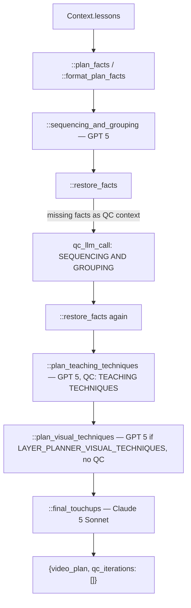

# 03 — Video Plan

> Stage 1 of eight ([00](00-overview.md)). It shapes the video's research facts from `lesson_plan.json`; [04](04-transcript.md) turns that shape into research notes for the narration and [06](06-text-overlays.md) reads its titles.

## What it does

Turns the flat list of research facts under one video of `lesson_plan.json` into sections and concepts, orders them, picks teaching techniques per concept, optionally a visual form per concept, and simplifies the lesson and section titles.

## Contract

- **Reads no artifact.** The input is `core/context.py::Context.lessons`, the plan's lesson list for this video.
  - `stages/video_plan.py::plan_facts` flattens every non-blank concept sentence of every lesson, in plan order.
  - `::format_plan_facts` renders them for the prompt, grouped under `Lesson: <name>`.
  - The input format is [../lore_input_spec.md](../lore_input_spec.md).
- **Writes `{video folder}/Video Plan.json`**, via `Context.artifact_path` in `run.py::run_stage`.
  - The artifact is wrapped: `{"video_plan": {...}, "qc_iterations": []}`. Consumers read `load_json_from_s3(context.video_plan_path)['video_plan']`.
  - `qc_iterations` is always an empty list. No consumer reads it; it is not a record of the QC that ran.
- **Downstream honours `Video Plan-edited.json`.** `Context.video_plan_path` goes through `Context.reviewed_path`, so a hand-edited sidecar wins for [04](04-transcript.md) and [06](06-text-overlays.md).
- **Skipped when the canonical `Video Plan.json` exists**, unless `--force`.
- **Raises when the video has no concepts**, before any model call.

## Scope

- **Owns grouping and order.** Which facts form a concept, which concepts form a section, and in what order.
- **Owns grounding.** Every planned fact is put back to the verbatim research sentence.
- **Owns the on-screen naming.** Every `simple_title` is written here.

Not here:

- Any sentence a viewer hears — [04](04-transcript.md). The narration engine regroups the concepts into its own movements.
- Any asset. `visual` is a declaration; nothing is drawn — [06](06-text-overlays.md).
- Any timing. There is no clock until [05](05-avatar-clips.md).
- New facts. A plan may not introduce one.

## Flow



## Design decisions

- **The plan is built in four model passes, each narrowing the previous.**
  - `::sequencing_and_grouping` decides sections, concepts and their order.
  - `::plan_teaching_techniques` adds techniques and suggestions per concept.
  - `::plan_visual_techniques` merges the techniques onto the plan and, when the layer is on, adds a visual per concept.
  - `::final_touchups` adds `simple_title` to the lesson and each section.
  - Splitting them keeps the QC criteria per pass meaningful.

- **Grounding is repaired after generation, not constrained during it.**
  - `::restore_facts` fuzzy-matches each research fact against every planned fact (`fuzz.ratio`, `::FACT_MATCH_THRESHOLD` = 90) and overwrites the best match with the verbatim research text.
  - Research facts that match nothing are passed to the sequencing QC finder as `prompts/video_planner_prompts.py::VIDEO_PLANNER_MISSING_FACTS`, which is what activates the otherwise-passing "Complete Facts Coverage" criterion.

- **QC is one finder call and at most one fixer call.**
  - `core/helpers.py::qc_llm_call` runs a finder with the pass's criteria from `prompts/qc_prompts.py::content_guidelines` (`VideoPlan` is its only entry). Any `FAIL` replays one fixer call, `prompts/qc_prompts.py::VIDEOPLAN_FIXER_USER_PROMPT`, on the pass's history and model.
  - The finder runs on `LLM.CLAUDE_5_OPUS` for `VideoPlan`.

- **Visuals are a layer.** `LAYER_PLANNER_VISUAL_TECHNIQUES` off skips the visual call and leaves every `concept.visual` null. The `lore` video type turns it off.

## Layers

In the order `::generate_lesson_video_plan` walks them:

- `::plan_facts`, `::format_plan_facts` — the input.
- `::sequencing_and_grouping` — `prompts/video_planner_prompts.py::VIDEO_PLANNER_SYSTEM_PROMPT` (formatted with `Context.subject`), the few-shot `::video_planner_history`, `::VIDEO_PLANNER_USER_PROMPT`.
- `::restore_facts` — the deterministic grounding pass.
- `::format_syllabus_grouping` — renders the structure (and techniques) as the text the later passes see.
- `::plan_teaching_techniques` — `::TEACHING_TECHNIQUE_SYSTEM_PROMPT`, `::TEACHING_TECHNIQUE_USER_PROMPT`.
- `::plan_visual_techniques` — `::VISUAL_ORGANIZER_SYSTEM_PROMPT`, `::VISUAL_ORGANIZER_USER_PROMPT`.
- `::final_touchups` — `::FINAL_TOUCHUPS_SYSTEM_PROMPT`, `::FINAL_TOUCHUPS_USER_PROMPT`, straight through `core/clients/openai.py::llm_complete`.
- `core/types.py::VideoPlan` and the `TeachingTechnique`, `VisualType` and `DiagramType` enums — the artifact's vocabulary.

## Rules

| Pass | Model | QC |
| --- | --- | --- |
| `::sequencing_and_grouping` | `LLM.GPT_5` | `qc_llm_call("VideoPlan", "SEQUENCING AND GROUPING")` |
| `::plan_teaching_techniques` | `LLM.GPT_5` | `qc_llm_call("VideoPlan", "TEACHING TECHNIQUES")` |
| `::plan_visual_techniques` | `LLM.GPT_5`, only if the layer is on | none |
| `::final_touchups` | `LLM.CLAUDE_5_SONNET` | none |

- **QC can revise but cannot reject.** If the fix is also bad, the plan ships.
- **The blocking failures are structural**: no concepts for the video, or a response that will not parse into `VideoPlan`. `run.py::run_stage` retries the whole stage up to three times.

## Artifact

```json
{
  "video_plan": {
    "lesson_title": "...",
    "simple_title": "...",
    "section_justifications": { "for_grouping": "...", "for_ordering": "..." },
    "sections": [
      {
        "section_title": "...",
        "simple_title": "...",
        "concept_justifications": { "for_grouping": "...", "for_ordering": "..." },
        "concepts": [
          {
            "concept_name": "...",
            "concept": "...",
            "facts": ["verbatim research fact"],
            "teaching_techniques": [{ "choice": "<TeachingTechnique>", "suggestion": "..." }],
            "visual": { "type": "<VisualType>", "diagram_type": "<DiagramType>", "justification": "..." }
          }
        ]
      }
    ]
  },
  "qc_iterations": []
}
```

`visual` is `null` when `LAYER_PLANNER_VISUAL_TECHNIQUES` is off.

## External dependencies

- **GPT 5** for three passes and **Claude 5 Sonnet** for the touch-ups, through `core/helpers.py::llm_call` / `core/clients/openai.py::llm_complete` and the TrueFoundry gateway.
- **Claude 5 Opus** for the QC finder.
- **Storage**, for the artifact write only.

## Boundary

- **[04](04-transcript.md) reads sections, concepts and facts.** Each concept becomes one research note (`concept_name` plus `facts`), labelled with its section's `simple_title`; the plan's `simple_title` (or `lesson_title`) is the story title.
- **[06](06-text-overlays.md) reads `simple_title`** for the lesson title overlay, and `visual` and section `simple_title` only when its text-slide, infographic or overview layers are on.
- **Nothing downstream re-checks the facts.** `::restore_facts` is the only grounding pass.

## Traps

- **Facts the QC fixer did not restore are dropped silently.** The second `::restore_facts` in `::generate_lesson_video_plan` discards its missing list; nothing logs or raises.
- **Two research facts can land on the same planned slot.** `::restore_facts` picks each fact's best match independently, so the later fact overwrites the earlier one.
- **`teaching_techniques` has no reader.** [04](04-transcript.md) passes only names and facts to the narration engine, so the technique pass and its QC shape nothing downstream.
