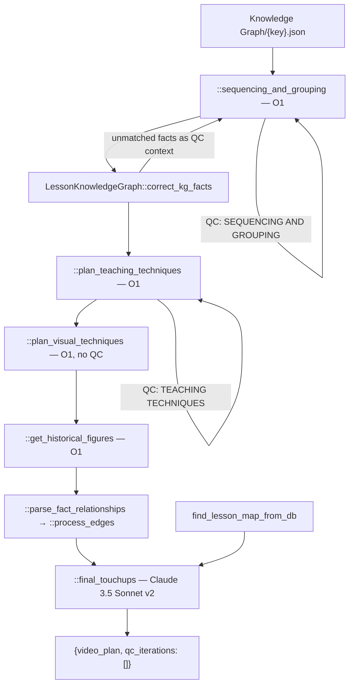

# 03 — Video Plan

> Stage 2 of nine ([00](00-overview.md)). It decides the lesson's shape from the facts [02](02-knowledge-graph.md) established; [04](04-transcript.md) writes the words for that shape and [06](06-text-overlays.md) draws the visuals it specified.

## What it does

Turns a flat set of facts into a taught lesson: groups them into sections and concepts, orders those, chooses a teaching technique and a visual form per concept, assigns a historical figure per section, and simplifies every title for on-screen use.

## Contract

- **Reads one artifact and one database.**
  - `APVideoContext.kg_path`, loaded as `core/types.py::LessonKnowledgeGraph`.
  - `core/clients/images.py::find_lesson_map_from_db`, which answers whether this lesson has a map available and what it depicts. The answer lands on the plan as `included_map`.
  - It does not read the content plan or the lesson metadata, despite both existing by now ([01](01-upstream.md)).
- **Writes `contents/subsection/Video Plan/{key}.json`, via `APVideoContext.video_plan_path`.**
  - The artifact is wrapped: `{"video_plan": {...}, "qc_iterations": []}`.
  - Consumers must reach through the wrapper. [04](04-transcript.md) and [07](07-scenes-breakdown.md) both do `load_json_from_s3(context.video_plan_path)['video_plan']`.
- **`qc_iterations` is always an empty list.**
  - `::generate_lesson_video_plan` initialises a feedback list and never appends to it.
  - The key is vestigial and no consumer reads it. It is not a record of the QC that did run.
- **Honours `-edited.json`.** `video_plan_path` prefers `{key}-edited.json`, which is how a reviewer's re-ordering of sections reaches [04](04-transcript.md).
- **Skipped when the canonical `{key}.json` exists.**

## Scope

- **Owns pedagogy.** What is grouped with what, in what order, taught how, and shown as what.
- **Owns the cast.** Which historical figures appear, per section, which is what makes the transcript a dialogue rather than a monologue.
- **Owns the on-screen naming.** Every `simple_title` is written here, for [06](06-text-overlays.md) to render.
- **Owns the check that the plan is grounded**, by matching its facts back against the knowledge graph.

Not here:

- Any sentence a viewer hears. The plan names concepts and suggests techniques; it writes no narration — [04](04-transcript.md).
- Any asset. `visual.type` and `figure_name` are declarations; nothing is drawn or voiced — [06](06-text-overlays.md), [08](08-images.md).
- Any timing. There is no clock until [05](05-avatar-clips.md).
- The facts themselves — [02](02-knowledge-graph.md). A plan may not introduce one.

## Flow



## Design decisions

- **The plan is built in five passes, each a separate model call, each narrowing the previous.**
  - `::sequencing_and_grouping` decides sections, concepts and their order.
  - `::plan_teaching_techniques` adds a technique and a suggestion per concept.
  - `::plan_visual_techniques` adds a visual form per concept.
  - `::get_historical_figures` assigns a cast per section.
  - `::final_touchups` rewrites titles into `simple_title` fields.
  - Splitting these is what makes the QC criteria per pass meaningful: a sequencing complaint cannot be answered by changing a diagram type.

- **Grounding is checked after generation, not constrained during it.**
  - `LessonKnowledgeGraph::correct_kg_facts` fuzzy-matches every fact the plan quoted back to node text and rewrites near-misses to the canonical wording.
  - Facts that match nothing are passed into the sequencing QC call as extra context, so the model is told which of its citations were not real.
  - The alternative — refusing the plan — was not taken, so a plan can ship with a fact the graph does not contain if QC lets it through.

- **Relationships are derived, not planned.**
  - `::parse_fact_relationships` and `::process_edges` convert the graph's `lo_edges` into `fact_relationships` and its `iu_edges` into `intra_unit_relationships`.
  - No model chooses these. They are the graph's edges, reshaped into the plan's vocabulary so [04](04-transcript.md) can narrate a connection without reading the graph's edge format.

- **QC is one finder call and at most one fixer call.**
  - `core/helpers.py::qc_llm_call` decorates a pass, runs a finder against the guidelines in `prompts/qc_prompts.py::videoplan_guidelines`, and if any criterion returns `FAIL`, replays one fixer call on the same history.
  - There is no iteration count and no second look. This is a deliberate simplification from the older loop still visible in `generate_transcript.py` ([04](04-transcript.md)).
  - The finder uses `LLM.CLAUDE_3_7_SONNET_THINKING` for this stage's criteria.

- **Visual planning is deliberately un-QC'd.**
  - The `@qc_llm_call` decorator on `::plan_visual_techniques` is commented out.
  - So diagram-type choices reach [06](06-text-overlays.md) unreviewed, and that stage's own QC is the first check on them.

- **`included_map` comes from a database, not a model.**
  - `find_lesson_map_from_db` is consulted in `::final_touchups` and the answer is written onto the plan.
  - [07](07-scenes-breakdown.md) branches on it: a lesson with a map gets a bespoke two-clip opening rather than a generic split.

## Layers

In the order `::generate_lesson_video_plan` walks them:

- `::sequencing_and_grouping` — the structural pass, with `prompts/video_planner_prompts.py::VIDEO_PLANNER_SYSTEM_PROMPT`, `::VIDEO_PLANNER_USER_PROMPT` and the few-shot `::video_planner_history`.
- `::format_syllabus_grouping` — renders the graph and the structure-so-far into the text a later pass is shown. Shared by the technique and visual passes.
- `::plan_teaching_techniques` — `::TEACHING_TECHNIQUE_SYSTEM_PROMPT`, `::TEACHING_TECHNIQUE_USER_PROMPT`.
- `::plan_visual_techniques` — `::VISUAL_ORGANIZER_SYSTEM_PROMPT`, `::VISUAL_ORGANIZER_USER_PROMPT`.
- `::get_historical_figures` — `::HISTORICAL_FIGURES_PROMPT` via `::get_historical_figures_prompt`.
- `::process_edges` and `::parse_fact_relationships` — the deterministic edge conversion.
- `::final_touchups` — `::FINAL_TOUCHUPS_SYSTEM_PROMPT`, `::FINAL_TOUCHUPS_USER_PROMPT`, plus the map lookup.
- `core/types.py::VideoPlan` and the `TeachingTechnique` and `VisualType` enums — the artifact's vocabulary.

## Rules

- **The models differ by pass and the split is intentional.**

| Pass | Model | QC |
| --- | --- | --- |
| `::sequencing_and_grouping` | `LLM.O1` | `qc_llm_call("VideoPlan", "SEQUENCING AND GROUPING")` |
| `::plan_teaching_techniques` | `LLM.O1` | `qc_llm_call("VideoPlan", "TEACHING TECHNIQUES")` |
| `::plan_visual_techniques` | `LLM.O1` | none — decorator commented out |
| `::get_historical_figures` | `LLM.O1` | none |
| `::final_touchups` | `LLM.ANTHROPIC_CLAUDE_3_5_SONNET_V2` | none |

- **QC can revise but cannot reject.**
  - A failing criterion produces one fixer call. If the fix is also bad, the plan ships.
  - Nothing in this stage raises on content grounds.
- **The only blocking failures are structural**: a missing knowledge graph artifact, or a model response that will not parse into `VideoPlan`.
  - `run.py::run_stage` retries the whole stage up to three times on either.

## Artifact

```json
{
  "video_plan": {
    "lesson_title": "...",
    "simple_title": "...",
    "included_map": "...",
    "section_justifications": { "for_grouping": "...", "for_ordering": "..." },
    "fact_relationships": [
      { "source_fact": "...", "target_fact": "...",
        "relationship": { "type": "...", "description": "..." } }
    ],
    "intra_unit_relationships": [ "same shape" ],
    "sections": [
      {
        "section_title": "...",
        "simple_title": "...",
        "historical_figures": ["..."],
        "concept_justifications": { "for_grouping": "...", "for_ordering": "..." },
        "concepts": [
          {
            "concept_name": "...",
            "concept": "...",
            "facts": ["verbatim knowledge-graph fact text"],
            "teaching_techniques": [{ "choice": "<TeachingTechnique>", "suggestion": "..." }],
            "visual": { "type": "<VisualType>", "diagram_type": "...", "justification": "..." },
            "figure_name": "... or null",
            "includes_question": true
          }
        ]
      }
    ]
  },
  "qc_iterations": []
}
```

## External dependencies

- **OpenAI o1** for four of the five passes, and **Anthropic Claude 3.5 Sonnet v2** for the fifth, all through `core/helpers.py::llm_call` onto `core/clients/openai.py::llm_complete`.
- **Anthropic Claude 3.7 Sonnet Thinking** for the QC finder and fixer, through `::qc_llm_call`.
- **The lesson map database**, through `core/clients/images.py::find_lesson_map_from_db`.
- **S3**, for the knowledge graph read and the artifact write.

## Boundary

- **Three stages read this artifact, for three different fields.**
  - [04](04-transcript.md) reads the whole structure: sections, concepts, facts, techniques and `historical_figures`, which is what makes the transcript a dialogue.
  - [06](06-text-overlays.md) reads `visual` to decide which concepts get a text slide and which get a diagram, and `simple_title` for what appears on them.
  - [07](07-scenes-breakdown.md) reads `included_map` only.
- **`teaching_techniques[].suggestion` is advice, not instruction.**
  - It reaches the transcript prompt as context. Nothing verifies the narration followed it.
- **`visual.type` is a commitment.** [06](06-text-overlays.md) branches on it and there is no fallback for a value it does not recognise.
- **Nothing downstream re-checks the facts.**
  - `::correct_kg_facts` runs exactly once, here. A fact that survives this stage is treated as true by every stage after it.

## Seams

- **`prompts/video_planner_prompts.py::VIDEO_PLAN_QC_PROMPT` and `::get_video_plan_qc_prompt` are imported and never called.**
  - They are the pre-`qc_llm_call` QC and were superseded by `prompts/qc_prompts.py::videoplan_guidelines`.
- **`::generate_lesson_video_plan`'s `__main__` block does not parse.**
  - It contains a bare `asda`, so the module cannot be run directly. It is import-safe, which is why nothing noticed.
- **`config/courses.py::data_list` carries two near-identical AP World History entries**, `AP World History: Video Lessons` and `... Lessons 2`. `config/courses.py::get_execution_input` maps the subject `AP World History` to the second.
