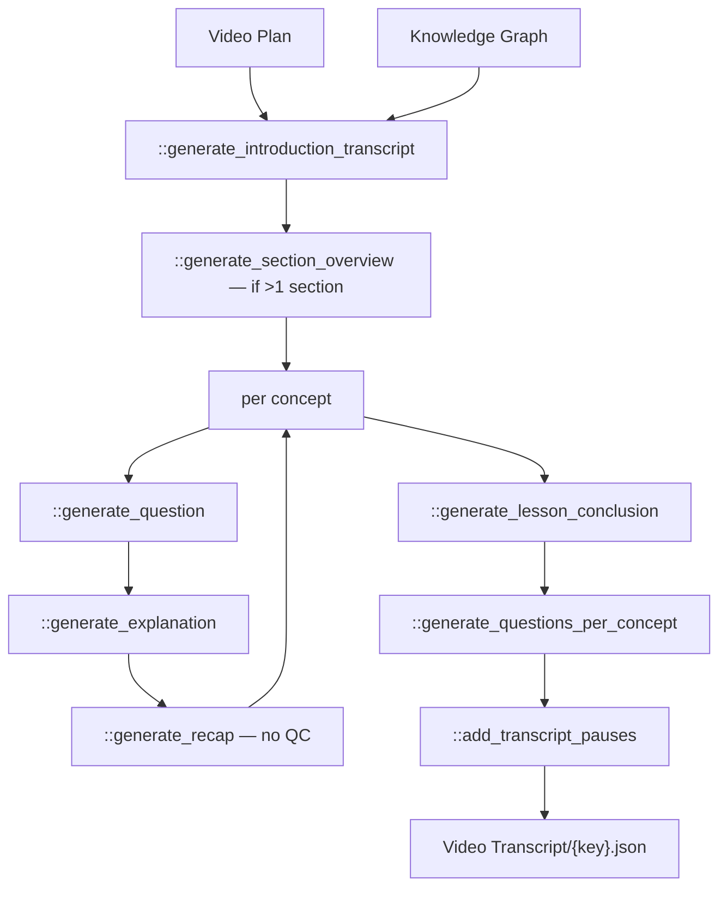

# 04 — Video Transcript

> Stage 3 of nine ([00](00-overview.md)). It writes every word the lesson says, against the shape [03](03-video-plan.md) chose; [05](05-avatar-clips.md) speaks it and derives the clock from it, and everything after is timed against that clock.

## What it does

Writes the lesson as a spoken dialogue: the host introduces it, asks a curious question per concept, a historical figure answers, the host recaps, and a conclusion closes it. Also writes the knowledge-check questions and inserts the SSML pauses the voice will read.

## Contract

- **`stages/transcript.py::generate_lesson_transcript` is the stage, and the only definition of that name.**
  - `ops/review/app.py::TranscriptValidationLayer` calls the same function, so the reviewer and the pipeline cannot drift apart.
- **Reads two artifacts.**
  - `APVideoContext.video_plan_path`, reaching through the wrapper for `['video_plan']`.
  - `APVideoContext.kg_path`, for the fact text.
  - v2 does not read `content_plan_path`, `metadata_path` or `context_pack_path`. v1 read the last two.
- **Writes `contents/subsection/Video Transcript/{key}.json`, via `APVideoContext.transcripts_path`.**
- **Honours `-edited.json`**, and this is the most-used sidecar in the system: the transcript is what reviewers correct most often ([12](12-operator-tooling.md)).
- **Skipped when the canonical `{key}.json` exists.**

## Scope

- **Owns the words.** Every sentence a viewer hears originates here and no later stage rewrites one.
- **Owns the dialogue form.** Who speaks each line, marked with `[Host]` and `[Figure]` tags in the transcript text.
- **Owns the pauses.** `lesson_transcript_paused` carries `<break time="...">` tags, and that is the string [05](05-avatar-clips.md) actually voices.
- **Owns the knowledge checks**, under `supplementary_content.questions`.
- **Owns the conclusion's bullet structure**, which [06](06-text-overlays.md) renders without composing.

Not here:

- Audio, voices, or any timestamp — [05](05-avatar-clips.md). This stage produces text with no clock.
- Which words appear on screen — [06](06-text-overlays.md) chooses those out of this text.
- The lesson's structure — [03](03-video-plan.md). The transcript fills a shape it does not choose.
- When a question is asked on screen: the MCQs are written here, but their trigger times are computed in [06](06-text-overlays.md).

## Flow



## Design decisions

- **The lesson is a podcast, not a lecture.**
  - The host asks; the historical figure named on the concept by [03](03-video-plan.md) answers; the host recaps.
  - This is why `figure_name` is load-bearing: it decides who speaks, which decides which voice and which portrait [05](05-avatar-clips.md) uses.
  - `prompts/prompts.py::introduce_historic_figure_sub_prompt` is what brings a figure on for the first time.

- **Generation is per segment, and the segment set is derived from the plan.**
  - One introduction, one overview per section when there is more than one, then question, explanation and recap per concept, then one conclusion.
  - The call count is therefore `O(sections × concepts)` and a broad lesson is materially more expensive than a deep one.

- **Each segment is QC'd against its own criteria, except the recap.**
  - `core/helpers.py::qc_llm_call` is applied per segment type with a name that selects guidelines out of `prompts/qc_prompts.py::transcript_content_guidelines`: `LESSON INTRODUCTION`, `SECTION OVERVIEW`, `CURIOUS QUESTION`, `CONCEPT EXPLANATION`, `LESSON CONCLUSION`.
  - `::generate_recap` has no QC, on the reasoning that a recap restates material already reviewed.
  - One finder call, at most one fixer call, per segment. No iteration.

- **The relationships from the plan are synthesised before the explanation is written.**
  - `prompts/prompts.py::SYNTHESIZE_RELATIONSHIPS_*` runs first so that the explanation prompt is given a connected account rather than a list of edges.
  - This is what turns `fact_relationships` into narration that says *because* rather than *and*.

- **Pauses are inserted last, over the finished text, in chunks.**
  - `::add_transcript_pauses` processes four paragraphs at a time with `prompts/prompts.py::ADD_TRANSCRIPT_PAUSES_*`.
  - It compares the returned text against the input and retries deterministically on a mismatch rather than QC-ing it, because the only correct behaviour is "same words, added breaks".
  - The result is a second, parallel copy of the transcript. Both are kept: `lesson_transcript` for anything that reads the words, `lesson_transcript_paused` for the voice.

- **The MCQs are generated per concept and QC'd as their own concern.**
  - `::generate_questions_per_concept` uses `prompts/prompts.py::MCQ_PER_CONCEPT_*` and `qc_llm_call("MCQs", "MCQs")` against `prompts/qc_prompts.py::mcq_guidelines`.
  - That QC includes a check that the correct answer is not simply the longest option, which is the classic generated-MCQ tell.

- **The conclusion is written twice, in two forms.**
  - `prompts/prompts.py::CONCLUSION_SLIDE_BULLETS_*` produces the structured `conclusion_slide` with bullets and sub-points.
  - `::CONCLUSION_TRANSCRIPT_*` produces the spoken conclusion.
  - [06](06-text-overlays.md) renders the first and never composes it, which is why the structure is settled here.

## Layers

In the order `::generate_lesson_transcript` walks them:

- `::generate_introduction_transcript` — `prompts/prompts.py::get_expository_intro_system_prompt`, `::GENERATE_EXPOSITORY_INTRODUCTION_USER_PROMPT`.
- `::generate_section_overview` — `::GENERATE_SECTION_OVERVIEW_*`.
- `::generate_question` — `::GENERATE_QUESTION_CONNECTIONS_*` then `::GENERATE_QUESTION_FINAL_*`, plus `::introduce_historic_figure_sub_prompt` and `::language_guidelines`.
- `::generate_explanation` — `::SYNTHESIZE_RELATIONSHIPS_*`, then `::get_explanation_base_system_prompt` and `::get_explanation_base_user_prompt`.
- `::generate_recap` — `::RECAP_PLAN_*`.
- `::generate_lesson_conclusion` — `::CONCLUSION_SLIDE_BULLETS_*` and `::CONCLUSION_TRANSCRIPT_*`.
- `::generate_questions_per_concept` — `::MCQ_PER_CONCEPT_*`.
- `::add_transcript_pauses` — `::ADD_TRANSCRIPT_PAUSES_*`.
- `core/types.py::TranscriptOutput` — the artifact.

## Rules

| Segment | Model | QC criteria |
| --- | --- | --- |
| Introduction | `LLM.CLAUDE_5_OPUS` | `LESSON INTRODUCTION` |
| Section overview | `LLM.CLAUDE_5_SONNET` | `SECTION OVERVIEW` |
| Question | `LLM.GPT_5` for connections, Claude 5 Sonnet for the final | `CURIOUS QUESTION` |
| Explanation | `LLM.GPT_5`, plus Claude for relationship synthesis | `CONCEPT EXPLANATION`, finder on Claude 5 Opus |
| Recap | `LLM.GPT_5` | none |
| Conclusion | `LLM.GPT_5` for bullets, Claude 5 Sonnet for prose | `LESSON CONCLUSION` |
| MCQs | `LLM.CLAUDE_5_OPUS` | `MCQs` |
| Pauses | Claude 5 Sonnet | deterministic mismatch retry |

- **No content failure blocks.** Every QC path either fixes once or accepts.
- **The blocking failures are structural**: a missing video plan or knowledge graph, or an unparseable model response.
- **`prompts/qc_prompts.py` is shared with [03](03-video-plan.md)**; `::QC_FINDER_SYSTEM_PROMPT`, `::QC_FINDER_USER_PROMPT` and `::QC_FIXER_USER_PROMPT` are the machinery, and the `*_guidelines` dicts are the per-stage criteria.

## Artifact

```json
{
  "lesson_transcript": "full text with [Host] and [Figure] speaker tags",
  "lesson_transcript_paused": "same text with <break time=\"...\"> tags",
  "lesson_transcript_breakdown": {
    "introduction": "...",
    "sections": {
      "<section_title>": {
        "overview": "...",
        "explanations": {
          "<concept_name>": {
            "concept": "...", "question": "...", "explanation": "...",
            "recap": "...", "figure_name": "..."
          }
        },
        "conclusion": ""
      }
    },
    "conclusion": "...",
    "conclusion_slide": {
      "title": "...",
      "bullets": [{ "text": "...", "sub_points": [{ "text": "..." }] }]
    }
  },
  "supplementary_content": {
    "questions": {
      "<section_title>": {
        "<concept_name>": [
          { "question": "...",
            "answer_options": [{ "id": "...", "answer": "...", "correct": true, "explanation": "..." }],
            "transcript": "..." }
        ]
      }
    }
  }
}
```

- **The per-section `"conclusion"` is always the empty string.**
  - `::generate_section_conclusions` exists in the module and is not called. The field is reserved and unfilled.

## External dependencies

- **GPT 5**, **Claude 5 Sonnet** and **Claude 5 Opus**, all through `core/helpers.py::llm_call` and `::qc_llm_call` onto `core/clients/openai.py::llm_complete` and the TrueFoundry gateway.
- **S3**, for two reads and one write.
- **No audio, image or video service.** This stage is text only.

## Boundary

- **[05](05-avatar-clips.md) reads `lesson_transcript_paused` and splits it on the speaker tags.**
  - The tag format is therefore a contract, not formatting. A change to how a speaker is marked breaks segmentation.
  - It also reads the unpaused `lesson_transcript` for the avatar-introduction pass.
- **[06](06-text-overlays.md) reads the breakdown, not the flat text.**
  - It needs per-concept `explanation` to locate slide content, and `conclusion_slide` to render the closer.
  - It also derives MCQ trigger times from the last words of each explanation, so the explanation's ending is load-bearing in a way nothing states.
- **[10](10-render.md) reads the transcript again for subtitles.**
- **Nothing downstream rewrites a word.** Every later stage selects, times or renders text that was fixed here.

## Seams

- **`::choose_concept_explanation_technique` and `::generate_section_conclusions` have no callers.**
- **`ops/review/app.py::TranscriptValidationLayer` calls the stage with two empty strings**, `generate_lesson_transcript('', '', context.dict())`, relying on the stage ignoring its first two arguments. A signature change here breaks the reviewer silently.
- **The v1 prompts are still in `prompts/prompts.py`**: `::get_transcript_planner_prompt`, `::get_introduction_transcript_prompt`, `::get_main_transcript_prompt`, `::get_conclusion_transcript_prompt`, the matching `::get_*_transcript_qc_prompt` family, and `::get_conclusion_bullet_points_prompt`. None is reachable from v2.
