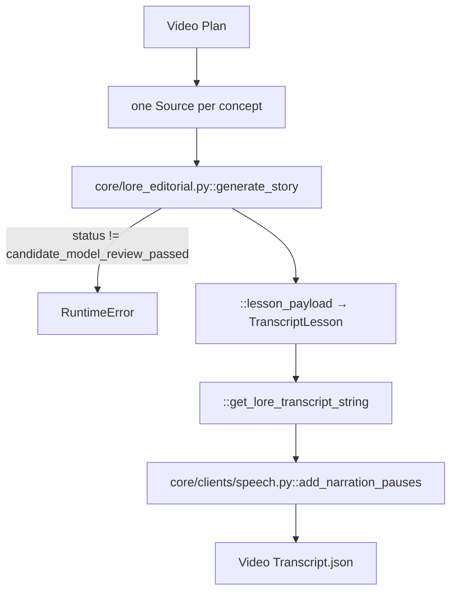

# 04 — Video Transcript

> Stage 2 of eight ([00](00-overview.md)). It writes every word the video says, from the research [03](03-video-plan.md) grouped; [05](05-avatar-clips.md) voices it and derives the clock from it, and everything after is timed against that clock.

## What it does

Writes one continuous single-host bedtime narration from the video plan's research, through the shared editorial engine, then inserts the SSML pauses the voice reads.

## Contract

- **`stages/transcript.py::generate_lesson_transcript` is the stage.** It rebuilds the `Context`, loads the plan and calls `::generate_lore_lesson_transcript` with `NARRATION_PARAMS`.
- **Reads one artifact**: `Context.video_plan_path` (the `-edited` sidecar if present), reaching through `['video_plan']`.
- **Writes `{video folder}/Video Transcript.json`**, a `core/types.py::TranscriptOutput`.
- **Downstream honours `Video Transcript-edited.json`** through `Context.transcripts_path`.
- **Skipped when the canonical `Video Transcript.json` exists**, unless `--force`.
- **Also writes an editorial trace to local disk**: `NARRATION_PARAMS["editorial_root"]`, else `artifacts/lore_editorial/` under the repository root, one new timestamped directory per call.

## Scope

- **Owns the words.** Every sentence a viewer hears originates here and no later stage rewrites one.
- **Owns the narrative structure.** The engine regroups the plan's concepts into its own movements; the plan's sections do not survive into the transcript.
- **Owns the pauses.** `lesson_transcript_paused` carries `<break time="...">` tags, and that is the string [05](05-avatar-clips.md) voices.

Not here:

- Audio, voices, or any timestamp — [05](05-avatar-clips.md).
- Which words appear on screen — [06](06-text-overlays.md).
- The research itself — `lesson_plan.json`, grouped by [03](03-video-plan.md). The transcript may omit a source but not add a fact.

## Flow



## Design decisions

- **One engine, two callers.** `core/lore_editorial.py::generate_story` backs both this stage and `tools/gen_lore_from_plan.py`. Hook drafting and choice, the editorial plan, the whole draft, review and revision, reference excerpts, models, run artifacts and status meanings are in [the lore editorial pipeline guide](../info/lore_editorial_pipeline.md).

- **Each planned concept becomes one research source.**
  - `::generate_lore_lesson_transcript` numbers them `S001`, `S002`, … in plan order; `text` is `::format_concept` (concept name plus facts), `context` is the section's `simple_title` (or `section_title`).
  - The story title is the plan's `simple_title`, falling back to `lesson_title`.

- **Subject-specific voice lives in a profile.**
  - `config/subject_profiles.py::resolve_profile` resolves `Context.subject` (or `NARRATION_PARAMS["subject_profile"]`) and raises on an unknown id rather than falling back. Its `voice` is rendered into the prompts; history additionally gets `prompts/lore_prompts.py::HISTORY_GUIDANCE`.
  - Onboarding a subject is [../info/subject_onboarding.md](../info/subject_onboarding.md).

- **Length is a word budget.** `target_words`, else `target_minutes × words_per_minute` (code default 35 × 135; the `lore` video type sets 60 × 135).

- **The breakdown keeps the `TranscriptLesson` shape, filled from movements.** `core/lore_editorial.py::lesson_payload` maps hook plus opening to `introduction`, each movement to one section keyed by movement id holding one explanation keyed by movement title, and the closing to `conclusion`.

- **Pauses are deterministic.** `add_narration_pauses` puts a 1 s break between sentences and 1.5–2.5 s between paragraphs, longer at topic shifts. Text that already has a break, or has fewer than two paragraphs, is returned unchanged.

## Layers

- `::generate_lesson_transcript` — the stage entry.
- `::generate_lore_lesson_transcript` — sources, word budget, trace directory, `core/clients/lore.py::LoreClient`, the status gate.
- `::format_concept` — one concept as a research note.
- `core/lore_editorial.py::generate_story` — the engine, with prompts from `prompts/lore_prompts.py` and `prompts/lore_hooks.py`.
- `core/lore_editorial.py::lesson_payload` — engine result to `TranscriptLesson`.
- `::get_lore_transcript_string` — one `[Host]: ` block per non-empty passage.
- `core/clients/speech.py::add_narration_pauses` — the SSML pass.
- `core/types.py::TranscriptOutput`, `::TranscriptLesson` — the artifact.

## Rules

| Call | Model | `NARRATION_PARAMS` key |
| --- | --- | --- |
| Hooks, editorial plan, draft, revisions, hook repair | `core/clients/lore.py::DEFAULT_MODEL` (`openai-group/gpt-6-astra`), reasoning `high` | `model`, `reasoning` |
| Whole-script review | same as the writer unless set | `review_model` |
| Hook choice | `core/clients/lore.py::DEFAULT_CHOICE_MODEL` (`openai-group/gpt-6-sol`), reasoning `medium` | `choice_model`, `choice_reasoning` |

- **Revisions**: `max_revisions` (default 2, range 0–3); every revision is reviewed again.
- **Hook lock**: `approved_hook`, else the entry in `docs/golden_references/2026-09-23/approved-hooks.json` whose title equals the story title.
- **The stage stops on content.** Any status other than `candidate_model_review_passed` raises `RuntimeError` naming the trace directory; the candidate and findings stay in the trace. Malformed model output gets one contract retry inside the engine, then raises.

## Artifact

```json
{
  "lesson_transcript": "[Host]: <hook>\n\n<opening>\n\n[Host]: <movement text>\n\n...\n\n[Host]: <closing ending in Good night.>",
  "lesson_transcript_paused": "same text with <break time=\"...\"/> tags",
  "lesson_transcript_breakdown": {
    "introduction": "<hook>\n\n<opening>",
    "sections": {
      "<movement id>": {
        "overview": "",
        "explanations": {
          "<movement title>": {
            "concept": "<movement purpose>", "question": "", "explanation": "<movement text>",
            "recap": "", "figure_name": "Host"
          }
        },
        "conclusion": ""
      }
    },
    "conclusion": "<closing>",
    "conclusion_slide": null
  }
}
```

## External dependencies

- **The TrueFoundry gateway**, through `core/clients/lore.py::LoreClient`; needs `TFY_BASE_URL` and `TFY_API_KEY`.
- **NLTK's Punkt tokenizer** for the pause pass.
- **Storage**, for one read and one write; the trace always goes to local disk.

## Boundary

- **[05](05-avatar-clips.md) reads `lesson_transcript_paused` and splits it on speaker tags** with `core/helpers.py::split_transcript`, and reads `lesson_transcript` for the avatar introductions. The `[Host]:` tag format is a contract.
- **[06](06-text-overlays.md) reads the breakdown.** Video split times match the last ten words of `introduction` and of each section's last explanation against the word timings.
- **[07](07-scenes-breakdown.md) and [08](08-images.md) read `lesson_transcript`** through `core/helpers.py::identify_location`.
- **Nothing downstream rewrites a word.**

## Traps

- **A content stop is retried as a whole.** `run.py::run_stage` retries any exception up to three times, so a `needs_editorial_review` result reruns the full engine three times, each into a new trace directory.
- **The hook registry matches on the plan's title**, `simple_title` or `lesson_title`, not `Context.title`. A touched-up title misses its approved hook.
- **Under S3 storage the trace is still local**, relative to the repository unless `editorial_root` is set.
