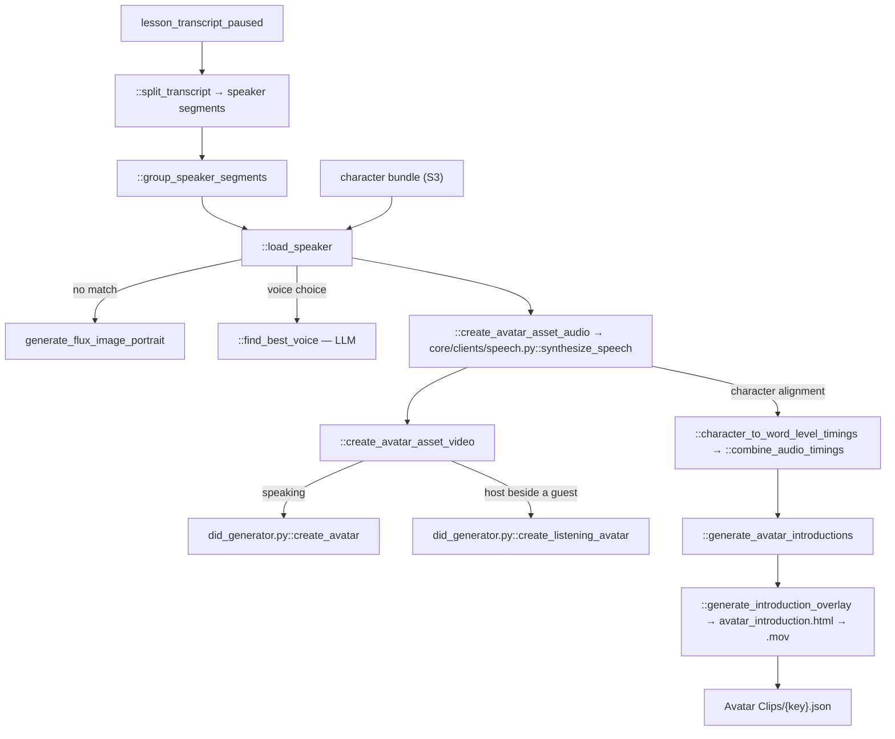

# 05 — Avatar Clips

> Stage 4 of nine ([00](00-overview.md)). It speaks the transcript [04](04-transcript.md) wrote and, in doing so, produces the clock every stage after it times against. [06](06-text-overlays.md) and [07](07-scenes-breakdown.md) both depend on that clock existing.

## What it does

Splits the paused transcript into speaker segments, gives each speaker a voice and a face, synthesises the audio, obtains word-level timings from the synthesis itself, generates talking-head video for the guests, and writes the lesson's single word-by-word timeline.

## Contract

- **Reads the transcript and a character library.**
  - `APVideoContext.transcripts_path` for `lesson_transcript_paused`, which is what is actually voiced, and the plain `lesson_transcript` for the introduction pass.
  - The character library. `core/stage_constants.py::CHARACTER_BUNDLE` is a character-name to S3-path mapping, loaded at import time from the local `core/character_bundle_mapping.json`; each character's own JSON is then read from S3, preferring a `{basename}-edited.json` sidecar.
  - That `open()` resolves against the module's own directory rather than the working directory, so the stage imports the same way from anywhere.
- **Writes `contents/subsection/Avatar Clips/{key}.json`, via `APVideoContext.avatar_assets_path`, plus a great deal of media.**

| Artifact | Path |
| --- | --- |
| Per-segment audio | `media/{key}/{segment_clip_prefix_name}.mp3` |
| Character portrait | `media/{key}/character_images/{uuid}.png` |
| Speaking clip | `media/{key}/avatar_assets/{segment_clip_prefix_name}.mp4` |
| Listening clip | `media/{key}/avatar_assets/{segment_clip_prefix_name}_listening.mp4` |
| Introduction card | `media/{key}/Avatar/Introduction/{id}.mov` |

- **`segment_clip_prefix_name` is `hash_image_description(f"{context.subsection}_{speaker}_{idx}")`.**
  - So a segment's media filename depends on its position in the transcript. Inserting a sentence early in a lesson re-keys every segment after it.
- **Honours `-edited.json` on the manifest.**
- **Skipped only on the manifest.**
  - `run.py::run_stage` sees the JSON and skips the stage.
  - If the JSON is deleted, every mp3 and mp4 is re-synthesised and re-bought. There is no per-segment existence check.

## Scope

- **Owns the lesson's clock.** `lesson_timings` is the authoritative word-by-word timeline and nothing else in the pipeline produces one.
- **Owns casting to voice and face.** Which ElevenLabs voice and which portrait a named figure gets.
- **Owns the talking heads**, including the listening animation that makes a two-person exchange look like a conversation.
- **Owns the avatar introduction cards**, both the copy on them and their rendering.

Not here:

- Any word. The transcript is voiced as written — [04](04-transcript.md).
- Any on-screen text besides the introduction cards — [06](06-text-overlays.md).
- Where the avatar sits in frame or how large it is; that is timeline geometry — [10](10-shotstack.md).
- Subtitles. They are generated at the end from the transcript, not from these timings — [10](10-shotstack.md).

## Flow



## Design decisions

- **The clock is a by-product of synthesis, not a separate alignment step.**
  - ElevenLabs is called at `/v1/text-to-speech/{voice}/with-timestamps`, which returns character-level alignment alongside the audio.
  - `core/clients/speech.py::character_to_word_level_timings` folds characters into words, `::process_chunks` handles text long enough to need splitting, and `::combine_audio_timings` offsets each segment so the result is one continuous lesson timeline.
  - There is no Whisper, no forced aligner and no second pass. The timings are exactly as accurate as the vendor's alignment.
  - This is why Avatar Clips must precede [06](06-text-overlays.md): there is no other source of a timestamp.

- **Continuity is passed to the synthesiser explicitly.**
  - `::create_avatar_asset_audio` passes the neighbouring segments as `previous_text` and `next_text`, and threads `previous_request_ids` through the loop.
  - Without that, each segment is synthesised cold and the prosody resets audibly at every speaker change.
  - Host speech is generated at speed 1.1, guests at 1.0.

- **A face is looked up before it is generated, and the lookup is fuzzy plus a model.**
  - `::find_best_match` takes the top twenty rapidfuzz matches for the speaker's name against the library keys, then asks Claude 3.5 Sonnet whether any of them is actually this person. A name can be spelled several ways in a transcript, and fuzzy distance alone will confidently match the wrong ruler.
  - A hit means a recurring historical figure keeps the same portrait, and the same voice, across every lesson they appear in.
  - Only on a miss does `core/clients/images.py::generate_flux_image_portrait` draw one, with an NSFW re-prompt loop.
  - `::load_speaker` caches per lesson in `loaded_speakers`, so a figure speaking ten times is loaded once.

- **The voice is chosen by a model only when the library does not already have one.**
  - A matched character's `voiceId` is used as-is; `::find_best_voice` picks an ElevenLabs voice from the portrait's prompt otherwise.
  - The host voice is hardcoded to `IKne3meq5aSn9XLyUdCD`, so only guests are matched.
  - When synthesis comes back as a captcha-style voice, the stage re-picks and retries rather than shipping it.

- **The host gets a listening animation, and that is why segments are grouped.**
  - `::group_speaker_segments` identifies host segments sitting between two segments of the same guest.
  - For those, `core/clients/did.py::create_listening_avatar` is driven by SSML breaks from `::generate_listening_avatar_ssml` rather than by speech, using Microsoft's Sara voice through D-ID rather than ElevenLabs.
  - The result is a guest who appears to be listening while the host talks, instead of a static portrait.

- **Introductions are found in the text, not scheduled.**
  - `::identify_speaker_intro` and `::describe_avatars` use a model to locate the words at which a figure is first named and to write the card's description.
  - `::generate_introduction_overlay` renders `templates/avatar_introduction.html` to a `.mov` with alpha, so the card can be composited over whatever is behind it.

- **Concurrency is capped at three because the vendors are.**
  - Both the audio pool and the video pool are `ThreadPoolExecutor(max_workers=3)`, with a comment naming ElevenLabs and D-ID as the reason.

## Layers

In the order `::generate_avatar_assets` walks them:

- `::split_transcript` — the paused transcript to speaker segments.
- `::group_speaker_segments` — marks which host segments need a listening treatment.
- `::load_speaker` — bundle match or generated portrait, plus voice selection via `::find_best_voice` and `::find_best_match`.
- `::create_avatar_asset_audio` — one ElevenLabs call per segment through `core/clients/speech.py::synthesize_speech`.
- `::grouped_avatar_asset_generation_audio` — the pooled driver for the above.
- `::create_avatar_asset_video` — D-ID speaking or listening clip per segment that needs one.
- `::generate_listening_avatar_ssml` — the break-only SSML for a listening clip.
- `::generate_avatar_introductions`, `::identify_speaker_intro`, `::describe_avatars`, `::generate_introduction_overlay` — the introduction cards.
- `core/types.py::AvatarAsset`, `::AvatarIntroduction`, `::WordTiming`, `::Speaker` — the vocabulary.

## Rules

- **Blocking**: a missing transcript artifact; an ElevenLabs failure that survives its retries; a D-ID job that returns `error`.
  - `core/clients/speech.py::generate_speech_via_elevenlabs` carries `@retry` with five attempts and exponential backoff, and chunks any text over 4096 characters.
  - `core/clients/did.py::create_avatar` polls `/talks` every ten seconds until `done` and raises on `error`. There is no backoff and no tenacity wrapper on it.
- **Warn-only**: a captcha voice, which triggers a re-pick rather than a failure.
- **Nothing in this stage validates the audio it produced.** There is no check that a segment's duration is plausible for its text.

## Artifact

```json
{
  "avatar_assets": [
    {
      "avatar_name": "...",
      "timings": [{ "text": "...", "start_time": 0.0, "end_time": 0.0 }],
      "src": "media/{key}/{segment}.mp3",
      "start_time": 0.0,
      "end_time": 0.0,
      "image": "presigned portrait URL",
      "prompt": "...",
      "avatar_clip": "media/{key}/avatar_assets/{segment}.mp4",
      "is_listening_avatar": false,
      "avatar_display_time": 0.0
    }
  ],
  "lesson_timings": [{ "text": "word", "start_time": 0.0, "end_time": 0.0 }],
  "avatar_introductions": [
    { "avatar_name": "...", "description": "...",
      "start_time": 0.0, "end_time": 0.0,
      "src": "media/{key}/Avatar/Introduction/{id}.mov" }
  ]
}
```

- **`image` is a presigned URL, not an S3 key**, unlike `src` and `avatar_clip`. Presigned URLs expire, so a manifest read long after generation may carry a dead portrait link.

## External dependencies

| Service | Wrapper | For | Auth |
| --- | --- | --- | --- |
| ElevenLabs | `core/clients/speech.py::synthesize_speech`, `::generate_speech_via_elevenlabs` | speech and the character alignment | `ELEVENLABS_API_KEY` |
| D-ID | `core/clients/did.py::create_avatar`, `::create_listening_avatar` | talking heads | `DID_API_KEY`, basic auth |
| Microsoft TTS | inside the D-ID payload | the listening animation's voice | via D-ID |
| fal.ai FLUX | `core/clients/images.py::generate_flux_image_portrait` | a portrait when the bundle has none | `FAL_KEY` |
| OpenAI / Anthropic | `core/clients/openai.py::llm_complete`, `::ensure_json` | voice matching, speaker identification, introduction copy | standard LLM keys |
| Playwright and ffmpeg | `core/media/html_to_video.py` | the introduction cards | local |
| S3 | `core/clients/s3.py` | everything | AWS |

- **Cost per lesson: one ElevenLabs synthesis per speaker segment, plus one D-ID job per guest segment and per listening segment.**
  - This is the second most expensive stage after [09](09-videos.md), and all of it is re-bought whenever the manifest is deleted.

## Boundary

- **`lesson_timings` is the contract, and three stages consume it.**
  - [06](06-text-overlays.md) matches an LLM-chosen phrase against it, via `core/media/clip_timings.py::match_segment_timings`, to turn a phrase into a timestamp.
  - [07](07-scenes-breakdown.md) walks it to cut the transcript into clips with real start and end times.
  - [10](10-shotstack.md) uses the per-asset `start_time` and `end_time` to place audio on the timeline.
- **`avatar_assets[].src` is the lesson's audio.** There is no other audio track; the finished video's sound is these mp3s laid end to end.
- **`avatar_clip` is optional and its absence is meaningful.**
  - A host segment with no clip is composited as audio only, over whatever visual [07](07-scenes-breakdown.md) chose.
  - [10](10-shotstack.md) puts the clips that do exist in a picture-in-picture track.
- **The speaker tag format from [04](04-transcript.md) is what `::split_transcript` parses.** Nothing else validates it.

## Seams

- **`::generate_avatar_assets`'s `__main__` block is a repair harness**, not a demo: it mutes intervals and retries a single D-ID asset, which is what you reach for when one segment in a finished lesson is wrong.
- **`ops/media/character_bundle.py` is how the character library is maintained** — a Google Drive download re-uploaded to S3 ([12](12-operator-tooling.md)).
- **The module imports `from pyparsing import C`**, which is unused.
- **`core/media/media_assets.py`** holds the black-frame detection and MOV-to-MP4 conversion this stage and [06](06-text-overlays.md) share.
