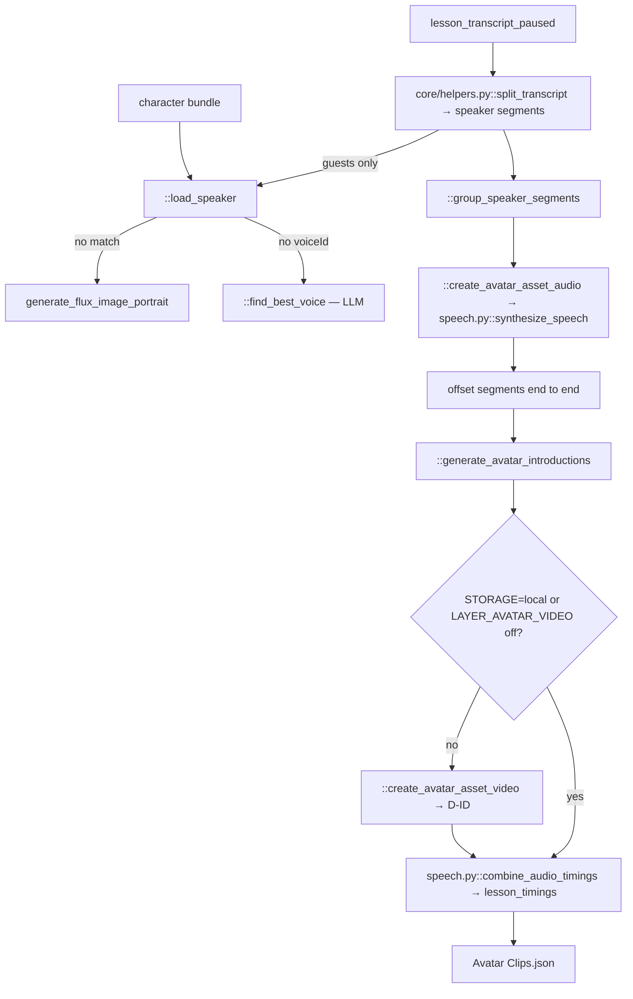

# 05 — Avatar Clips

> Stage 3 of eight ([00](00-overview.md)). It speaks the transcript [04](04-transcript.md) wrote and, in doing so, produces the clock every stage after it times against. [06](06-text-overlays.md) and [07](07-scenes-breakdown.md) both depend on that clock existing.

## What it does

Splits the paused transcript into speaker segments, synthesises each with ElevenLabs, obtains word-level timings from the synthesis itself, and writes the video's single word-by-word timeline. The guest machinery — portraits, voice matching, D-ID talking heads, introduction cards — is still in the module and runs only when the transcript names a speaker other than `Host` or `Narrator`.

## Contract

- **Reads the transcript and, for guests, a character library.**
  - `Context.transcripts_path` for `lesson_transcript_paused`, which is what is actually voiced, and the plain `lesson_transcript` for the introduction pass.
  - The character library. `core/stage_constants.py::CHARACTER_BUNDLE` is a character-name to storage-path mapping, loaded at import time from `core/character_bundle_mapping.json` beside the module; each character's own JSON is then read from storage, preferring a `{basename}-edited.json` sidecar.
- **Writes `{video folder}/Avatar Clips.json`, plus media under `{video folder}/media/`.**

| Artifact | Path under `media/` |
| --- | --- |
| Per-segment audio | `{segment_clip_prefix_name}.mp3` |
| Character portrait | `character_images/{uuid}.png` |
| Speaking clip | `avatar_assets/{segment_clip_prefix_name}.mp4` |
| Listening clip | `avatar_assets/{segment_clip_prefix_name}_listening.mp4` |
| Introduction card | `Avatar/Introduction/{id}.mov` |

- **`segment_clip_prefix_name` is `hash_image_description(f"{context.title}_{speaker}_{idx}")`.**
  - So a segment's filename depends on its position in the transcript. Inserting a speaker turn early re-keys every segment after it.
- **Honours `-edited.json` on the manifest**, through `Context.avatar_assets_path`.
- **Skipped only on the manifest.**
  - `run.py::run_stage` sees the JSON and skips the stage.
  - If the JSON is deleted, every mp3 and mp4 is re-synthesised and re-bought. There is no per-segment existence check.

## Scope

- **Owns the video's clock.** `lesson_timings` is the authoritative word-by-word timeline and nothing else in the pipeline produces one.
- **Owns the narration audio.** The host voice and speed are set here.
- **Owns guest casting, talking heads and introduction cards**, when a transcript has guests.

Not here:

- Any word. The transcript is voiced as written — [04](04-transcript.md).
- Pause placement. `lesson_transcript_paused` already carries the SSML breaks from `core/clients/speech.py::add_narration_pauses` — [04](04-transcript.md).
- Any on-screen text besides the introduction cards — [06](06-text-overlays.md).
- Where an inset sits in frame — [10](10-render.md).

## Flow



## Design decisions

- **A lore transcript is one segment.**
  - `core/helpers.py::split_transcript` merges consecutive lines with the same speaker tag, and the lore transcript is nothing but `[Host]:` blocks, so the whole narration is a single segment and a single mp3.
  - `core/clients/speech.py::synthesize_speech` then chunks it at 4096 characters on the last full stop (`::split_text`), synthesises each chunk, and joins audio and timings. Chunks are sent cold: no `previous_text` or request ids pass between them.

- **The clock is a by-product of synthesis, not a separate alignment step.**
  - ElevenLabs is called at `/v1/text-to-speech/{voice}/with-timestamps` with `ELEVENLABS_MODEL_ID` (default `eleven_multilingual_v2`), which returns character-level alignment alongside the audio.
  - `core/clients/speech.py::character_to_word_level_timings` folds characters into words, `::process_chunks` drops the `<break>` tags (giving their time to the preceding word) and folds punctuation-only tokens into their neighbour, and `::combine_audio_timings` offsets each segment so the result is one continuous timeline.
  - There is no forced aligner and no second pass. The timings are exactly as accurate as the vendor's alignment.
  - This is why Avatar Clips must precede [06](06-text-overlays.md): there is no other source of a timestamp.

- **The host voice is hardcoded.**
  - `::create_avatar_asset_audio` uses voice `PIGsltMj3gFMR34aFDI3` at speed 0.9 for `host`/`narrator`, with `add_pauses=True`; guests use their matched voice at 1.0.
  - `add_narration_pauses` returns its input unchanged when breaks are already present, so the paused transcript is not paused twice.
  - `synthesize_speech` normalises loudness with `::standardize_volume` before upload.

- **Guest continuity is passed to the synthesiser explicitly.**
  - For a guest turn, the neighbouring turns go in as `previous_text` and `next_text`, and `::grouped_avatar_asset_generation_audio` threads the last three `previous_request_ids` through each speaker's run. Host turns get neither.

- **A guest's face is looked up before it is generated.**
  - `::find_best_match` takes the top twenty fuzzy matches for the speaker's name against the library keys, then asks `LLM.CLAUDE_5_SONNET` whether any of them is this person.
  - Only on a miss does `core/clients/images.py::generate_flux_image_portrait` draw one, from a prompt written by `LLM.GPT_5`.
  - A matched character's `voiceId` is used as-is; otherwise `::find_best_voice` picks from `core/stage_constants.py::elevenlabs_voice_descriptions`. A `detected_captcha_voice` error re-picks and retries once.

- **Listening clips and introduction cards exist for two-person exchanges.**
  - A host segment between two turns of the same guest is flagged `is_listening_avatar`; `core/clients/did.py::create_listening_avatar` animates the guest's portrait from break-only SSML (`::generate_listening_avatar_ssml`) with D-ID's `Sara` voice.
  - `::identify_speaker_intro` and `::describe_avatars` locate the first naming of each guest and write the card copy; `::generate_introduction_overlay` renders `templates/avatar_introduction.html` to an alpha `.mov`.

- **D-ID is skipped in two cases.** Under `STORAGE=local`, or with `LAYER_AVATAR_VIDEO` off (the `lore` video type sets it off), no talking head is generated; audio and `lesson_timings` are produced either way and `avatar_clip` stays unset.

- **Concurrency is capped at three.** Both the audio pool and the D-ID pool are `ThreadPoolExecutor(max_workers=3)`.

## Layers

In the order `::generate_avatar_assets` walks them:

- `core/helpers.py::split_transcript` — the paused transcript to speaker segments.
- `::load_speaker` — per guest: bundle match or generated portrait, plus `::find_best_match` and `::find_best_voice`.
- `::group_speaker_segments` — host segments individually, each guest's segments as one sequential run.
- `::grouped_avatar_asset_generation_audio`, `::create_avatar_asset_audio` — one synthesis per segment.
- `::generate_avatar_introductions`, `::identify_speaker_intro`, `::describe_avatars`, `::generate_introduction_overlay` — the introduction cards.
- `::create_avatar_asset_video`, `::generate_listening_avatar_ssml` — D-ID speaking or listening clip per segment that needs one.
- `core/types.py::AvatarAsset`, `::AvatarIntroduction`, `::WordTiming`, `::Speaker` — the vocabulary.
- Prompts: `prompts/avatar_prompts.py`.

## Rules

- **Blocking**: a missing transcript artifact; an ElevenLabs failure that survives its retries; a D-ID job that returns `error`.
  - `core/clients/speech.py::generate_speech_via_elevenlabs` carries `@retry` with five attempts and exponential backoff.
  - `core/clients/did.py::poll_for_completion` polls every ten seconds until `done` and raises on `error`. There is no retry wrapper on the D-ID calls.
- **`::describe_avatars` runs even with no guests.** A host-only transcript still spends one Claude call on an empty persona list, and a reply without an `<introductions>` tag raises.
- **Nothing in this stage validates the audio it produced.** There is no check that a segment's duration is plausible for its text.

## Artifact

```json
{
  "avatar_assets": [
    {
      "avatar_name": "Host",
      "timings": [{ "text": "...", "start_time": 0.0, "end_time": 0.0 }],
      "src": "{video folder}/media/{segment}.mp3",
      "start_time": 0.0,
      "end_time": 0.0,
      "image": null,
      "prompt": null,
      "avatar_clip": null,
      "is_listening_avatar": false,
      "avatar_display_time": 0.0
    }
  ],
  "lesson_timings": [{ "text": "word", "start_time": 0.0, "end_time": 0.0 }],
  "avatar_introductions": []
}
```

- **For guests, `image` is a presigned URL, not a storage key**, unlike `src` and `avatar_clip`. Presigned URLs expire, and [10](10-render.md) drops any `http` source.

## External dependencies

| Service | Wrapper | For | Auth |
| --- | --- | --- | --- |
| ElevenLabs | `core/clients/speech.py::synthesize_speech`, `::generate_speech_via_elevenlabs` | speech and the character alignment | `ELEVENLABS_API_KEY` |
| D-ID | `core/clients/did.py::create_avatar`, `::create_listening_avatar` | guest talking heads | `DID_API_KEY` |
| fal.ai FLUX | `core/clients/images.py::generate_flux_image_portrait` | a guest portrait when the bundle has none | `FAL_KEY` |
| TrueFoundry gateway | `core/clients/openai.py::llm_complete`, `::ensure_json` | voice matching, speaker identification, introduction copy | `TFY_API_KEY`, `TFY_BASE_URL` |
| Playwright and ffmpeg | `core/media/html_to_video.py` | the introduction cards | local |
| Storage | `core/clients/s3.py` | everything | local or AWS |

- **Cost for a lore video: one ElevenLabs call per 4096-character chunk of narration**, plus the one Claude call above. Guests add a D-ID job per guest and listening segment. All of it is re-bought whenever the manifest is deleted.

## Boundary

- **`lesson_timings` is the contract, and three stages consume it.**
  - [06](06-text-overlays.md) matches model-chosen phrases against it, via `core/media/clip_timings.py::match_segment_timings`, to turn a phrase into a timestamp.
  - [07](07-scenes-breakdown.md) walks it to cut the narration into clips with real start and end times.
  - [10](10-render.md) concatenates `avatar_assets[].src` in `start_time` order as the soundtrack.
- **`avatar_assets[].src` is the video's audio.** There is no other audio track.
- **`avatar_introductions[].avatar_name` feeds [07](07-scenes-breakdown.md)**, which tells the scene model not to depict those figures.
- **The speaker tag format from [04](04-transcript.md) is what `split_transcript` parses.** Nothing else validates it.

## Seams

- **`core/media/html_to_video.py`** renders the introduction cards, shared with [06](06-text-overlays.md).
- **The character library has no maintenance tool in the tree.** `core/character_bundle_mapping.json` and the per-character JSON are edited by hand.
