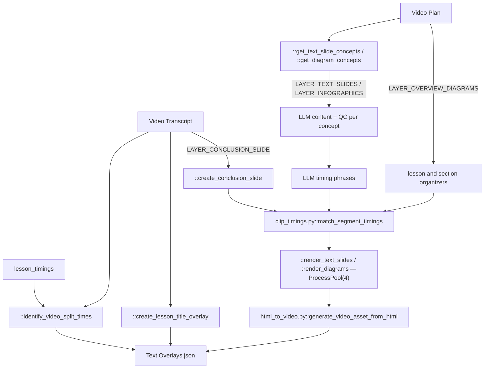

# 06 — Text Overlays

> Stage 4 of eight ([00](00-overview.md)). It draws everything the viewer reads, timed against the clock [05](05-avatar-clips.md) produced. [07](07-scenes-breakdown.md) then fills the gaps this stage did not claim.

## What it does

Decides what appears on screen as text — the video title, bullet slides, diagrams, overview organizers, the conclusion — writes the content with a model, pins every element to a moment in the narration, and renders each one to a video file with a headless browser. Every overlay kind except the title is behind a layer flag, and the `lore` video type turns all of them off, so a lore run writes only the title overlay and `video_splits`.

## Contract

- **Reads three artifacts, and the third is a hard ordering dependency.**
  - `Context.transcripts_path` as `core/types.py::TranscriptOutput`.
  - `Context.video_plan_path` for `['video_plan']`, whose per-concept `visual` field decides what each concept gets.
  - `Context.avatar_assets_path` for `lesson_timings`. Without it there is no way to convert a phrase into a timestamp, which is why this stage cannot run before [05](05-avatar-clips.md).
- **Writes `{video folder}/Text Overlays.json`, plus one video file per rendered overlay.**

| Artifact | Path under `media/` | Template |
| --- | --- | --- |
| Text slide | `TextSlides/{id}.mov` | `templates/text_slide.html` |
| Diagram, organizer or conclusion | `Diagrams/{id}.mov`, `.mp4` for the tree | `templates/diagrams/{type}.html` |

- **Layer flags gate each kind.** `LAYER_TEXT_SLIDES`, `LAYER_INFOGRAPHICS` (per-concept diagrams), `LAYER_OVERVIEW_DIAGRAMS` (lesson and section organizers) and `LAYER_CONCLUSION_SLIDE`, all read from `inputs` with a default of on.
- **Runs at most two at a time, process-wide.**
  - `::generate_text_overlays` carries `core/helpers.py::concurrency_slots` with `slots=2, lock_name="OVERLAY_GEN_LOCK"`.
  - So a batch of videos serialises here even though `run.py` runs three at once.
- **Honours `-edited.json` on the manifest**, through `Context.text_overlays_path`.
- **Skipped only on the manifest.** Every `.mov` and `.mp4` is re-rendered whenever the stage runs.

## Scope

- **Owns everything the viewer reads**, except the avatar introduction cards.
- **Owns the timing of those elements**, down to the individual bullet: a slide's bullets appear one at a time, each on its own word.
- **Owns the rendering**, from Jinja2 template through headless Chromium to a video file.
- **Owns the section split points** (`video_splits`).

Not here:

- Any wording that is not on-screen text. Narration is fixed — [04](04-transcript.md).
- Which concepts get a slide or diagram; that is `visual.type` on the plan — [03](03-video-plan.md).
- The visuals behind the words — [07](07-scenes-breakdown.md), [08](08-images.md), [09](09-videos.md).
- Compositing — [10](10-render.md).
- The clock — [05](05-avatar-clips.md).

## Flow



## Design decisions

- **Content and timing are two separate model calls, in that order.**
  - First a call writes the slide's or diagram's content, QC'd against requirements in `prompts/overlay_prompts.py`.
  - Then a second call is asked which verbatim phrase from the transcript each element should land on.

- **A timestamp is never generated. It is matched.**
  - The model returns a phrase; `core/media/clip_timings.py::match_segment_timings` locates that phrase in `lesson_timings` and yields word indices, which become absolute times.
  - The match is exact after normalisation — case, punctuation and dashes stripped — not fuzzy. A phrase that matches nothing raises `ValueError`, which the callers turn into a re-prompt with `UNMATCHED_PHRASES_USER_PROMPT` or `SEGMENT_MISMATCH_USER_PROMPT`.

- **Elements carry both an absolute and a relative clock.**
  - A slide has `start_time` and `end_time` on the video timeline.
  - Each bullet inside it has a `start_time` relative to the slide's own start, because the rendered HTML animates on its own clock once the video begins.

- **A visual interrupting a bullet splits the bullet.**
  - `::split_slide_points_at_visual` and `::phrase_split_to_content_split` cut a slide's content where a visual is due.

- **Diagrams are typed, and the type comes from the plan.**
  - `templates/diagrams/` holds `mind_map.html`, `tree.html`, `venn_diagram.html`, `lesson_organizer.html` and `conclusion_slide_new.html`, one per `core/types.py::DiagramType` value.
  - `prompts/overlay_prompts.py::DIAGRAM_CONFIGS` binds each type to its prompt and QC requirements, and each diagram model's `fill_timings` puts a `start_time` on every node so a diagram reveals progressively.

- **The organizers are extra passes over the introduction and section overviews.**
  - `::extract_intro_overview_segment` picks the part of the introduction worth diagramming, then `::get_lesson_overview_diagram_contents` (only with more than one section) and `::get_section_overview_diagram_contents` build organizers from it.
  - An organizer with fewer than three categories renders as `lesson_organizer`, otherwise as `mind_map`.
  - `::create_transition_canvases` (section title cards) is commented out of the orchestrator; the section organizer carries the transition.

- **The conclusion is rendered, not composed.**
  - `::create_conclusion_slide` takes `conclusion_slide` straight from the transcript breakdown and only computes its timings.

- **The video title is hardcoded to the first five seconds.**
  - `::create_lesson_title_overlay` sets `video_plan.simple_title` at 0 to 5 with no model involvement.

- **Split points come from the transcript's own structure.**
  - `::identify_video_split_times` matches the last ten words of the introduction and of each section's last explanation (or recap) to produce `Introduction`, `Section: <name>` and `Conclusion` times.

- **Rendering is CPU-bound and therefore process-parallel.**
  - `::render_text_slides` and `::render_diagrams` use `ProcessPoolExecutor(max_workers=4)`.
  - `core/media/html_to_video.py::convert_html_to_video` picks `::html_to_mov` for a `.mov` target (frame-by-frame screenshots, `qtrle`, alpha) or `::html_to_mp4` for `.mp4` (Playwright's recorder plus an ffmpeg transcode).
  - `::staged_page` renders the Jinja2 template to a `_render_{id}.html` scratch page inside `templates/` so relative component links resolve, and refuses to overwrite an existing file.

## Layers

`::generate_text_overlays` is the orchestrator; the rest of the module divides as follows.

| Function | Owns |
| --- | --- |
| `::generate_text_overlays` | loads the three inputs, applies the layer flags, returns an `OverlaysData` dump |
| `::identify_video_split_times` | the per-section split points |
| `::create_lesson_title_overlay` | the 0–5 s title |
| `::get_text_slide_concepts` | filters the plan for `text_slide` visuals and joins the transcript |
| `::process_text_slide_concept`, `::get_text_slide_content` | one concept's slide content, QC and timing, and the thread-pool driver |
| `::text_slide_from_content` | the model's `{title, points}` to a `TextSlide` |
| `::slides_timings_identifier` | maps returned timing JSON onto a `TextSlide` with word-aligned times |
| `::normalize`, `::phrase_split_to_content_split`, `::split_slide_points_at_visual` | bullet and visual overlap arithmetic |
| `::render_text_slides`, `::create_text_slides` | render and wrap the slide pipeline |
| `::get_diagram_concepts` | filters the plan for diagram visuals |
| `::process_diagram_concept`, `::get_diagram_content` | one diagram's content, and the thread-pool driver |
| `::identify_diagram_timings` | phrase fill plus `fill_timings`, with one re-prompt |
| `::extract_intro_overview_segment`, `::get_lesson_overview_diagram_contents`, `::get_section_overview_diagram_contents` | the organizers |
| `::render_diagrams`, `::create_diagrams` | render and wrap the diagram pipeline |
| `::create_conclusion_slide` | the conclusion diagram and its render |
| `::review_timings` | an opt-in human pause, see Rules |
| `::determine_section_transition`, `::create_transition_canvases` | section title cards — not called |

## Rules

- **Blocking**: a missing transcript, video plan or avatar manifest; a phrase that still fails to match after its re-prompt; a Playwright render failure.
- **ffmpeg failures inside the render are logged, not raised**, so a failed transcode surfaces later as a missing file at upload.
- **QC is per element.**
  - Slide content is checked against `prompts/overlay_prompts.py::TEXT_SLIDE_QC_REQUIREMENTS` and diagram content against `DIAGRAM_QC_REQUIREMENTS`, through `core/helpers.py::llm_call_with_qc`; a failure re-prompts, it does not drop the element.
- **`::review_timings` blocks on stdin when `REVIEW_TIMINGS` is set.**
  - It writes `./point_timings.json`, waits for Enter, and reads it back. Both call sites run inside a four-worker pool sharing that one path, so it is only usable with the pools reduced to one worker. Unset, it is a pass-through.

## Artifact

`core/types.py::OverlaysData`, as a lore run writes it:

```json
{
  "title_overlays": [
    { "text": "...", "type": "lesson_title",
      "start_index": 0, "end_index": 0, "start_time": 0.0, "end_time": 5.0 }
  ],
  "text_slides": [],
  "diagrams": [],
  "conclusion_slide": null,
  "video_splits": { "Introduction": 0.0, "Section: <name>": 0.0, "Conclusion": 0.0 }
}
```

With the layers on, `text_slides[]` carry `title`, `elements[].contents[]` (`content`, `phrase`, `start_time`, `start_duration`), window times and `src` under `media/TextSlides/`; `diagrams[]` and `conclusion_slide` carry `type`, `data` (the diagram model with per-node timings), window times and `src` under `media/Diagrams/`.

## External dependencies

- **The TrueFoundry gateway**, through `core/helpers.py::llm_call`, `::llm_call_with_qc` and `core/clients/openai.py::llm_complete` (`LLM.CLAUDE_5_OPUS` for content, `LLM.CLAUDE_5_SONNET` and `LLM.GPT_5` for timing and organizers). A lore run makes none of these calls.
- **Playwright Chromium and ffmpeg**, local, through `core/media/html_to_video.py`.
- **Storage**, for three reads, the media uploads and the manifest write.

## Boundary

- **[07](07-scenes-breakdown.md) reads this manifest to know which parts of the video are already spoken for.**
  - `stages/scenes_breakdown.py::split_transcript_into_video_segments` takes the `text_slides`, `diagrams` and `conclusion_slide` windows and splits the narration around them. With none, the whole narration is scene material.
- **[10](10-render.md) reads `text_slides`, `diagrams` and `conclusion_slide`** and overlays each `src` over its window.
- **`title_overlays` and `video_splits` have no consumer.** The render does not draw the title and nothing cuts the video at the split points.

## Seams

- **`templates/conclusion_slide.html` is unused.** The live conclusion renders from `templates/diagrams/conclusion_slide_new.html`.
- **`core/media/html_to_video.py::render_template` is the Jinja2 loader** pointed at `templates/`; `::render_text_slide_template` and `::render_diagram_template` wrap `::generate_video_asset_from_html` for the two overlay kinds.
- **`core/types.py::Concept` has no `figure_name`, and the two concept paths read it differently.**
  - `::process_text_slide_concept` uses `.get('figure_name', '')`, so the prompt field formats as empty.
  - `::process_diagram_concept` indexes `concept_data['figure_name']`, so turning on `LAYER_INFOGRAPHICS` with any diagram concept raises `KeyError`.
