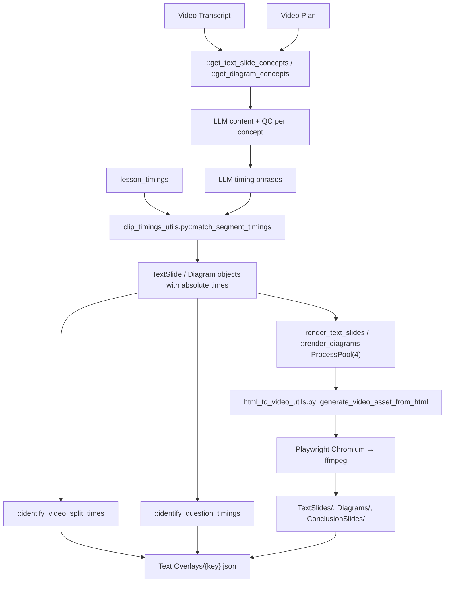

# 06 — Text Overlays

> Stage 5 of nine ([00](00-overview.md)). It draws everything the viewer reads, timed against the clock [05](05-avatar-clips.md) produced. [07](07-scenes-breakdown.md) then fills the gaps this stage did not claim.

## What it does

Decides what appears on screen as text — title cards, bullet slides, five kinds of diagram, the conclusion — writes the content with a model, pins every element to a moment in the narration, and renders each one to a video file with a headless browser.

## Contract

- **Reads three artifacts, and the third is a hard ordering dependency.**
  - `APVideoContext.transcripts_path` as `core/types.py::TranscriptOutput`.
  - `APVideoContext.video_plan_path` for `['video_plan']`, whose per-concept `visual` field decides what each concept gets.
  - `APVideoContext.avatar_assets_path` for `lesson_timings`. Without it there is no way to convert a phrase into a timestamp, which is why this stage cannot run before [05](05-avatar-clips.md).
- **Writes `contents/subsection/Text Overlays/{key}.json`, via `APVideoContext.text_overlays_path`, plus one video file per overlay.**

| Artifact | Path under `media/{key}/` | Template |
| --- | --- | --- |
| Text slide | `TextSlides/{id}.mov` | `templates/text_slide.html` |
| Diagram | `Diagrams/{id}.mov`, `.mp4` for the tree | `templates/diagrams/{type}.html` |
| Conclusion | `ConclusionSlides/{id}.mp4` | `templates/diagrams/conclusion_slide_new.html` |

- **Runs at most two at a time, process-wide.**
  - `::generate_text_overlays` carries `@concurrency_slots(slots=2, lock_name="OVERLAY_GEN_LOCK")`, a global semaphore from `core/helpers.py`.
  - So a batch of subsections serialises here even though the batch pool allows three.
- **Honours `-edited.json` on the manifest**, though the reviewer's overlay layer does not currently write one. See Seams.
- **Skipped only on the manifest.** Every `.mov` and `.mp4` is re-rendered whenever the stage runs.

## Scope

- **Owns everything the viewer reads**, except subtitles and the avatar introduction cards.
- **Owns the timing of those elements**, down to the individual bullet: a slide's bullets appear one at a time, each on its own word.
- **Owns the rendering**, from Jinja2 template through headless Chromium to a video file with an alpha channel.
- **Owns the section split points** that [10](10-render.md) uses to cut the finished lesson into per-section files.
- **Owns the moment each knowledge check is offered**, though [04](04-transcript.md) wrote the questions.

Not here:

- Any wording that is not on-screen text. Narration is fixed — [04](04-transcript.md).
- Which concepts get a diagram at all; that is `visual.type` on the plan — [03](03-video-plan.md).
- The visuals behind the words — [07](07-scenes-breakdown.md), [08](08-images.md), [09](09-videos.md).
- Where an overlay sits in frame, or its fade — [10](10-render.md) owns compositing.
- The clock — [05](05-avatar-clips.md).

## Flow



## Design decisions

- **Content and timing are two separate model calls, in that order.**
  - First a call writes the slide's or diagram's content, QC'd against requirements in `prompts/overlay_prompts.py`.
  - Then a second call is asked which verbatim phrase from the transcript each element should land on.
  - Asking for both at once produced elements timed to words the narration did not contain, which is the failure `::match_segment_timings` exists to catch.

- **A timestamp is never generated. It is matched.**
  - The model returns a phrase; `core/media/clip_timings.py::match_segment_timings` fuzzily locates that phrase in `lesson_timings` and yields word indices, which become absolute times.
  - A phrase that matches nothing has no time, and the element cannot be placed.
  - This is the same discipline as [03](03-video-plan.md)'s fact matching: the model proposes in the vocabulary of the transcript, and code resolves it.

- **Elements carry both an absolute and a relative clock.**
  - A slide has `start_time` and `end_time` on the lesson timeline.
  - Each bullet inside it has `start_duration`, relative to the slide's own start, because the rendered HTML animates on its own clock once the video begins.
  - `::normalize` is what converts one to the other.

- **A visual interrupting a bullet splits the bullet.**
  - `::split_slide_points_at_visual` and `::phrase_split_to_content_split` cut a slide's content where a visual is due, so the slide does not sit over an image it was not composed with.
  - This is the only place slide structure is changed after the model wrote it.

- **Diagrams are typed, and the type comes from the plan.**
  - `templates/diagrams/` holds `mind_map.html`, `tree.html`, `venn_diagram.html`, `lesson_organizer.html` and `conclusion_slide_new.html`.
  - `::DIAGRAM_CONFIGS` binds each to its prompt and its model class, and `BaseDiagram::fill_timings` puts a `phrase` and a `start_time` on every node so a diagram reveals progressively rather than appearing whole.

- **The lesson and section organizers are extra passes over the introduction and overviews.**
  - `::extract_intro_overview_segment` trims the introduction to the part worth diagramming, then `::get_lesson_overview_diagram_contents` and `::get_section_overview_diagram_contents` build organizers from it.
  - This is why section title cards were dropped: `::create_transition_canvases` is commented out of the orchestrator because the section overview diagram now carries the transition.

- **The conclusion is rendered, not composed.**
  - `::create_conclusion_slide` takes the `conclusion_slide` structure straight from the transcript and only computes its timings.
  - So the closing summary a viewer reads was written in [04](04-transcript.md).

- **The lesson title is hardcoded to the first five seconds.**
  - `::create_lesson_title_overlay` sets 0 to 5 with no model involvement, which is why a lesson always opens the same way.

- **Question timings are a heuristic, not a model call.**
  - `::identify_question_timings` takes the last fifteen words of each concept's explanation and adds a second.
  - This is the cheapest defensible rule for "ask after you have explained", and it is marked as such by being the only timing in the stage with no phrase matching.

- **Rendering is CPU-bound and therefore process-parallel.**
  - `::render_text_slides` and `::render_diagrams` use `ProcessPoolExecutor(max_workers=4)`; every other pool in the pipeline is threads.
  - Each worker drives its own Chromium through `core/media/html_to_video.py::convert_html_to_video`, which chooses `::html_to_mov` for alpha via frame-by-frame screenshots and the `qtrle` codec, or `::html_to_mp4` via Playwright's own recorder plus an ffmpeg transcode.

## Layers

`::generate_text_overlays` is the orchestrator; the rest of the module divides as follows.

| Function | Owns |
| --- | --- |
| `::generate_text_overlays` | loads the three inputs, builds `OverlaysData`, returns its dump |
| `::get_text_slide_concepts` | filters the plan for `text_slide` visuals and joins the transcript |
| `::process_text_slide_concept` | one concept's slide content, QC and timing |
| `::get_text_slide_content` | the parallel driver for the above |
| `::slides_timings_identifier` | maps returned timing JSON onto a `TextSlide` with word-aligned times |
| `::normalize`, `::phrase_split_to_content_split`, `::split_slide_points_at_visual` | bullet and visual overlap arithmetic |
| `::render_text_slides`, `::create_text_slides` | render and wrap the slide pipeline |
| `::get_diagram_concepts` | filters the plan for diagram visuals |
| `::process_diagram_concept`, `::get_diagram_content` | one diagram's content, and the parallel driver |
| `::identify_diagram_timings` | phrase fill plus `fill_timings`, with retry |
| `::extract_intro_overview_segment` | trims the introduction for the lesson organizer |
| `::get_lesson_overview_diagram_contents`, `::get_section_overview_diagram_contents` | the organizer diagrams |
| `::render_diagrams`, `::create_diagrams` | render and wrap the diagram pipeline |
| `::create_conclusion_slide` | the conclusion diagram and its render |
| `::identify_video_split_times` | the per-section split points |
| `::identify_question_timings` | the MCQ trigger times |
| `::determine_section_transition` | the section title trigger phrase — used only by the dead transition path |
| `::create_transition_canvases` | section title cards — commented out of the orchestrator |

## Rules

- **Blocking**: a missing transcript, video plan or avatar manifest; a Playwright or ffmpeg failure on a render.
- **Warn-and-continue**: a timing phrase that matches nothing, which leaves the element unplaced.
- **QC is per element and advisory.**
  - Slide content is checked against `prompts/overlay_prompts.py::TEXT_SLIDE_QC_REQUIREMENTS` through `core/helpers.py::llm_call_with_qc`; a failure re-prompts, it does not drop the slide.
  - `::identify_diagram_timings` retries `fill_timings` rather than QC-ing it, because an unfilled node is a mechanical failure.
- **Two functions will hang a headless run.**
  - `::slides_timings_identifier` and `::identify_diagram_timings` both contain `input("Check Timings")`.
  - On a developer's terminal this is a deliberate inspection point. In a batch run it blocks on stdin forever, with no log line and no timeout.
  - This is the single most likely reason an unattended run appears stuck at stage 5.

## Artifact

`core/types.py::OverlaysData`:

```json
{
  "title_overlays": [
    { "text": "...", "type": "lesson_title | section_title",
      "start_index": 0, "end_index": 0, "start_time": 0.0, "end_time": 5.0 }
  ],
  "text_slides": [
    { "title": "...", "start_index": 0, "end_index": 0,
      "start_time": 0.0, "end_time": 0.0,
      "elements": [
        { "type": "...",
          "contents": [{ "content": "...", "phrase": "...",
                         "start_index": 0, "start_time": 0.0, "start_duration": 0.0 }] }
      ],
      "src": "media/{key}/TextSlides/{id}.mov",
      "visuals": ["..."] }
  ],
  "diagrams": [
    { "type": "mind_map | tree | venn_diagram | lesson_organizer | conclusion",
      "data": { "per-node phrase and start_time" },
      "start_index": 0, "end_index": 0, "start_time": 0.0, "end_time": 0.0,
      "src": "media/{key}/Diagrams/{id}.mov" }
  ],
  "conclusion_slide": { "type": "conclusion", "data": { "ConclusionSlideNew" }, "src": "..." },
  "video_splits": { "Introduction": 0.0, "Section: <name>": 0.0, "Conclusion": 0.0 },
  "questions": { "<section>": { "<concept>": { "time": 0.0, "questions": ["..."] } } }
}
```

## External dependencies

- **Anthropic and OpenAI**, through `core/helpers.py::llm_call` and `::llm_call_with_qc`. Two or more calls per slide and per diagram, plus the organizer and conclusion passes, makes this the heaviest LLM stage by call count.
- **Playwright Chromium and ffmpeg**, local, through `core/media/html_to_video.py`.
  - `::render_template` here is the Jinja2 loader pointed at this package's `templates/`. It is not `core/context.py::render_template`, which loads from `./templates` and rewrites asset URLs to presigned S3 links; that one is not on this path.
- **S3**, for three reads, the media uploads and the manifest write.
- **No TTS and no avatar service.** All timing is borrowed from [05](05-avatar-clips.md).

## Boundary

- **[07](07-scenes-breakdown.md) reads this manifest to know which parts of the lesson are already spoken for.**
  - `stages/scenes_breakdown.py::split_transcript_into_video_segments` takes the overlay windows and splits the transcript around them, so a text slide and a generated visual never compete for the same seconds.
  - This is the ordering dependency that makes Text Overlays stage 5 and Scenes Breakdown stage 6.
- **[10](10-render.md) reads nearly every field.**
  - `text_slides[].src`, `diagrams[].src` and `conclusion_slide.src` become their own timeline tracks.
  - `title_overlays` become text assets prepended above everything.
  - `video_splits` drives the ffmpeg section cuts after the render.
  - `questions` is carried into the published output for the player to offer.
- **`src` is an S3 key**, and [10](10-render.md) presigns it at render time.

## Seams

- **`::process_text_slide_concept` is defined twice in the module**, identically. The second definition shadows the first.
- **`::process_text_slide_concept` uses `transcript_timings` without receiving it as a parameter**, and `::get_text_slide_content` does not pass it to the executor. Anything reaching that path depends on a name resolving from elsewhere.
- **`::slides_timings_identifier` is annotated as taking a `TextSlide` but is handed a raw `{title, points}` dict** by its caller.
- **`core/media/html_to_video.py::render_conclusion_slides_template` is dead, and `templates/conclusion_slide.html` exists only for it.**
  - It renders a `ConclusionSlide` with `bullet_points` and a `background_src` to an mp4.
  - `::generate_text_overlays` imports it and never calls it; the live conclusion goes through `::create_conclusion_slide`, which returns a `Diagram` rendered from `templates/diagrams/conclusion_slide_new.html`.
  - Removing the template means also removing the function and the import, or the next caller gets a missing-template error rather than a missing-function one.
- **`ops/repair/text_slides.py` repairs this stage's output after the fact.**
  - It re-imports `::identify_question_timings` and `::slides_timings_identifier`, shortens slides over roughly 517 characters, re-renders them, writes the manifest back, and deletes the render artifact to force a re-compose ([12](12-operator-tooling.md)).
- **`ops/review/app.py`'s `OverlayValidationLayer.process` is a `pass` with a TODO.** Overlay edits made in the reviewer are not persisted, which is why no `-edited.json` appears for this stage in practice.
