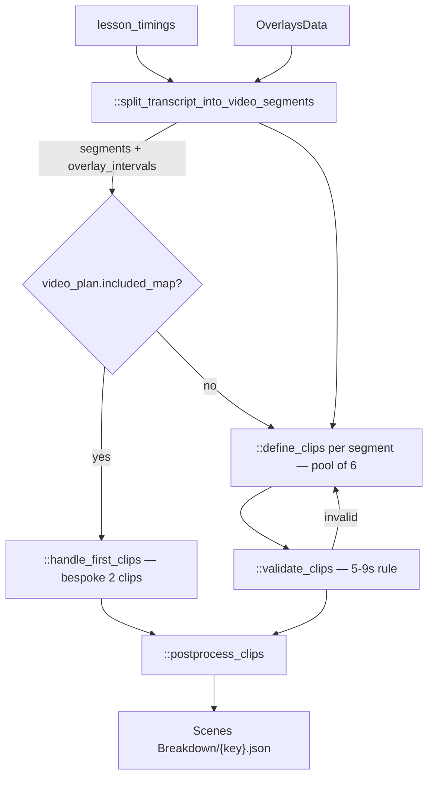

# 07 — Scenes Breakdown

> Stage 6 of nine ([00](00-overview.md)). It cuts the lesson into the visual clips that fill everything [06](06-text-overlays.md) did not claim; [08](08-images.md) draws a still for each and [09](09-videos.md) sets it moving.

## What it does

Splits the narration into timed segments around the overlay windows, asks a model to describe one visual per segment of five to nine seconds, and writes each as a clip with a type, a description, an image prompt and a video prompt.

## Contract

- **Reads three artifacts.**
  - `APVideoContext.avatar_assets_path` for `lesson_timings`, the clock, and `avatar_introductions`.
  - `APVideoContext.text_overlays_path` as `core/types.py::OverlaysData`, to know which spans of the lesson are already occupied.
  - `APVideoContext.video_plan_path` for `included_map` only.
- **Writes `contents/subsection/Scenes Breakdown/{key}.json`, via `APVideoContext.clips_path`, as `{"clips": [...]}`.**
- **Honours `-edited.json`**, and this is the second-most-edited artifact after the transcript: a reviewer rewriting an image prompt edits a clip here ([12](12-operator-tooling.md)).
- **Skipped when the canonical `{key}.json` exists.** No media is produced by this stage, so a rerun costs only model calls.

## Scope

- **Owns the visual rhythm.** How often the picture changes, and therefore how the lesson feels.
- **Owns what each visual depicts**, as a description and as the two prompts that will realise it.
- **Owns the image-or-motion decision.** `media.type` is `"IMAGE"` or `"VIDEO"` and is set here.
- **Owns clip boundaries in time**, which come from the word clock rather than from the model.

Not here:

- Any pixel. A clip is a description and a prompt — [08](08-images.md), [09](09-videos.md).
- Anything that appears over the clip — [06](06-text-overlays.md) already placed those, and this stage works around them.
- Compositing, transitions or overlap handling in the finished video — [10](10-shotstack.md).
- The clock — [05](05-avatar-clips.md).

## Flow



## Design decisions

- **Segmentation is deterministic and the model never sees the whole lesson.**
  - `::split_transcript_into_video_segments` walks `lesson_timings`, subtracts the spans occupied by text slides, diagrams and the conclusion, and returns the remaining segments together with the `overlay_intervals` it removed.
  - `::split_paragraphs` and `::split_segment_into_paragraphs` do the word-index arithmetic.
  - So the model is asked "describe visuals for this stretch of narration", once per stretch, and cannot reorganise the lesson.

- **A clip is five to nine seconds, and that rule is enforced in code.**
  - `::validate_clips` computes each clip's duration from the word timings and sets `duration_valid`.
  - An invalid split is fed back and the segment re-split, up to two further rounds.
  - The bound exists because [09](09-videos.md) buys motion in five and ten second units; a clip outside the window either wastes a generation or needs an ffmpeg speed change.

- **The model chooses the visual, not the timing.**
  - `::define_clips` returns descriptions and where to cut; the times are then read off the clock for those word indices.
  - This is the same separation as [06](06-text-overlays.md): the model works in words, code works in seconds.

- **A lesson with a map opens differently, deliberately.**
  - When `video_plan.included_map` is set, `::handle_first_clips` replaces the generic split of the first segment with a bespoke two-clip opening built around the map.
  - This is the only place `included_map` is read, and the only reason [03](03-video-plan.md) consults the map database at all.

- **Both prompts are written up front, and the image prompt is written even for motion clips.**
  - `core/types.py::Media` auto-fills `img_prompt` when empty and `video_prompt` for `VIDEO` clips.
  - [09](09-videos.md) is image-to-video, so every motion clip needs a still first. Writing both here keeps the two downstream stages from having to invent prompts.

- **`media.id` is a hash of the description, not of the position.**
  - Via `core/hash.py::hash_image_description`.
  - Two clips describing the same visual therefore share an id and, downstream, share media. This is what makes the per-clip skip in [08](08-images.md) and [09](09-videos.md) effective.
  - It also means editing a description in the sidecar orphans the old media rather than replacing it.

- **`location` is carried for history's sake.**
  - A geographic setting per clip, which the image prompts use to keep a lesson's imagery regionally coherent.

## Layers

In the order `::generate_clips` walks them:

- `::split_transcript_into_video_segments` — the clock and the overlay manifest to segments plus intervals.
- `::split_paragraphs`, `::split_segment_into_paragraphs`, `::split_transcript_into_segments` — the word-index and text splitting helpers.
- `::handle_first_clips` — the map opening.
- `::define_clips` — one model call per segment, driven through a wrapper in a pool.
- `::validate_clips` — the duration rule and the retry signal.
- `::postprocess_clips` — final adjustment against `overlay_intervals`.
- `core/types.py::Clip` and `::Media` — the artifact's models.

## Rules

- **`::define_clips` and `::handle_first_clips` both use `LLM.ANTHROPIC_CLAUDE_3_5_SONNET_V2`.**
- **Concurrency is `ContextAwareThreadPoolExecutor(max_workers=6)`**, one task per non-overlay segment, so the CloudWatch `lesson_id` context survives into the workers ([11](11-support-layer.md)).
- **Blocking**: a missing avatar, overlay or plan artifact; a model response that will not parse after its retries.
- **Warn-only**: a clip that stays outside the five-to-nine-second window after the retry rounds ships with `duration_valid: false`.
  - Nothing downstream refuses such a clip. [09](09-videos.md) will speed-adjust anything over 9.9 seconds with ffmpeg.
- **Cost is a handful of Claude calls** — roughly one per non-overlay segment plus retries, typically five to fifteen for a lesson. This stage is cheap; the two after it are not.

## Artifact

```json
{
  "clips": [
    {
      "text": "the narration this visual covers",
      "media": {
        "type": "VIDEO",
        "description": "what the visual shows",
        "id": "hash of the description",
        "img_prompt": "...",
        "video_prompt": "..."
      },
      "range": [0, 0],
      "start_time": 0.0,
      "end_time": 8.5,
      "duration": 8.5,
      "duration_valid": true,
      "location": "Song Dynasty China"
    }
  ]
}
```

- **`range` is the word-index span and is frequently null.** `start_time` and `end_time` are the authoritative placement.
- **`duration` is derived, not authored**, and validated against the five-to-nine-second rule by the `Clip` model itself.

## External dependencies

- **Anthropic Claude 3.5 Sonnet v2**, through `core/helpers.py::llm_call`.
- **S3**, for three reads and one write.
- **No image, video, audio or render service.** This stage produces no media at all.

## Boundary

- **[08](08-images.md) reads `clips` and treats `media.id` as the filing key.**
  - Every still lands at `media/{key}/images/{media.id}/`, so the id is what makes the per-clip skip work.
  - It reads `img_prompt` as the prompt and `media.type` to decide between generation and web search.
- **[09](09-videos.md) reads the same list plus each clip's chosen still.**
  - It skips `IMAGE` clips unless the still was AI-generated, and uses `duration` to pick a five or ten second generation.
- **[10](10-shotstack.md) reads `start_time`, `end_time` and `media.type` to lay the visual track**, and resolves each clip to a video or an image by looking for the video metadata file first.
- **The overlay windows this stage carved around are not recorded in the artifact.**
  - `overlay_intervals` is internal. Anything downstream that needs to know where overlays sit reads [06](06-text-overlays.md)'s manifest directly.

## Seams

- **`::identify_maps` is fully implemented and disabled.**
  - It asks a model whether a clip needs a map and runs its own pool at `max_workers=5`.
  - Its call in `::postprocess_clips` is commented out, so map decisions now come only from `included_map` on the plan.
- **`::generate_clips`'s `__main__` loads a local `./clips.json`** to exercise `::postprocess_clips` alone.
- **The module imports boto3, requests and subprocess** and uses none of them on the main path.
- **`ops/repair/regenerate_concept.py` re-enters this stage for a single concept** as part of the reviewer-driven repair workflow ([12](12-operator-tooling.md)).
