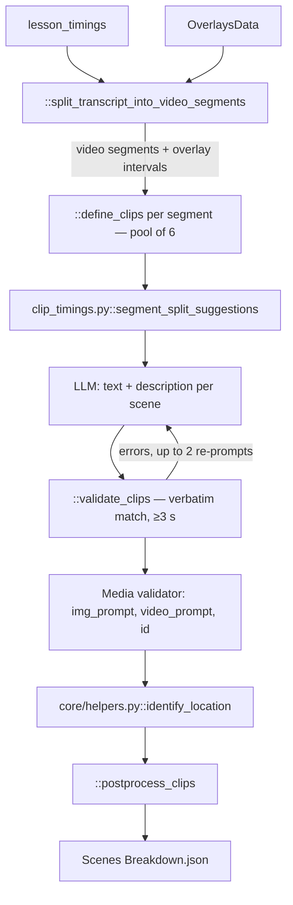

# 07 — Scenes Breakdown

> Stage 5 of eight ([00](00-overview.md)). It cuts the narration into the visual clips that fill everything [06](06-text-overlays.md) did not claim; [08](08-images.md) draws a still for each and [09](09-videos.md) can set it moving.

## What it does

Splits the narration into timed segments around the overlay windows, asks a model to cut each segment into scenes of roughly six to nine seconds and describe one visual per scene, and writes each as a clip with a description, an image prompt, a video prompt and a location.

## Contract

- **Reads two artifacts directly, and the transcript through a helper.**
  - `Context.avatar_assets_path` for `lesson_timings`, the clock, and `avatar_introductions`.
  - `Context.text_overlays_path` as `core/types.py::OverlaysData`, to know which spans are already occupied.
  - `Context.transcripts_path`, read by `core/helpers.py::identify_location` once per clip.
- **Writes `{video folder}/Scenes Breakdown.json` as `{"clips": [...]}`.**
- **Honours `-edited.json`**, through `Context.clips_path`. Hand-editing a clip's prompt or description happens here.
- **Skipped when the canonical `Scenes Breakdown.json` exists.** No media is produced by this stage, so a rerun costs only model calls.

## Scope

- **Owns the visual rhythm.** How often the picture changes.
- **Owns what each visual depicts**, as a description and as the two prompts that will realise it.
- **Owns clip boundaries in time**, which come from the word clock rather than from the model.

Not here:

- Any pixel — [08](08-images.md), [09](09-videos.md).
- Anything that appears over the clip — [06](06-text-overlays.md) already placed those, and this stage works around them.
- Compositing — [10](10-render.md).
- The clock — [05](05-avatar-clips.md).

## Flow



## Design decisions

- **Segmentation is deterministic and the model never sees the whole narration.**
  - `::split_transcript_into_video_segments` merges overlay windows less than a second apart, walks `lesson_timings`, and returns the uncovered stretches (split into paragraphs by `::split_segment_into_paragraphs`) plus the overlay intervals.
  - With no overlays at all — the lore case — the whole narration is split into paragraph segments.
  - `::split_paragraphs` does the word-index arithmetic, halving any paragraph over five sentences. `lesson_timings` carries no newlines, so in practice each video segment is at most five sentences and gets its own model call.

- **Split suggestions come from code; the model refines them.**
  - `core/media/clip_timings.py::segment_split_suggestions` cuts a segment into near-equal pieces of at most 8 s (8.5 s under 18 s), folding a remainder under 4.5 s into the last piece, and attaches word-count tolerances against a 6.5–8.5 s band.
  - `prompts/clips_prompts.py::DEFINE_TRANSCRIPT_CLIPS` asks the model to adjust those splits within tolerance and describe one scene each, returning only `text` and `media.description`.

- **Validation checks that the model's text is real, not its length.**
  - `::validate_clips` requires each clip's `text` to match the clock verbatim (via `match_segment_timings`) and, when a segment has more than one clip, to last at least 3 s.
  - Failures are fed back with `FIX_CLIPS_USER_PROMPT`, up to two further rounds. Clips that still fail to match are dropped silently.
  - The 5–9 s rule lives only on `core/types.py::Clip`, which sets `duration_valid`; nothing enforces it.

- **The model chooses the visual, not the timing.**
  - Times are read off the clock for the matched word indices. The model works in words, code works in seconds.

- **Every clip is `VIDEO`, and both prompts are written by extra model calls.**
  - `::define_clips` builds every `Media` with `type: "VIDEO"`.
  - `core/types.py::Media` fills an empty `img_prompt` through `core/helpers.py::generate_img_prompt` and, for `VIDEO`, `video_prompt` through `::generate_video_prompt` — two Claude calls per clip, made even for the `lore` type, which never generates video.

- **`media.id` is a hash of the description, not of the position.**
  - Via `core/hash.py::hash_image_description`, filled by the `Media` validator.
  - Two clips describing the same visual share an id and, downstream, share media. Editing a description in the sidecar orphans the old media rather than replacing it.

- **`location` is identified per clip.**
  - `core/helpers.py::identify_location` sends the full transcript plus the clip's text to the model and returns a place; [08](08-images.md) feeds it into image QC.

- **Guests are kept off screen.** `avatar_introductions[].avatar_name` goes into the user prompt as figures not to depict. A host-only transcript has none.

- **`::postprocess_clips` closes the gaps.**
  - The first clip starts at 0; each later clip starts where the previous one ended; clips beside an overlay window overlap it by 1.5 s to cover the fade; any clip over 20 s is clamped; the last clip gets 2 s added.

## Layers

In the order `::generate_clips` walks them:

- `::split_transcript_into_video_segments` — the clock and the overlay manifest to segments plus intervals.
- `::split_segment_into_paragraphs`, `::split_paragraphs` — the word-index splitting helpers.
- `::define_clips` — one model call per video segment, plus re-prompts, `Media` prompt generation and location.
- `::validate_clips` — the verbatim-match and minimum-length checks.
- `::postprocess_clips` — gap closing against the overlay intervals.
- `core/types.py::Clip` and `::Media` — the artifact's models.
- Prompts: `prompts/clips_prompts.py`.

## Rules

- **Every model call here uses `LLM.CLAUDE_5_SONNET`.**
- **Concurrency is `ContextAwareThreadPoolExecutor(max_workers=6)`**, one task per video segment; inside a task the per-clip `Media` and location calls run sequentially.
- **Blocking**: a missing avatar or overlay artifact; a model response that will not parse.
- **Warn-only**: a clip outside five to nine seconds ships with `duration_valid: false`; nothing downstream reads the flag.
- **Cost is about four Claude calls per clip** — its share of the segment call, two prompt calls and one location call — plus re-prompts. A lore video's narration of tens of minutes produces hundreds of clips.

## Artifact

```json
{
  "clips": [
    {
      "text": "the narration this visual covers",
      "media": {
        "type": "VIDEO",
        "description": "what the visual shows",
        "id": "hash of the description",
        "img_prompt": "...",
        "video_prompt": "..."
      },
      "range": null,
      "start_time": 0.0,
      "end_time": 8.5,
      "duration": 8.5,
      "duration_valid": true,
      "location": "Song Dynasty China"
    }
  ]
}
```

- **`range` is never set by this stage.** `start_time` and `end_time` are the authoritative placement.
- **`duration` is recomputed by `::postprocess_clips`**, but `duration_valid` is not; it reflects the pre-adjustment duration.

## External dependencies

- **Claude 5 Sonnet**, through `core/helpers.py::llm_call`, `core/clients/openai.py::llm_complete` and the TrueFoundry gateway.
- **Storage**, for three reads per run plus one transcript read per clip, and one write.
- **No image, video, audio or render service.**

## Boundary

- **[08](08-images.md) reads `clips` and treats `media.id` as the filing key.**
  - Every still lands under `media/images/{media.id}/`.
  - It reads `img_prompt` as the prompt, `text` and `location` for QC, and `media.type` to decide between generation and web search.
- **[09](09-videos.md) reads the same list plus each clip's chosen still**, and `duration` to pick a five or ten second generation.
- **[10](10-render.md) reads `start_time`, `end_time` and `media.id`** to lay the still track.
- **The overlay intervals this stage carved around are not recorded in the artifact.** Anything downstream that needs them reads [06](06-text-overlays.md)'s manifest directly.

## Seams

- **`::split_transcript_into_segments` has no caller.** Its call in `::generate_clips` is commented out.
