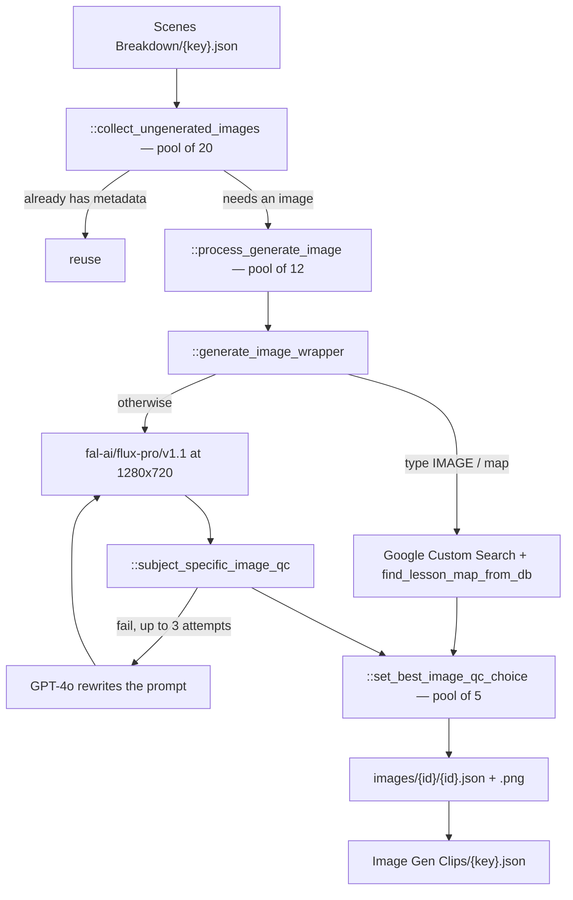

# 08 — Image Gen Clips

> Stage 7 of nine ([00](00-overview.md)). It draws or sources one still per clip [07](07-scenes-breakdown.md) described; [09](09-videos.md) starts every motion generation from the still this stage chose.

## What it does

For each clip, produces candidate images — generated with FLUX, or found on the web for maps — checks them against the lesson's subject matter, picks the best, and files it under the clip's media id.

## Contract

- **Reads the clip list and its own prior output.**
  - `APVideoContext.clips_path` for every clip.
  - Per clip, `media/{key}/images/{media.id}/{media.id}.json`, which is the per-clip skip check.
- **Writes per clip and once in aggregate.**

| Artifact | Path |
| --- | --- |
| Per-clip metadata | `media/{key}/images/{media.id}/{media.id}.json` |
| Chosen image and variants | `media/{key}/images/{media.id}/{media.id}.png`, `-v{N}.png` |
| Aggregate index | `contents/subsection/Image Gen Clips/{key}.json`, as `{"images": [...]}` |

- **The aggregate is an index, not the data.**
  - `APVideoContext.image_json_path` holds a list of `ImagesMetadata` dumps. The per-clip JSON files are the real record and are what [09](09-videos.md) reads.
- **`::regenerate_image` writes back to `clips_path`.**
  - It is the only stage after [07](07-scenes-breakdown.md) that modifies the clip list, updating `img_prompt` when a prompt is rewritten.
- **Two levels of skip, and they disagree.**
  - `run.py::run_stage` skips the whole stage when the aggregate exists.
  - `::collect_ungenerated_images` skips a clip whose per-clip JSON exists, unless `force=True`.
  - So an aggregate present with per-clip files missing means the stage is skipped and the images never get made. That state is reachable by deleting media without deleting the index.
- **No `-edited.json` sidecar.** A reviewer's choice is recorded as `human_choice` inside the per-clip metadata instead ([12](12-operator-tooling.md)).

## Scope

- **Owns every still in the lesson**, whether generated or sourced.
- **Owns the choice between generating and searching.** A map is found; a scene is drawn.
- **Owns image QC and selection**, including the record of which candidate was picked and by whom.
- **Owns prompt rewriting on a QC failure**, and writing the rewrite back to the clip.

Not here:

- What the visual depicts. The description and the prompt came from [07](07-scenes-breakdown.md); this stage may reword a prompt but not change the subject.
- Motion — [09](09-videos.md).
- Where the image sits on screen or how long it shows — [10](10-shotstack.md).
- Portraits of historical figures, which are a different generation with a different function — [05](05-avatar-clips.md).

## Flow



## Design decisions

- **Two sources, chosen by what the clip is.**
  - `core/clients/images.py::GeneratedImageTypes` distinguishes `FLUX` from `WEB`. It lives with the image client rather than in `core/types.py` with the other models.
  - A clip whose `media.type` is `IMAGE`, which in practice means a map, is searched for; everything else is generated.
  - `::generate_image_wrapper` is where that branch lives.

- **A map is looked up before it is searched.**
  - `core/clients/images.py::find_lesson_map_from_db` is tried first, so a curated map beats a search result.
  - The web search is then restricted to `.edu`, `.org`, `.gov` and `.ac` domains, which is the only provenance control in the pipeline.
  - Search returns up to eight candidates, which is why a selection step exists at all.

- **QC is subject-aware, and a failure rewrites the prompt rather than re-rolling it.**
  - `::subject_specific_image_qc` checks a generated image against the clip's narration snippet and its `location`, so an anachronism or a wrong region is caught.
  - On failure, GPT-4o rewrites the prompt and FLUX is called again, up to three attempts.
  - Re-rolling the same prompt would have produced the same anachronism; rewriting is what makes the retry worth buying.

- **Selection is recorded, with human choice ranking above machine choice.**
  - `ImagesMetadata` carries both `qc_choice` and `human_choice`.
  - `::set_best_image_qc_choice` fills the former; the reviewer fills the latter.
  - [09](09-videos.md) reads `human_choice` first and falls back to `qc_choice`, so a reviewer's pick propagates into the motion generation without any other coordination.

- **Every candidate is kept.**
  - Variants are written as `-v{N}.png` and listed in `image[]`, and `n_regenerations` counts the rounds.
  - This is what makes the reviewer's image layer possible: it shows the alternatives that were already paid for.

- **The pools are sized to what they do.**
  - Collecting existing metadata is 20 workers, because it is S3 reads.
  - Generation is 12, bounded by the vendor.
  - QC selection is 5.
  - `core/clients/openai.py` and the QC helper carry tenacity retries with exponential backoff from 7 to 90 seconds.

## Layers

In the order `::generate_all_images` walks them:

- `::collect_ungenerated_images` — partitions clips into "has metadata" and "needs an image".
- `::process_generate_image` — one clip's generation, QC and metadata.
- `::generate_image_wrapper` — the FLUX-or-web branch and the actual call.
- `::subject_specific_image_qc` — the history check, returning a verdict and its reasoning.
- `::set_best_image_qc_choice` — picks among candidates.
- `::choose_best_image` — applies an index as the choice.
- `::regenerate_image` — a single clip redone with a new prompt, writing back to the clip list.
- `core/types.py::ImagesMetadata` and `::ImageDetails` — the per-clip record.

## Rules

- **Blocking**: a missing clip list; a FLUX failure surviving its retries; an unparseable QC response after retries.
- **Warn-and-continue**: a clip whose QC never passes ships with its last image and the failing `evaluation` recorded.
- **Cost is roughly one paid FLUX call per non-map clip, plus up to two more on QC failure.**
  - A typical lesson has fifteen to thirty clips, so this stage buys fifteen to thirty images minimum.
  - Web-sourced maps are free of image-generation cost but still consume search quota.
  - Deleting the aggregate index re-buys all of it, because the per-clip skip only helps if the per-clip files survived.

## Artifact

Per clip:

```json
{
  "prompt": "...",
  "id": "media.id from the clip",
  "image": [{ "src": "media/{key}/images/{id}/{id}.png", "prompt": "...", "model": null }],
  "type": "FLUX | web",
  "n_regenerations": 0,
  "qc_choice": 0,
  "human_choice": null,
  "evaluation": { "the QC verdict and its reasoning": "..." }
}
```

Aggregate, at `image_json_path`: `{"images": [ ...one of the above per clip... ]}`.

## External dependencies

| Service | Model or endpoint | For | Auth |
| --- | --- | --- | --- |
| fal.ai FLUX | `fal-ai/flux-pro/v1.1`, 1280x720 | generated stills | `FAL_KEY` |
| Google Custom Search | image search on academic domains | maps and sourced imagery | `GCP_API_KEY`, `GCP_SEARCH_CXID` |
| Lesson map database | `find_lesson_map_from_db` | curated maps | internal |
| OpenAI | `chatgpt-4o-latest` | prompt rewriting on QC failure | `OPENAI_API_KEY` |
| Vision QC | `absolute_image_qc`, `image_quality_check` in `core/clients/images.py` | candidate validation and ranking | via the LLM keys |
| S3 | — | metadata and PNGs | AWS |

## Boundary

- **[09](09-videos.md) reads the per-clip JSON, not the aggregate.**
  - It resolves the chosen still by `human_choice` then `qc_choice`, and uses that image as the keyframe for image-to-video.
  - It also reads `type`: a clip whose image was AI-generated gets motion even when `media.type` is `IMAGE`, and a web-sourced map does not.
- **[10](10-shotstack.md) falls back to this stage's output.**
  - It looks for a clip's video metadata first and uses the still only when no video exists, as an `ImageAsset` on the media track.
- **`img_prompt` on the clip list may have been rewritten by this stage.**
  - Anything reading `clips_path` after stage 7 is reading a possibly-updated prompt, which is the one case where a later stage edits an earlier stage's artifact.

## Seams

- **When `qc=False`, `::generate_all_images` returns a name that was never assigned.**
  - The QC path reuses the futures list from the generation loop, so the non-QC branch is not a working configuration. The stage is only ever called with the default `qc=True`.
- **`::generate_all_images` calls `update_images()` on entry**, a sheet-to-S3 map synchronisation unrelated to generating anything for this lesson.
- **The module imports `LumaAI` and does not use it.** Luma belongs to [09](09-videos.md).
- **`::generate_all_images`'s `__main__` is a smoke test** calling `generate_flux_image("Hello World")`.
- **`core/clients/sheets.py`** is the Google Sheets and Drive surface behind `update_images` and the reviewer's image uploads.
