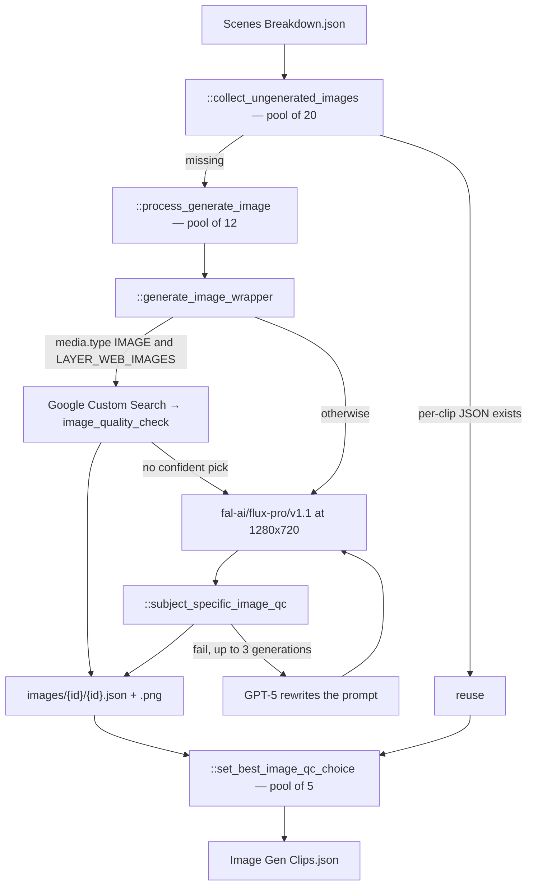

# 08 — Image Gen Clips

> Stage 6 of eight ([00](00-overview.md)). It draws or sources one still per clip [07](07-scenes-breakdown.md) described; [09](09-videos.md) starts every motion generation from that still, and [10](10-render.md) composites it directly when no video exists.

## What it does

For each clip, generates a still with FLUX — or, for an `IMAGE` clip with web images enabled, searches for one — checks it against the subject profile's QC conditions, rewrites the prompt and regenerates on failure, and files the result under the clip's media id.

## Contract

- **Reads the clip list and its own prior output.**
  - `Context.clips_path` for every clip.
  - Per clip, `media/images/{media.id}/{media.id}.json`, which is the per-clip skip check.
- **Writes per clip and once in aggregate.**

| Artifact | Path |
| --- | --- |
| Per-clip metadata | `{video folder}/media/images/{media.id}/{media.id}.json` |
| Image | `{video folder}/media/images/{media.id}/{media.id}.png`; further candidates `{media.id}-v0.png`, `-v1.png`, … |
| Aggregate index | `{video folder}/Image Gen Clips.json`, as `{"images": [...]}` |

- **The aggregate is an index, not the data.** The per-clip JSON files are the record, and they are what [09](09-videos.md) and [10](10-render.md) read.
- **Two levels of skip, and they disagree.**
  - `run.py::run_stage` skips the whole stage when the aggregate exists.
  - `::collect_ungenerated_images` skips a clip whose per-clip JSON exists, unless `force=True`.
  - So an aggregate present with per-clip files missing means the stage is skipped and the images never get made. Delete the aggregate to fill the gaps; surviving per-clip files are reused.
- **No `-edited.json` sidecar.** A human pick is `human_choice` inside the per-clip metadata; nothing in the pipeline sets it.

## Scope

- **Owns every scene still**, whether generated or sourced.
- **Owns the choice between generating and searching.**
- **Owns image QC and prompt rewriting on a QC failure.**
- **Owns the record of which candidate is chosen** (`qc_choice`, `human_choice`).

Not here:

- What the visual depicts. The description and prompt came from [07](07-scenes-breakdown.md).
- Motion — [09](09-videos.md).
- Placement or duration on screen — [10](10-render.md).
- Guest portraits — [05](05-avatar-clips.md).

## Flow



## Design decisions

- **In practice every still is FLUX.**
  - `::generate_image_wrapper` searches the web only for a clip whose `media.type` is `IMAGE`, and only when `LAYER_WEB_IMAGES` is on.
  - [07](07-scenes-breakdown.md) writes every clip as `VIDEO`, and the `lore` video type turns `LAYER_WEB_IMAGES` off, so the web branch is reached only by hand-editing a clip.
  - `core/clients/images.py::GeneratedImageTypes` names the sources; the stored `type` is `FLUX` or `web`.

- **The web branch is a map search with a confidence gate.**
  - `core/clients/images.py::generate_web_image` asks Google Custom Search for Creative Commons images restricted in turn to `.edu`, `.org`, `.gov` and `.ac`, aiming for eight.
  - `core/clients/image_qc.py::image_quality_check` ranks them against the prompt plus `prompts/clips_prompts.py::WEB_MAP_CONDITIONS`. A pick is kept only with confidence above 3; otherwise the clip falls through to FLUX.

- **QC is subject-aware, and a failure rewrites the prompt rather than re-rolling it.**
  - `::subject_specific_image_qc` builds conditions from `config/subject_profiles.py::resolve_profile` (`images.conditions(period=context.chapter, location=clip.location, subject=..., title=...)`) and judges the image with `core/clients/image_qc.py::absolute_image_qc` on the gateway's vision route.
  - Any `FAIL` sends the failed conditions to `LLM.GPT_5` with `IMAGE_PROMPT_REWRITE_FROM_QC` / `IMAGE_PROMPT_REWRITE_FROM_QC_USER`, and FLUX is called again with the new prompt, up to three generations in all. After the third the last image is kept.
  - The rewritten prompt lands in `image[].prompt`; the metadata's top-level `prompt` and the clip list keep the original.

- **Images are judged for a general adult audience.** `prompts/clips_prompts.py::AUDIENCE` is passed wherever the image client and ranking QC take an audience.

- **FLUX handles its own content-filter failures.**
  - `core/clients/images.py::generate_flux_image` retries an NSFW-flagged result with the same prompt, then with a Claude-rewritten one, and returns `"NSFW"` after seven retries; `::generate_ai_image` then falls back to DALL-E for that clip.

- **Selection is recorded, with human choice ranking above machine choice.**
  - `core/types.py::ImagesMetadata.get_best_image` takes `human_choice`, then `qc_choice`, then index 0.
  - `::set_best_image_qc_choice` sets `qc_choice`: to 0 when there is one candidate, otherwise by ranking with `image_quality_check`. The pipeline path produces one candidate per clip, so the ranking call does not run.

- **The pools are sized to what they do.** Collecting existing metadata is 20 workers (storage reads); generation is 12; selection is 5. `::subject_specific_image_qc` carries tenacity with three attempts and 7-to-90-second exponential backoff.

## Layers

In the order `::generate_all_images` walks them:

- `::collect_ungenerated_images` — partitions clips into "has metadata" and "needs an image".
- `::process_generate_image` — one clip's generation, upload and metadata.
- `::generate_image_wrapper` — the web-or-FLUX branch and the QC retry loop.
- `::subject_specific_image_qc` — the profile check, returning a verdict or a rewritten prompt.
- `::set_best_image_qc_choice` — sets `qc_choice` and rewrites the per-clip JSON.
- `core/types.py::ImagesMetadata` and `::ImageDetails` — the per-clip record.
- Prompts: `prompts/clips_prompts.py`, `prompts/images/`.

## Rules

- **Blocking**: a missing clip list; a FLUX failure surviving its retries; an unparseable QC response after retries.
- **Warn-and-continue**: a clip whose QC never passes ships with its last image. The failing verdict is logged, not stored.
- **Cost is one to three FLUX calls per clip, plus one vision QC call per generation and one GPT-5 rewrite per failure.**
  - A lore video has hundreds of clips, so this stage buys hundreds of images.
  - Deleting the aggregate alone re-buys nothing; deleting the per-clip files re-buys those clips.

## Artifact

Per clip:

```json
{
  "prompt": "the clip's img_prompt",
  "id": "media.id from the clip",
  "image": [{ "src": "{video folder}/media/images/{id}/{id}.png", "prompt": "the prompt actually used", "model": "FLUX" }],
  "type": "FLUX",
  "n_regenerations": 0,
  "qc_choice": 0,
  "human_choice": null,
  "evaluation": null
}
```

`evaluation` is filled only when `image_quality_check` ranked several candidates. Aggregate: `{"images": [ ...ImagesMetadata dumps... ]}`.

## External dependencies

| Service | Model or endpoint | For | Auth |
| --- | --- | --- | --- |
| fal.ai FLUX | `fal-ai/flux-pro/v1.1`, 1280x720 | generated stills | `FAL_KEY` |
| OpenAI images | `dall-e-3`, via `core/clients/openai.py::generate_image_dalle` | NSFW fallback | `OPENAI_API_KEY` |
| Google Custom Search | image search on academic domains | web-sourced maps | `GCP_API_KEY`, `GCP_SEARCH_CXID` |
| TrueFoundry gateway | `LLM.GPT_5` | prompt rewriting on QC failure, ranking conditions | `TFY_API_KEY`, `TFY_BASE_URL` |
| Vision QC | `core/clients/image_qc.py::absolute_image_qc`, `::image_quality_check` | pass/fail and ranking | via the gateway |
| Storage | — | metadata and PNGs | local or AWS |

## Boundary

- **[09](09-videos.md) reads the per-clip JSON, not the aggregate.**
  - It takes `get_best_image().src` as the keyframe for image-to-video.
  - It also reads `type`: an `IMAGE` clip with an AI-generated still gets motion, a web-sourced one does not.
- **[10](10-render.md) reads the per-clip JSON directly** and composites the chosen still; a clip without one is left black.

## Seams

- **Newly generated clips appear twice in the aggregate.** The selection pool appends to the same `futures` list the generation pool filled, so `as_completed` yields each new clip's metadata once from each pool. Previously generated clips appear once.
- **With `qc=False`, `::generate_all_images` returns a name that was never assigned.** The stage is only ever called with the default `qc=True`.
- **A web pick at index 0 is never used.** The acceptance test is `confidence > 3 and best_image_index and ...`, and index 0 is falsy, so the top-ranked result falls through to FLUX.