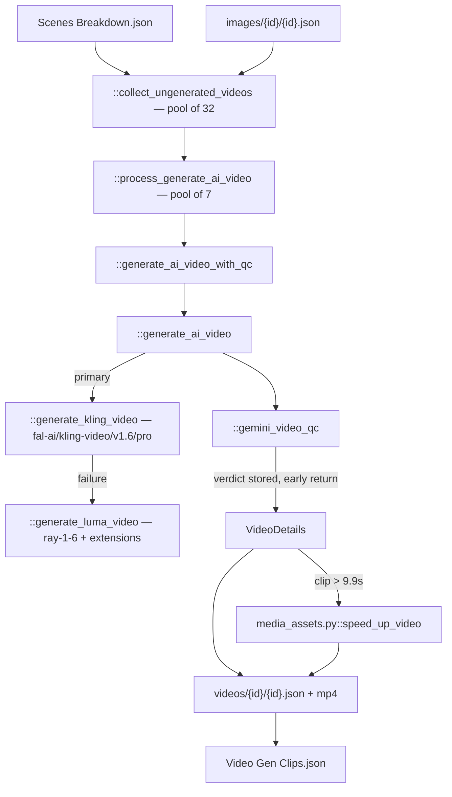

# 09 — Video Gen Clips

> Stage 7 of eight ([00](00-overview.md)). It sets each still from [08](08-images.md) in motion. It is not run by the `lore` video type (`skip_stages` in `config/video_types.json`) nor under `STORAGE=local` (`run.py::LOCAL_SKIP`), so [10](10-render.md) never sees its output today.

## What it does

For each clip that should move, generates video from the chosen still with Kling, falling back to Luma, runs a Gemini quality check whose verdict is recorded and ignored, slows anything whose clip runs over 9.9 seconds, and files the result under the clip's media id.

## Contract

- **Reads the clip list and the stills.**
  - `Context.clips_path`.
  - Per clip, `media/images/{media.id}/{media.id}.json`, taking `ImagesMetadata.get_best_image()` — `human_choice`, then `qc_choice`, then 0.
  - Per clip, `media/videos/{media.id}/{media.id}.json`, which is the per-clip skip check.
- **Writes per clip and once in aggregate.**

| Artifact | Path |
| --- | --- |
| Per-clip metadata | `{video folder}/media/videos/{media.id}/{media.id}.json` |
| Generated video | `{video folder}/media/videos/{media.id}/{media.id}-v{N}-{retry}.mp4` |
| Aggregate index | `{video folder}/Video Gen Clips.json`, as `{"videos": [...]}` |

- **The aggregate is an index; the per-clip files are the record**, as in [08](08-images.md).
- **Not every clip gets a video, and the rule is not simply `media.type`.**
  - A `VIDEO` clip does, unless its per-clip JSON exists.
  - An `IMAGE` clip does if its still was AI-generated (FLUX, GPT, DALL-E or Midjourney) — every run, since that branch does not check for existing video metadata.
  - An `IMAGE` clip with a web-sourced still does not.
- **At most three run videos are in this stage at once, process-wide.**
  - `::generate_all_videos` carries `core/helpers.py::concurrency_slots` with `slots=3, lock_name="VIDEO_GEN_LOCK"`.
- **No `-edited.json`.** `human_choice` in the per-clip metadata selects among variants.

## Scope

- **Owns motion.** Every moving image that is not an avatar or an overlay.
- **Owns duration fitting**, by choosing a 5 or 10 second Kling generation, Luma extension on fallback, and an ffmpeg speed change when the clip runs long.
- **Owns vendor choice and fallback.**

Not here:

- What the clip depicts, or its prompt — [07](07-scenes-breakdown.md).
- The still — [08](08-images.md).
- Talking heads — [05](05-avatar-clips.md).
- Placement in the finished video — [10](10-render.md).

## Flow



## Design decisions

- **Kling is the primary and the choice is hardcoded.**
  - `::generate_ai_video` sets `model = 'KLING'` and calls `::generate_kling_video` against `fal-ai/kling-video/v1.6/pro/image-to-video`, asking for 5 seconds when the clip is at most 5, otherwise 10.
  - `::generate_luma_video` runs when Kling raises; the `LUMA` branch that would select it directly is unreachable.
  - Kling carries tenacity with three attempts and a 5-then-30-second wait chain.

- **Generation is image-to-video, which is why [08](08-images.md) must run first.**
  - The chosen still, presigned, is the keyframe. There is no text-to-video path.
  - The prompt is the clip's `video_prompt`, or `"Slow-motion video, gentle crane shot"` when empty.

- **Luma builds long clips by extension.**
  - `::call_luma_generation` produces a base generation, polled every five seconds until `completed` or `failed`; then `extend_count = int((duration - 5.0001) // 4 + 1.1)` further generations extend it.
  - `::create_generation_with_retries` retries a failed generation up to twice: first with a prompt passed through `::secure_prompt`, then with `'Create a slow motion zoom in effect.'`.
  - A black result (`core/media/media_assets.py::is_video_black`) is regenerated up to five times.

- **A clip that runs long is slowed rather than cut.**
  - When `end_time - start_time` exceeds 9.9 s, `core/media/media_assets.py::speed_up_video` applies `setpts` and `atempo` with factor `9.9 / duration`, below 1, clamped to 0.25–2.0.
  - The function's name is the reverse of what a factor below 1 does.

- **Every candidate is kept and numbered by variant and retry.**
  - `{id}-v{N}-{retry}.mp4` and `VideoDetails.retry`. A rerun on a clip with existing metadata appends and sets `human_choice` to the newest.

## Layers

In the order `::generate_all_videos` walks them:

- `::collect_ungenerated_videos` — partitions clips.
- `core/clients/gemini.py::delete_old_gemini_files` — clears previously uploaded Gemini files before generating.
- `::process_generate_ai_video` — one clip end to end.
- `::generate_ai_video_with_qc` — generation plus the QC call.
- `::generate_ai_video` — vendor dispatch and fallback.
- `::generate_kling_video`, `::generate_luma_video`, `::call_luma_generation`, `::create_generation_with_retries` — the vendors.
- `::secure_prompt` — Luma retry prompt sanitisation.
- `::gemini_video_qc` — the quality verdict.
- `::reimagine_image_prompt` — the scene rewrite on a QC failure, unreachable.
- `core/types.py::VideoMetadata`, `::VideoDetails`, `::VideoClipQC` — the per-clip record.
- Prompts: `prompts/clips_prompts.py` (`AI_VIDEO_QC_PROMPT`, `AI_VIDEO_QC_SEVERITY_CHECK`, `SECURE_VIDEO_PROMPT_SYSTEM_PROMPT`, the `REIMAGINE_SCENE_*` strings).

## Rules

- **The QC loop is disabled.**
  - `::generate_ai_video_with_qc` calls `::gemini_video_qc`, then returns `[video_details]` on a line commented `# REMOVE LINE TO ENABLE VIDEO QC WITH GEMINI`.
  - Everything below it — `::reimagine_image_prompt`, the still regeneration through `stages/image_clips.py::generate_image_wrapper`, the recursive retry — never executes.
  - So the Gemini call is paid for, its verdict is written into `qc`, and nothing acts on it.
- **`model` always records `KLING`**, including when the Luma fallback produced the video.
- **Blocking**: a missing clip list; a missing still for a clip that needs one; Kling and Luma both failing; a Gemini reply with no verdict after three attempts.
- **Concurrency**: the outer semaphore of three, an inner pool of 7 clips per run video for generation, and 32 for the collection pass.

## Cost

- **One Kling generation per clip that moves.** Every clip [07](07-scenes-breakdown.md) writes is `VIDEO`.
- **Luma fallback multiplies**: one base generation plus one per four seconds beyond five.
- **One Gemini call per generated video**, for a verdict that is discarded.

## Artifact

Per clip:

```json
{
  "prompt": "Slow-motion video...",
  "id": "media.id from the clip",
  "videos": [
    { "src": "{video folder}/media/videos/{id}/{id}-v1-0.mp4",
      "prompt": "...",
      "model": "KLING",
      "qc": { "passed": true, "reason": "...", "severity": null },
      "retry": 0 }
  ],
  "n_regenerations": 0,
  "human_choice": 0
}
```

Aggregate: `{"videos": [ ...VideoMetadata dumps... ]}`.

## External dependencies

| Service | Model or endpoint | For | Auth |
| --- | --- | --- | --- |
| Kling via fal.ai | `fal-ai/kling-video/v1.6/pro/image-to-video` | primary motion | `FAL_KEY` |
| Luma AI | `ray-1-6` image-to-video plus extensions | fallback | `LUMAAI_API_KEY` |
| Google Gemini | `core/clients/gemini.py::gemini_media_analysis`, `LLM.GEMINI_2_5` | the discarded verdict | `GEMINI_API_KEY` |
| TrueFoundry gateway | `LLM.CLAUDE_5_SONNET` via `::secure_prompt` | Luma retry prompts | `TFY_API_KEY`, `TFY_BASE_URL` |
| ffmpeg | local | duration fitting | — |
| Storage | — | stills in, videos out | AWS |

## Boundary

- **[10](10-render.md) does not read this stage's output.** `stages/local_render.py::collect` resolves every clip to its still under `media/images/`; there is no video track.
- **Nothing downstream reads `qc`.**

## Seams

- **`::reimagine_image_prompt` is fully written and unreachable**, along with the retry accounting around it. Re-enabling QC means deleting one `return` and then finding out whether that path still works.
- **The stage imports `stages/image_clips.py::generate_image_wrapper`** only for that unreachable path.
