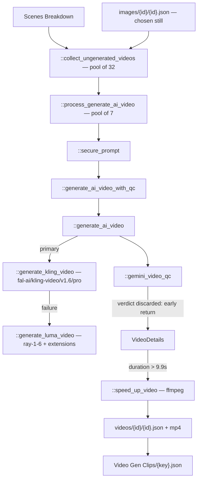

# 09 — Video Gen Clips

> Stage 8 of nine ([00](00-overview.md)). It sets each still from [08](08-images.md) in motion; [10](10-shotstack.md) lays the results on the timeline. This is the most expensive stage in the pipeline.

## What it does

For each clip that should move, generates video from the chosen still with Kling, falling back to Luma, extends or speed-adjusts it to fit the clip's duration, runs a Gemini quality check, and files the result under the clip's media id.

## Contract

- **Reads the clip list and the stills.**
  - `APVideoContext.clips_path`.
  - Per clip, `media/{key}/images/{media.id}/{media.id}.json`, taking the image indicated by `human_choice` then `qc_choice`.
  - Per clip, `media/{key}/videos/{media.id}/{media.id}.json`, which is the per-clip skip check.
- **Writes per clip and once in aggregate.**

| Artifact | Path |
| --- | --- |
| Per-clip metadata | `media/{key}/videos/{media.id}/{media.id}.json` |
| Generated video and variants | `media/{key}/videos/{media.id}/{media.id}-v{N}-{retry}.mp4` |
| Aggregate index | `contents/subsection/Video Gen Clips/{key}.json`, as `{"videos": [...]}` |

- **`APVideoContext.video_json_path` is an index; the per-clip files are the record**, exactly as in [08](08-images.md).
- **Not every clip gets a video, and the rule is not simply `media.type`.**
  - A `VIDEO` clip always does.
  - An `IMAGE` clip does too, if its still was AI-generated — FLUX, GPT, DALL-E or Midjourney.
  - An `IMAGE` clip whose still came from the web, which in practice means a map, does not. Maps are shown as stills.
- **Only three lessons generate video at once, process-wide.**
  - `::generate_all_videos` carries `@concurrency_slots(slots=3, lock_name="VIDEO_GEN_LOCK")`.
- **No `-edited.json`.** A reviewer's pick is `human_choice` in the per-clip metadata.

## Scope

- **Owns motion.** Every moving image in the lesson that is not an avatar or an overlay.
- **Owns duration fitting**, by Luma extension when generating short, and by ffmpeg speed change when the result runs long.
- **Owns vendor choice and fallback.**

Not here:

- What the clip depicts, or its prompt — [07](07-scenes-breakdown.md), with the prompt possibly rewritten in [08](08-images.md).
- The still itself — [08](08-images.md).
- Talking heads — [05](05-avatar-clips.md). Those are a different vendor and a different track.
- Placement, trimming or transitions in the finished lesson — [10](10-shotstack.md).

## Flow



## Design decisions

- **Kling is the primary and the choice is hardcoded.**
  - `::generate_ai_video` sets `model = 'KLING'` and calls `::generate_kling_video` against `fal-ai/kling-video/v1.6/pro/image-to-video`.
  - `::generate_luma_video` exists as the fallback when Kling fails, and the `LUMA` branch that would select it deliberately is unreachable.
  - Kling carries tenacity with three attempts and a 5-then-30-second wait chain.

- **Generation is image-to-video, which is why [08](08-images.md) must run first.**
  - The chosen still is the keyframe. There is no text-to-video path.
  - This also means a bad still guarantees a bad clip, and the QC that mattered was the image QC.

- **Luma builds long clips by extension, not by asking for a long one.**
  - `::call_luma_generation` and `::create_generation_with_retries` produce a base generation; then `extend_count = int((duration - 5) // 4 + 1.1)` further generations extend it.
  - So a nine-second Luma fallback costs two or more generations, not one.
  - Luma is polled every five seconds until `completed` or `failed`, with up to two prompt retries and up to five retries on a black-frame result.

- **A clip that comes back too long is slowed rather than cut.**
  - `::speed_up_video` applies ffmpeg `setpts` and `atempo` to anything over 9.9 seconds.
  - Slowing preserves the whole shot; trimming would lose whatever the end of it showed.
  - The function's name is the reverse of what a factor below 1 does to it.

- **Prompts are sanitised before they are sent.**
  - `::secure_prompt` exists because historical subject matter reliably trips vendor content filters, and a refused generation costs a round trip.

- **Every candidate is kept and numbered by both variant and retry.**
  - `{id}-v{N}-{retry}.mp4` and `VideoDetails.retry`, so the reviewer can see what a retry produced.

## Layers

In the order `::generate_all_videos` walks them:

- `::collect_ungenerated_videos` — partitions clips, resolving each one's chosen still.
- `::process_generate_ai_video` — one clip end to end.
- `::secure_prompt` — prompt sanitisation.
- `::generate_ai_video_with_qc` — generation plus the QC call.
- `::generate_ai_video` — vendor dispatch and fallback.
- `::generate_kling_video`, `::generate_luma_video`, `::call_luma_generation`, `::create_generation_with_retries` — the vendors.
- `::gemini_video_qc` — the quality verdict.
- `::reimagine_image_prompt` — the scene rewrite on a QC failure, unreachable.
- `::speed_up_video` — the ffmpeg duration fit.
- `core/types.py::VideoMetadata`, `::VideoDetails`, `::VideoClipQC` — the per-clip record.

## Rules

- **The QC loop is disabled, and this is the most consequential dead code in the pipeline.**
  - `::generate_ai_video_with_qc` calls `::gemini_video_qc`, then returns `[video_details]` immediately.
  - The comment on that line says `# REMOVE LINE TO ENABLE VIDEO QC WITH GEMINI`.
  - Everything below it — the reimagine call to `::reimagine_image_prompt`, the regeneration, the retry accounting — never executes.
  - So the Gemini call is paid for, its verdict is written into `qc` on the metadata, and nothing acts on it. A failing clip ships.
- **Blocking**: a missing clip list; a missing still for a clip that needs one; Kling and Luma both failing.
- **Warn-and-continue**: a black-frame Luma result after five retries; a clip whose QC verdict is negative.
- **Concurrency**: the outer semaphore of three lessons, an inner pool of 7 per lesson for generation, and 32 for the collection pass.

## Cost

- **One Kling generation per clip that moves.** For a typical lesson that is ten to twenty-five generations.
- **Luma fallback multiplies**: one base generation plus one per four seconds beyond five.
- **One Gemini call per generated video**, entirely for a verdict that is discarded.
- **This stage plus [05](05-avatar-clips.md) is where a lesson's money goes**, and both re-buy everything when their JSON is deleted.

## Artifact

Per clip:

```json
{
  "prompt": "Slow-motion video...",
  "id": "media.id from the clip",
  "videos": [
    { "src": "media/{key}/videos/{id}/{id}-v1-0.mp4",
      "prompt": "...",
      "model": "KLING | LUMA",
      "qc": { "passed": true, "reason": "...", "severity": null },
      "retry": 0 }
  ],
  "n_regenerations": 0,
  "human_choice": 0
}
```

Aggregate, at `video_json_path`: `{"videos": [ ...one of the above per clip... ]}`.

## External dependencies

| Service | Model or endpoint | For | Auth |
| --- | --- | --- | --- |
| Kling via fal.ai | `fal-ai/kling-video/v1.6/pro/image-to-video` | primary motion | `FAL_KEY` |
| Luma AI | `ray-1-6` image-to-video plus extensions | fallback and long clips | `LUMAAI_API_KEY` |
| Google Gemini | `gemini_media_analysis` with `AI_VIDEO_QC_PROMPT` | the discarded verdict | `GEMINI_API_KEY` |
| Anthropic Claude 3.5 Sonnet v2 | via `::reimagine_image_prompt` | unreachable | `CLAUDE_KEY` |
| ffmpeg | local | duration fitting | — |
| S3 | — | stills in, videos out | AWS |

- **Runway and Veo are not used**, despite being the obvious peers of the two vendors here. There are no references to either.

## Boundary

- **[10](10-shotstack.md) resolves each clip by looking for this stage's per-clip metadata first.**
  - Found: the clip becomes a `VideoAsset` at volume 0, since the lesson's audio is the avatar track.
  - Not found: the clip falls back to [08](08-images.md)'s still as an `ImageAsset`.
  - So a clip that failed here degrades to a static image rather than breaking the render, which is why a silent QC failure is easy to miss.
- **`human_choice` is what selects among variants**, and it is set by the reviewer's video layer — which is a no-op, so in practice the first variant is used ([12](12-operator-tooling.md)).
- **Nothing downstream reads `qc`.** It is recorded and unused.

## Seams

- **`::generate_all_videos`'s `__main__` calls `::speed_up_video('87220643-v4-1.mp4', 0.3)`** against a local file — a developer's ffmpeg experiment, not a pipeline path.
- **The module imports `sqlalchemy.false`**, unused.
- **`::reimagine_image_prompt` is fully written and unreachable**, along with the retry accounting around it. Re-enabling QC means deleting one `return` and then finding out whether that path still works.
- **`core/media/media_assets.py`** holds the black-frame detection this stage relies on for the Luma retry.
