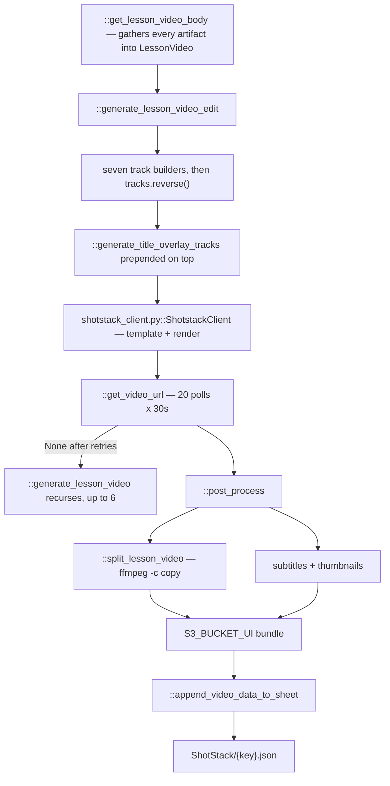

# 10 — ShotStack

> Stage 9 of nine, the last ([00](00-overview.md)). It assembles everything the eight stages before it produced into one timeline, renders it, and publishes the result.

## What it does

Builds a Shotstack edit out of the avatar audio, the generated visuals, the overlays and the title cards, submits it for render, polls until the MP4 exists, then downloads it, splits it per section, writes subtitles and thumbnails, copies everything to the public viewer bucket and records the row in the delivery sheet.

## Contract

- **Reads almost every artifact in the lesson.**
  - `APVideoContext.clips_path` for the visual track's timing and types.
  - `APVideoContext.avatar_assets_path` for the audio, the talking-head clips and the introduction cards.
  - `APVideoContext.text_overlays_path` for slides, diagrams, the conclusion, the title overlays and `video_splits`.
  - `APVideoContext.transcripts_path` for the subtitle text.
  - Per clip, `media/{key}/videos/{id}/{id}.json` if it exists, otherwise `media/{key}/images/{id}/{id}.json`.
- **Every asset reference is converted to a presigned S3 URL before submission**, with six hours of validity for the media clips, because Shotstack renders from public URLs.
- **Writes one artifact and a published bundle.**

| Artifact | Location |
| --- | --- |
| Render record | `contents/subsection/ShotStack/{key}.json` |
| Finished lesson | `media/{key}/{sanitized subsection}.mp4` in the main bucket |
| Published bundle | `{subject}/{chapter}/{section}/{title}_{timestamp}/` in the bucket named by `S3_BUCKET_UI` |
| Delivery row | a Google Sheet, via `::append_video_data_to_sheet` |

- **The published bundle holds the full MP4 and its SRT, the per-section MP4s and their SRTs, and the thumbnails.**
- **Skipped when `contents/subsection/ShotStack/{key}.json` exists.**
  - There is no partial assembly: the stage either builds the whole lesson or is skipped.
  - This is why `ops/repair/text_slides.py` deletes this artifact after repairing an overlay — it is the only way to force a re-compose.

## Scope

- **Owns compositing.** Track order, geometry, fades, volumes, and the overlap handling between adjacent clips.
- **Owns the render contract with Shotstack**, including the poll.
- **Owns publication**: the splits, the subtitles, the thumbnails, the viewer-bucket layout and the delivery sheet row.

Not here:

- Any content decision. Every word, image, diagram and duration arrived already fixed.
- Subtitle wording, which is the transcript — [04](04-transcript.md).
- Whether the lesson is any good. Nothing here evaluates the result; see [12](12-operator-tooling.md) for what does, advisorily.

## Flow



## Design decisions

- **The timeline is seven track builders, and the build order is the reverse of the stacking order.**
  - `::generate_lesson_video_edit` appends tracks in one order and then calls `tracks.reverse()`, because Shotstack draws the first track on top.
  - Reading the builders in source order therefore gives the stack from bottom to top:

| Builder | Layer | Volume |
| --- | --- | --- |
| `::generate_audio_tracks` | the avatar audio | 1.0 |
| `::generate_mediaclip_tracks` | generated video or stills | 0 |
| `::generate_text_slide_tracks` | bullet slides | 0.1 |
| `::generate_diagram_tracks` | diagrams | 0.1 |
| `::generate_conclusion_slide_tracks` | the conclusion | 0.1 |
| `::generate_avatar_introduction_tracks` | introduction cards | 0.1 |
| `::generate_avatar_tracks` | the talking head, picture-in-picture | 1.0 |

  - `::generate_title_overlay_tracks` is prepended after the reverse, so title cards sit above everything.

- **Media clips are muted and the avatar track carries all the sound.**
  - Generated video comes with no useful audio, and the overlays are silent renders. Setting media to volume 0 and audio to 1.0 is what keeps the mix predictable.
  - The 0.1 on the overlay tracks is a floor rather than a mix decision; those files have no audio.

- **Overlapping audio goes to its own track.**
  - `::generate_audio_tracks` puts a clip that overlaps its predecessor on a separate track rather than trimming it, because a trim would cut a word.

- **Adjacent visual clips are overlapped by 0.2 seconds.**
  - `::generate_mediaclip_tracks` extends each clip slightly into the next so there is no single-frame gap at a boundary.

- **The avatar is a fixed picture-in-picture.**
  - `scale=0.148` at offset `x=0.41, y=-0.24`, hardcoded in `::generate_avatar_tracks`.
  - So the talking head always sits in the same corner, and the geometry is a compositing decision made here rather than a property of the clip.

- **The lesson title is a black hold with a zoom, built as text rather than rendered upstream.**
  - `::generate_title_overlay_tracks` distinguishes `TitleOverlayType.LESSON_TITLE` from `SECTION_TITLE` and builds Shotstack text assets for both.
  - This is the exception to "[06](06-text-overlays.md) owns everything the viewer reads": the title cards are composited, not pre-rendered.

- **Subtitles are files, not burned-in pixels.**
  - The render carries no captions. `::post_process` writes SRTs alongside the MP4, so the player controls them.

- **Section splits are local and lossless.**
  - `::split_lesson_video` uses ffmpeg with `-c copy` against the `video_splits` timestamps from [06](06-text-overlays.md), so no re-encode and no second render.

- **The retry is a recursion, not a loop.**
  - When the poll yields no URL, `::generate_lesson_video` calls itself with `retry + 1`, up to six times.
  - Each attempt is a fresh template and a fresh render, so a stuck render costs another render.

## Layers

In the order `::generate_lesson_video` walks them:

- `::get_lesson_video_body` — reads every artifact and assembles `core/types.py::LessonVideo`, resolving each clip to a video or a still and presigning every URL.
- `::generate_lesson_video_edit` — the seven builders, the reverse, the titles, and the `Edit` with its output settings.
- `::replace_underscore_in_out` — key renaming for the Shotstack schema, where `in` and `out` are reserved words that cannot be Python field names.
- `core/clients/shotstack.py::ShotstackClient` — template creation, render submission and `::get_video_url`.
- `::post_process` — download, split, subtitle, thumbnail, upload to the viewer bucket.
- `::split_lesson_video` — the ffmpeg section cuts.
- `::append_video_data_to_sheet` — the delivery sheet row.

## Rules

- **Output is `mp4` at `hd`.**
  - `::generate_lesson_video_edit` defaults its `resolution` parameter to `sd` and the caller passes `hd`.
- **The poll is bounded at twenty attempts of thirty seconds, about ten minutes**, in `ShotstackClient::get_video_url`.
  - There is also a flat `time.sleep(10)` after template creation before the first poll.
- **Blocking**: any missing upstream artifact; six failed renders.
- **Degrades silently**: a clip with no generated video becomes a still ([09](09-videos.md)); a missing overlay file simply produces no track for it.
- **Cost is one template and one render per attempt.** Everything after the render is local ffmpeg and S3, apart from the thumbnail generation.

## Artifact

```json
{
  "lesson_video": {
    "url": "the ephemeral Shotstack render URL",
    "edit": { "timeline": { "tracks": ["..."] }, "output": { "format": "mp4", "resolution": "hd" } },
    "src": "media/{key}/{subsection}.mp4",
    "output_data": {
      "metadata": { "DomainId": "...", "ClusterId": "..." },
      "title": "the subsection",
      "url": "the public viewer URL",
      "subtitles_url": "...",
      "subtitles_type": "srt",
      "segment_urls": { "<section>": "..." },
      "segment_subtitles_urls": { "<section>": "..." },
      "transcript": "...",
      "thumbnails": { "lesson_thumbnail": "...", "section_thumbnails": { "<section>": "..." } },
      "sheet_link": "..."
    },
    "lesson_report": { "...": "..." }
  }
}
```

- **`url` expires.** It is Shotstack's own hosted output; `src` and `output_data.url` are the durable copies.
- **`output_data.metadata` carries `DomainId` and `ClusterId` down from [01](01-upstream.md)**, which is what lets `ops/delivery/stele.py` map a finished video back onto the standard it teaches.

## External dependencies

| Service | Wrapper | For | Auth |
| --- | --- | --- | --- |
| Shotstack | `core/clients/shotstack.py::ShotstackClient` | template, render, poll | `SHOTSTACK_API_KEY`, or `SHOTSTACK_API_KEY_PROD` when `SHOTSTACK_ENVIRONMENT=prod` |
| ffmpeg | local | section splits, lossless | — |
| Google Sheets and Drive | `core/clients/sheets.py`, `::append_video_data_to_sheet` | the delivery row and thumbnail upload | the `GOOGLE_*` service account |
| S3 | `core/clients/s3.py` | reads, presigning, the finished MP4, the viewer bundle | AWS |

## Boundary

- **This is the end of the pipeline. Nothing downstream is a stage.**
- **`core/notification_system.py::NotificationSystem.send_success_message` reads this artifact** to put the finished video's URL and the delivery sheet link into the Google Chat thread ([11](11-support-layer.md)).
- **`ops/delivery/delivery_sheet.py` and `ops/delivery/stele.py` are the publish path beyond it**, reading `output_data` to fill the sheet and then push to the learning platform ([12](12-operator-tooling.md)).
- **Deleting this artifact is the standard way to force a re-render** after fixing anything upstream, and it is what the repair scripts do.

## Seams

- **`::generate_lesson_video_edit`'s `resolution` default of `sd` disagrees with every call site.** The default is not what ships.
- **The `shotstack/` package has been deleted.** It held a render harness importing a module that never existed, plus an unused reference timeline.
- **`core/media/subtitles.py` and `core/media/thumbnails.py` duplicate parts of `::post_process`** as standalone batch scripts, for lessons whose render predates those features ([12](12-operator-tooling.md)).
